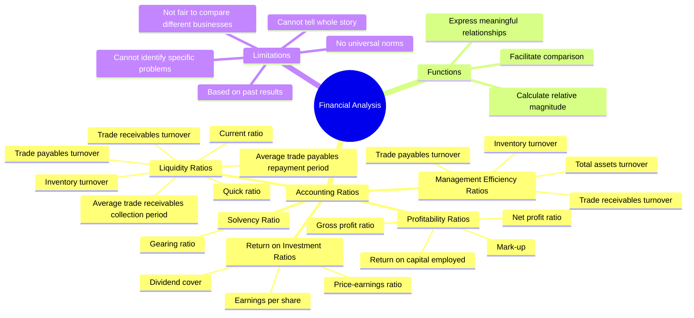
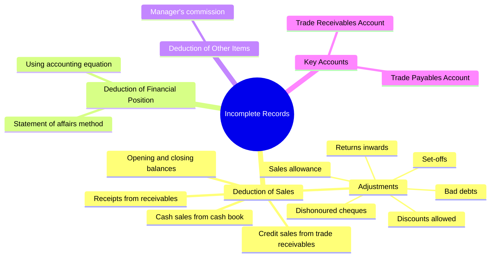
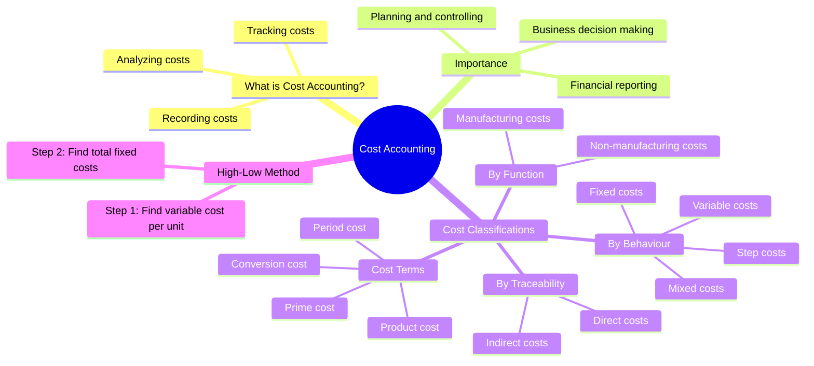
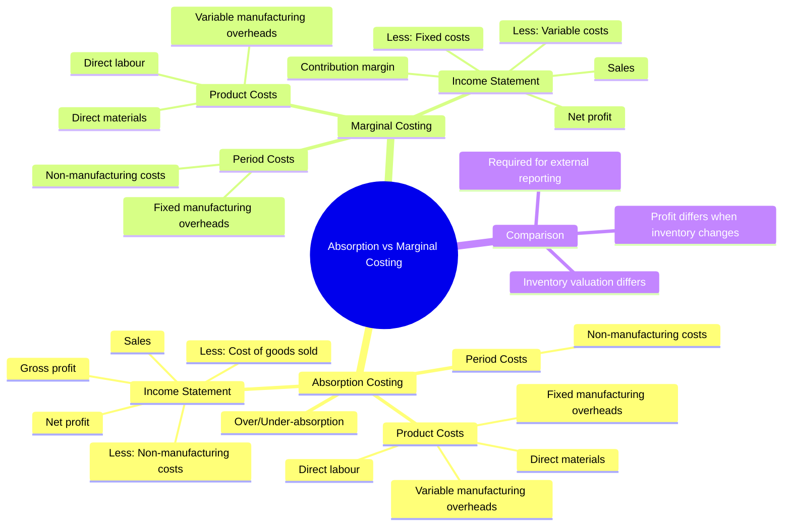
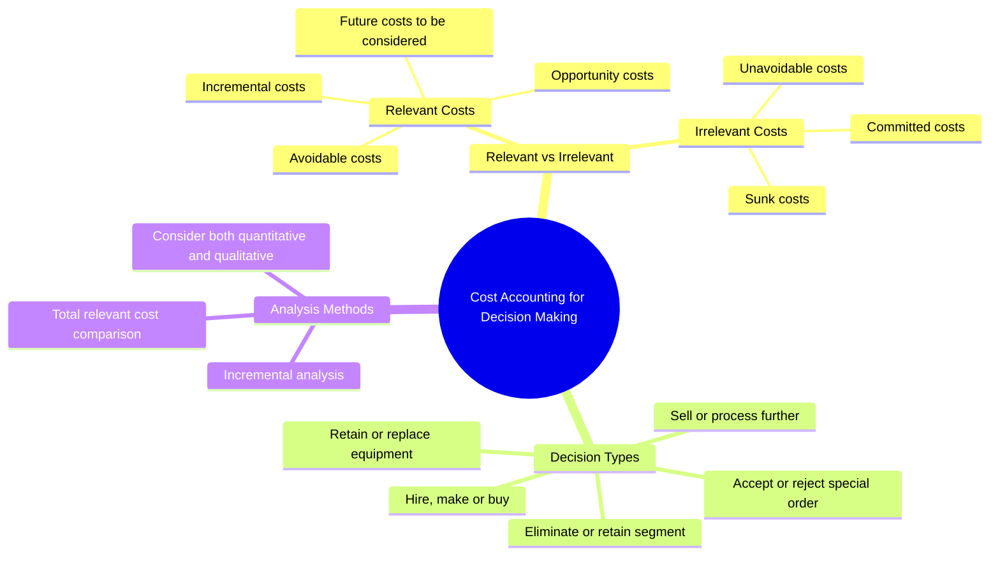

# BAFS Book 4 - Complete Summaries

Complete summaries of Chapters 21, 22, 24, 25, 26, and 27 from BAFS Book 4.

---

# Chapter 21: Financial Analysis

## Concept Map



---

## 1. Profitability Ratios (Section 21.3)

Profitability measures the ability of a business to earn profits.

| Ratio | Formula | Interpretation |
|-------|---------|----------------|
| **Gross Profit Ratio** | (Gross profit / Sales) × 100% | Higher ratio means sales are more profitable |
| **Mark-up** | (Gross profit / Cost of goods sold) × 100% | Higher mark-up means more profitable |
| **Net Profit Ratio** | (Net profit before tax / Sales) × 100% | Higher ratio = greater ability to generate profits |
| **Return on Capital Employed** | (PBIT / Average capital employed) × 100% | Higher = more capable of generating profits |

---

## 2. Liquidity Ratios (Section 21.4)

Liquidity measures the ability to meet short-term financial obligations when due.

| Ratio | Formula | Interpretation |
|-------|---------|----------------|
| **Current Ratio** | Current assets / Current liabilities | Higher = more liquid |
| **Quick Ratio** | (Current assets - Inventory) / Current liabilities | Stringent liquidity test |
| **Trade Receivables Turnover** | Credit sales / Average trade receivables | Measures receivables relative to sales |
| **Average Collection Period** | (Avg trade receivables / Credit sales) × 365 days | Shorter = faster collection |
| **Trade Payables Turnover** | Credit purchases / Average trade payables | Measures payables relative to purchases |
| **Average Repayment Period** | (Avg trade payables / Credit purchases) × 365 days | Shorter = faster repayment |
| **Inventory Turnover** | Cost of goods sold / Average inventory | Higher = faster selling inventory |

---

## 3. Solvency Ratio (Section 21.5)

| Ratio | Formula | Interpretation |
|-------|---------|----------------|
| **Gearing Ratio** | (Non-current liabilities + Preference capital) / (Non-current liabilities + Shareholders' fund) × 100% | Higher = riskier business |

---

## 4. Management Efficiency Ratios (Section 21.6)

| Ratio | Formula | Interpretation |
|-------|---------|----------------|
| **Total Assets Turnover** | Sales / Total assets | Higher = more efficient asset use |

---

## 5. Return on Investment Ratios (Section 21.7)

| Ratio | Formula | Interpretation |
|-------|---------|----------------|
| **Earnings per Share (EPS)** | (NPAT - Preference dividend) / Number of ordinary shares | Higher = better return potential |
| **Dividend Cover** | (NPAT - Preference dividend) / Ordinary dividend | Higher = smaller proportion distributed |
| **Price-earnings Ratio (P/E)** | Market price per share / EPS | High = sell signal; Low = buy signal |

---

## Glossary - Chapter 21

| Term | Definition |
|------|------------|
| **Profitability** | The ability of a business to earn profits |
| **Liquidity** | The ability to meet short-term financial obligations |
| **Current ratio** | Times current liabilities covered by current assets |
| **Quick ratio** | Current assets excluding inventory vs current liabilities |

---

# Chapter 22: Incomplete Records

## Concept Map



---

## Overview

When businesses don't maintain complete double-entry systems, we calculate missing figures.

---

## Trade Receivables Account Format

| Trade Receivables | $ |
|-------------------|---|
| Balance b/f | xx |
| Credit sales | **?** |
| Bank - Dishonoured cheque | xx |
| **Less:** | |
| Cash and bank | (xx) |
| Returns inwards | (xx) |
| Discounts allowed | (xx) |
| Allowance for doubtful accounts | (xx) |
| Sales allowance | (xx) |
| Balance c/f | (xx) |

---

## Trade Payables Account Format

| Trade Payables | $ |
|----------------|---|
| Balance b/f | xx |
| Credit purchases | **?** |
| **Less:** | |
| Cash and bank | (xx) |
| Returns outwards | (xx) |
| Discounts received | (xx) |
| Purchase allowance | (xx) |
| Balance c/f | (xx) |

---

## Key Formulas

### Credit Sales
```
Credit sales = (Closing trade receivables × Trade receivables turnover)
            OR
Credit sales = (Average trade receivables × 365) / Average collection period
```

### Credit Purchases
```
Credit purchases = (Closing trade payables × Trade payables turnover)
                OR
Credit purchases = (Average trade payables × 365) / Average repayment period
```

### Net Profit/Loss
```
Net profit/(loss) = Closing capital - Opening capital + Drawings - Additional capital
```

---

## Statement of Affairs

| Statement of Affairs as at [date] | $ |
|-----------------------------------|---|
| **Assets** | xx |
| **Less: Liabilities** | (xx) |
| **Capital** | **xx** |

---

## Manager's Commission

**Before commission:**
```
Commission = Commission % × Net profit before commission
```

**After commission:**
```
Commission = (Commission % / (100 + Commission %)) × Net profit before commission
```

---

# Chapter 24: Cost Accounting

## Concept Map



---

## Overview

**Cost accounting** is the process of recording, tracking, and analyzing costs associated with a cost object.

---

## Cost Classifications

### 1. Direct and Indirect Costs (Section 24.3A)

| Type | Definition |
|------|------------|
| **Direct costs** | Easily traced to a specific cost object |
| **Indirect costs** | Cannot be easily traced; need allocation |

### 2. Fixed and Variable Costs (Section 24.3B)

| Type | Definition | Graph |
|------|------------|-------|
| **Fixed costs** | Constant within relevant range | Horizontal line |
| **Variable costs** | Vary with activity level | Upward diagonal |
| **Step costs** | Constant in steps, then jump | Stair-step |
| **Mixed costs** | Partly fixed, partly variable | Diagonal with intercept |

### 3. Manufacturing vs Non-manufacturing (Section 24.3C)

| Manufacturing Costs | Non-manufacturing Costs |
|---------------------|------------------------|
| Direct materials | Administrative overheads |
| Direct labour | Selling and distribution |
| Manufacturing overheads | R&D overheads |
| | Finance costs |

---

## Cost Terms

| Term | Formula |
|------|---------|
| **Prime cost** | Direct materials + Direct labour |
| **Conversion cost** | Direct labour + Manufacturing overheads |
| **Total costs** | DM + DL + Expenses = Prime cost + Overheads |

---

## High-Low Method

**Step 1:** Variable cost per unit
```
Variable cost per unit = (Cost at high - Cost at low) / (High activity - Low activity)
```

**Step 2:** Fixed costs
```
Fixed costs = Total costs - (Variable cost per unit × Activity level)
```

---

# Chapter 25: Absorption and Marginal Costing

## Concept Map



---

## Cost Classification by Method

| Cost Type | Absorption Costing | Marginal Costing |
|-----------|-------------------|------------------|
| **Product costs** | DM, DL, Variable MOH, Fixed MOH | DM, DL, Variable MOH |
| **Period costs** | Non-manufacturing | Fixed MOH, Non-manufacturing |

---

## Absorption Costing

### Overhead Absorption
```
Predetermined rate = Budgeted overheads / Budgeted quantity of absorption base
Absorbed overheads = Actual quantity × Predetermined rate
```

### Over/Under-absorption
- **Over-absorption:** Actual < Absorbed → Deduct from COGS
- **Under-absorption:** Actual > Absorbed → Add to COGS

### Income Statement
| | $ |
|---|---|
| Sales | xx |
| Less: COGS (including fixed MOH) | (xx) |
| (Over)/Under-absorbed fixed MOH | xx/(xx) |
| **Gross profit** | xx |
| Less: Non-manufacturing costs | (xx) |
| **Net profit** | xx |

---

## Marginal Costing

### Income Statement
| | $ |
|---|---|
| Sales | xx |
| Less: Variable costs | (xx) |
| **Contribution margin** | xx |
| Less: Fixed manufacturing overheads | (xx) |
| Less: Fixed non-manufacturing overheads | (xx) |
| **Net profit** | xx |

---

## Comparison Table

| Aspect | Absorption | Marginal |
|--------|------------|----------|
| Cost classification | By function | By behaviour |
| Shows | Gross profit | Contribution margin |
| Fixed MOH treatment | Product cost | Period cost |
| External reporting | Required | Not allowed |
| Decision-making | Less useful | More useful |

---

## Net Profit Differences

| Inventory Change | Effect |
|------------------|--------|
| Increases | Absorption profit > Marginal profit |
| Decreases | Absorption profit < Marginal profit |
| Unchanged | Absorption profit = Marginal profit |

---

# Chapter 26: Cost-Volume-Profit Analysis

## Concept Map

```mermaid
mindmap
  root((CVP Analysis))
    Key Concepts
      Breakeven Point
        Where total costs = total revenue
        No profit, no loss
      Contribution Margin
        Sales - Variable costs
      Margin of Safety
        Actual sales - Breakeven sales
    Calculations
      Breakeven Units
        Fixed costs / Unit contribution margin
      Breakeven Revenue
        Fixed costs / Contribution margin ratio
      Target Profit
        (Target profit + Fixed costs) / Unit CM
      Margin of Safety
        Actual - Breakeven
    Applications
      Single Product
      Multiple Products
        Weighted average method
      Limiting Factors
        Rank by contribution per limiting factor
```

---

## Key Formulas

### Breakeven Point
```
Breakeven (units) = Fixed costs / Unit contribution margin
Breakeven (revenue) = Fixed costs / Contribution margin ratio

Unit contribution margin = Unit selling price - Unit variable cost
Contribution margin ratio = (Unit CM / Unit selling price) × 100%
```

### Target Profit
```
Units for target profit = (Target profit + Fixed costs) / Unit contribution margin
```

### Margin of Safety
```
In dollars: Actual/Budgeted sales - Breakeven sales
In units: Actual/Budgeted units - Breakeven units
Ratio: (Actual - Breakeven) / Actual × 100%
```

---

## CVP for Multiple Products

**Weighted average method:**
```
Breakeven (units) = Fixed costs / Weighted average unit contribution margin
```

---

## CVP with Limiting Factors

**Steps:**
1. Calculate contribution per unit of limiting factor
2. Rank products from highest to lowest
3. Produce highest-ranked products first

**Formula:**
```
Contribution per unit of limiting factor = Unit contribution margin / Amount of limiting factor per unit
```

---

# Chapter 27: Cost Accounting for Decision Making

## Concept Map



---

## Relevant Costs Framework

### Relevant (Consider These)
| Type | Definition |
|------|------------|
| **Expected future revenues** | Revenues that will change |
| **Expected future costs** | Costs that will be incurred |
| **Opportunity costs** | Highest-valued alternative forgone |
| **Incremental costs** | Additional costs from action |
| **Avoidable costs** | Costs that can be eliminated |

### Irrelevant (Ignore These)
| Type | Definition |
|------|------------|
| **Sunk costs** | Already incurred, cannot recover |
| **Committed costs** | Already undertaken |
| **Unavoidable costs** | Cannot be avoided by decision |

---

## Decision-Making Process

1. **Only relevant costs matter** - Ignore sunk costs
2. **Analyze all alternatives** - Impact on revenues, costs, profits
3. **Two analysis methods:**
   - Incremental (compare only differences)
   - Total relevant (compare totals)
4. **Decision rule:**
   - Higher costs/lower profits → No action
   - Lower costs/higher profits → Take action

---

## Types of Business Decisions

1. **Accept or reject special order** (Section 27.4)
2. **Hire, make or buy** (Section 27.5)
3. **Sell or process further** (Section 27.6)
4. **Retain or replace equipment** (Section 27.7)
5. **Eliminate or retain segment** (Section 27.8)

---

# Complete Formula Summary

## Financial Ratios
```
Gross Profit Ratio = (Gross profit / Sales) × 100%
Current Ratio = Current assets / Current liabilities
Gearing Ratio = (Non-current liabilities + Preference capital) / Total capital × 100%
EPS = (NPAT - Preference dividend) / Number of ordinary shares
```

## Incomplete Records
```
Net profit = Closing capital - Opening capital + Drawings - Additional capital
Credit sales = (Average trade receivables × 365) / Collection period
```

## Cost Accounting
```
Contribution margin = Sales - Variable costs
Breakeven point (units) = Fixed costs / Unit contribution margin
High-low variable cost = (High cost - Low cost) / (High activity - Low activity)
Prime cost = Direct materials + Direct labour
Conversion cost = Direct labour + Manufacturing overheads
```

## Manager's Commission
```
Before commission: Commission % × Net profit before commission
After commission: (Commission % / (100 + Commission %)) × Net profit before commission
```
