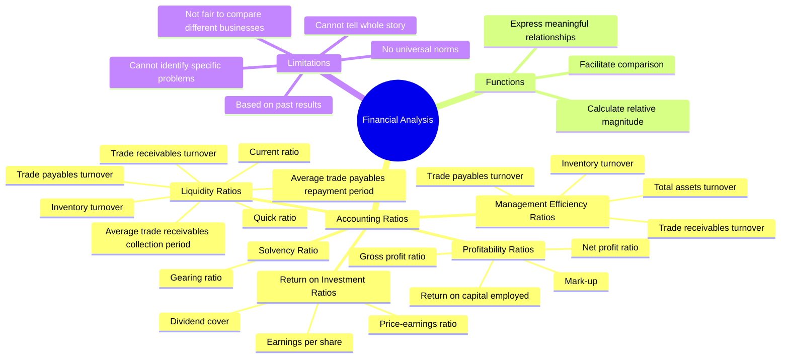
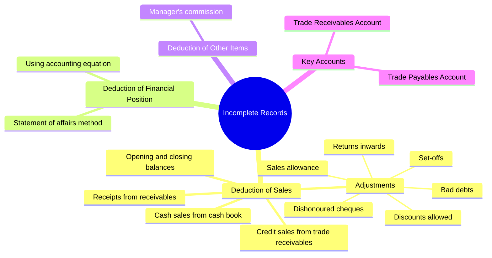
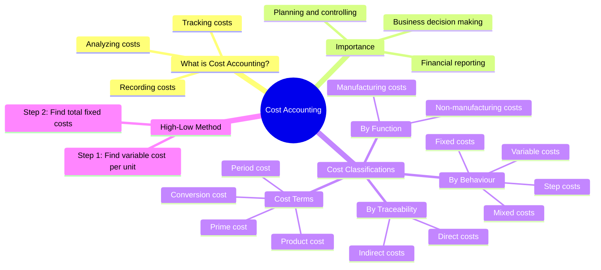
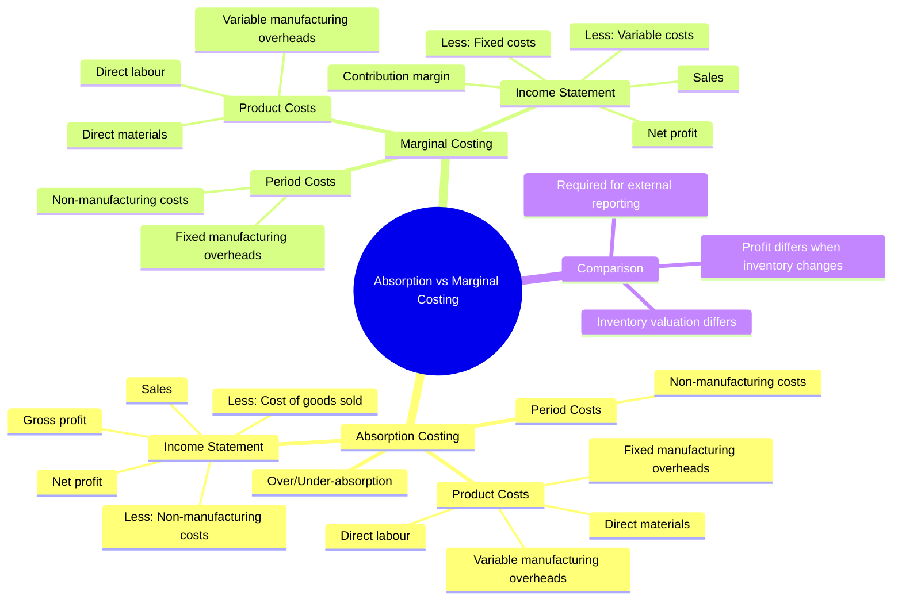
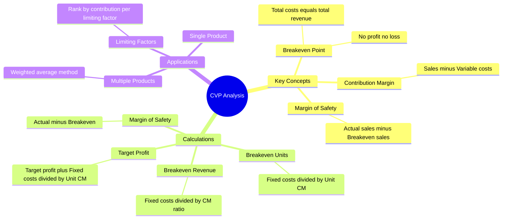
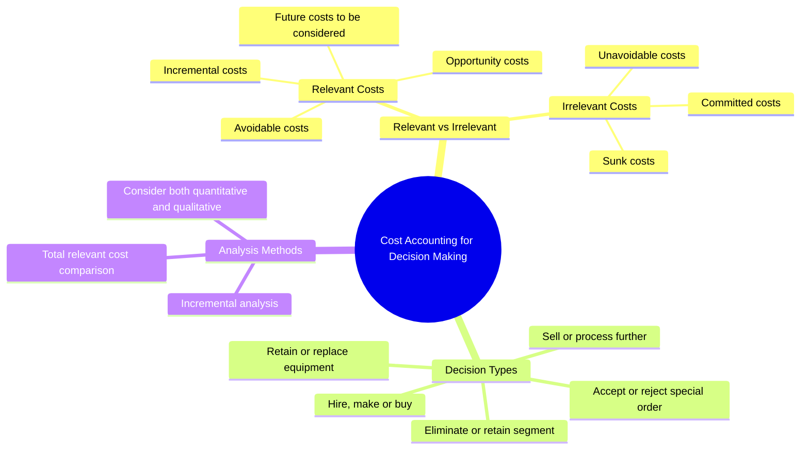

# BAFS Book 4 - Complete Summaries

> [!abstract] Overview
> Complete summaries of Chapters 21, 22, 24, 25, 26, and 27 from BAFS Book 4.

---

# Chapter 21: Financial Analysis ^ch21

## Concept Map


```mermaid
mindmap
  root((Financial Analysis))
    Accounting Ratios
      Profitability Ratios
        Gross profit ratio
        Mark-up
        Net profit ratio
        Return on capital employed
      Liquidity Ratios
        Current ratio
        Quick ratio
        Trade receivables turnover
        Average trade receivables collection period
        Trade payables turnover
        Average trade payables repayment period
        Inventory turnover
      Solvency Ratio
        Gearing ratio
      Management Efficiency Ratios
        Trade receivables turnover
        Trade payables turnover
        Inventory turnover
        Total assets turnover
      Return on Investment Ratios
        Earnings per share
        Dividend cover
        Price-earnings ratio
    Functions
      Express meaningful relationships
      Calculate relative magnitude
      Facilitate comparison
    Limitations
      Cannot tell whole story
      Not fair to compare different businesses
      Based on past results
      No universal norms
      Cannot identify specific problems
```

---

## 1. Profitability Ratios (Section 21.3) ^profitability

> [!tip] Key Insight
> Profitability measures the ability of a business to earn profits.

| Ratio | Formula | Interpretation |
|-------|---------|----------------|
| **Gross Profit Ratio** | $\frac{\text{Gross profit}}{\text{Sales}} \times 100\%$ | Higher ratio means sales are more profitable |
| **Mark-up** | $\frac{\text{Gross profit}}{\text{Cost of goods sold}} \times 100\%$ | Higher mark-up means more profitable |
| **Net Profit Ratio** | $\frac{\text{Net profit before tax}}{\text{Sales}} \times 100\%$ | Higher ratio = greater ability to generate profits |
| **Return on Capital Employed** | $\frac{\text{PBIT}}{\text{Average capital employed}} \times 100\%$ | Higher = more capable of generating profits |

---

## 2. Liquidity Ratios (Section 21.4) ^liquidity

> [!info] Definition
> Liquidity measures the ability to meet short-term financial obligations when due.

| Ratio | Formula | Interpretation |
|-------|---------|----------------|
| **Current Ratio** | $\frac{\text{Current assets}}{\text{Current liabilities}}$ | Higher = more liquid |
| **Quick Ratio** | $\frac{\text{Current assets} - \text{Inventory}}{\text{Current liabilities}}$ | Stringent liquidity test |
| **Trade Receivables Turnover** | $\frac{\text{Credit sales}}{\text{Average trade receivables}}$ | Measures receivables relative to sales |
| **Average Collection Period** | $\frac{\text{Avg trade receivables}}{\text{Credit sales}} \times 365 \text{ days}$ | Shorter = faster collection |
| **Trade Payables Turnover** | $\frac{\text{Credit purchases}}{\text{Average trade payables}}$ | Measures payables relative to purchases |
| **Average Repayment Period** | $\frac{\text{Avg trade payables}}{\text{Credit purchases}} \times 365 \text{ days}$ | Shorter = faster repayment |
| **Inventory Turnover** | $\frac{\text{Cost of goods sold}}{\text{Average inventory}}$ | Higher = faster selling inventory |

---

## 3. Solvency Ratio (Section 21.5) ^solvency

| Ratio | Formula | Interpretation |
|-------|---------|----------------|
| **Gearing Ratio** | $\frac{\text{Non-current liabilities} + \text{Preference capital}}{\text{Non-current liabilities} + \text{Shareholders' fund}} \times 100\%$ | Higher = riskier business |

---

## 4. Management Efficiency Ratios (Section 21.6) ^efficiency

| Ratio | Formula | Interpretation |
|-------|---------|----------------|
| **Total Assets Turnover** | $\frac{\text{Sales}}{\text{Total assets}}$ | Higher = more efficient asset use |

---

## 5. Return on Investment Ratios (Section 21.7) ^roi

| Ratio | Formula | Interpretation |
|-------|---------|----------------|
| **Earnings per Share (EPS)** | $\frac{\text{NPAT} - \text{Preference dividend}}{\text{Number of ordinary shares}}$ | Higher = better return potential |
| **Dividend Cover** | $\frac{\text{NPAT} - \text{Preference dividend}}{\text{Ordinary dividend}}$ | Higher = smaller proportion distributed |
| **Price-earnings Ratio (P/E)** | $\frac{\text{Market price per share}}{\text{EPS}}$ | High = sell signal; Low = buy signal |

---

## Glossary - Chapter 21

| Term | Definition |
|------|------------|
| **Profitability** | The ability of a business to earn profits |
| **Liquidity** | The ability to meet short-term financial obligations |
| **Current ratio** | Times current liabilities covered by current assets |
| **Quick ratio** | Current assets excluding inventory vs current liabilities |

---

# Chapter 22: Incomplete Records ^ch22

## Concept Map


```mermaid
mindmap
  root((Incomplete Records))
    Deduction of Sales
      Cash sales from cash book
      Credit sales from trade receivables
      Opening and closing balances
      Receipts from receivables
      Adjustments
        Returns inwards
        Discounts allowed
        Bad debts
        Dishonoured cheques
        Set-offs
        Sales allowance
    Deduction of Financial Position
      Using accounting equation
      Statement of affairs method
    Deduction of Other Items
      Manager's commission
    Key Accounts
      Trade Receivables Account
      Trade Payables Account
```

---

## Overview

> [!warning] Context
> When businesses don't maintain complete double-entry systems, we calculate missing figures.

---

## Trade Receivables Account Format

| Trade Receivables | $ |
|-------------------|---|
| Balance b/f | xx |
| Credit sales | **?** |
| Bank - Dishonoured cheque | xx |
| **Less:** | |
| Cash and bank | (xx) |
| Returns inwards | (xx) |
| Discounts allowed | (xx) |
| Allowance for doubtful accounts | (xx) |
| Sales allowance | (xx) |
| Balance c/f | (xx) |

---

## Trade Payables Account Format

| Trade Payables | $ |
|----------------|---|
| Balance b/f | xx |
| Credit purchases | **?** |
| **Less:** | |
| Cash and bank | (xx) |
| Returns outwards | (xx) |
| Discounts received | (xx) |
| Purchase allowance | (xx) |
| Balance c/f | (xx) |

---

## Key Formulas ^key-formulas-ir

### Credit Sales ^credit-sales
$$
\begin{aligned}
\text{Credit sales} &= (\text{Closing trade receivables} \times \text{Trade receivables turnover}) \\
&\text{OR} \\
&= \frac{\text{Average trade receivables} \times 365}{\text{Average collection period}}
\end{aligned}
$$

### Credit Purchases ^credit-purchases
$$
\begin{aligned}
\text{Credit purchases} &= (\text{Closing trade payables} \times \text{Trade payables turnover}) \\
&\text{OR} \\
&= \frac{\text{Average trade payables} \times 365}{\text{Average repayment period}}
\end{aligned}
$$

### Net Profit/Loss ^net-profit-ir
$$
\text{Net profit/(loss)} = \text{Closing capital} - \text{Opening capital} + \text{Drawings} - \text{Additional capital}
$$

---

## Statement of Affairs

| Statement of Affairs as at [date] | $ |
|-----------------------------------|---|
| **Assets** | xx |
| **Less: Liabilities** | (xx) |
| **Capital** | **xx** |

---

## Manager's Commission ^managers-commission

> [!example] Formulas

**Before commission:**
$$
\text{Commission} = \text{Commission \%} \times \text{Net profit before commission}
$$

**After commission:**
$$
\text{Commission} = \left(\frac{\text{Commission \%}}{100 + \text{Commission \%}}\right) \times \text{Net profit before commission}
$$

---

# Chapter 24: Cost Accounting ^ch24

## Concept Map


```mermaid
mindmap
  root((Cost Accounting))
    What is Cost Accounting?
      Recording costs
      Tracking costs
      Analyzing costs
    Importance
      Planning and controlling
      Financial reporting
      Business decision making
    Cost Classifications
      By Traceability
        Direct costs
        Indirect costs
      By Behaviour
        Fixed costs
        Variable costs
        Step costs
        Mixed costs
      By Function
        Manufacturing costs
        Non-manufacturing costs
      Cost Terms
        Prime cost
        Conversion cost
        Product cost
        Period cost
    High-Low Method
      Step 1: Find variable cost per unit
      Step 2: Find total fixed costs
```

---

## Overview

> [!note] Definition
> **Cost accounting** is the process of recording, tracking, and analyzing costs associated with a cost object.

## Cost Classifications ^cost-classifications

### 1. Direct and Indirect Costs (Section 24.3A)

| Type | Definition |
|------|------------|
| **Direct costs** | Easily traced to a specific cost object |
| **Indirect costs** | Cannot be easily traced; need allocation |

### 2. Fixed and Variable Costs (Section 24.3B)

| Type | Definition | Graph |
|------|------------|-------|
| **Fixed costs** | Constant within relevant range | Horizontal line |
| **Variable costs** | Vary with activity level | Upward diagonal |
| **Step costs** | Constant in steps, then jump | Stair-step |
| **Mixed costs** | Partly fixed, partly variable | Diagonal with intercept |

### 3. Manufacturing vs Non-manufacturing (Section 24.3C)

| Manufacturing Costs | Non-manufacturing Costs |
|---------------------|------------------------|
| Direct materials | Administrative overheads |
| Direct labour | Selling and distribution |
| Manufacturing overheads | R&D overheads |
| | Finance costs |

---

## Cost Terms ^cost-terms

| Term | Formula |
|------|---------|
| **Prime cost** | $\text{Direct materials} + \text{Direct labour}$ |
| **Conversion cost** | $\text{Direct labour} + \text{Manufacturing overheads}$ |
| **Total costs** | $\text{DM} + \text{DL} + \text{Expenses} = \text{Prime cost} + \text{Overheads}$ |

---

## High-Low Method ^high-low

**Step 1:** Variable cost per unit
$$
\text{Variable cost per unit} = \frac{\text{Cost at high} - \text{Cost at low}}{\text{High activity} - \text{Low activity}}
$$

**Step 2:** Fixed costs
$$
\text{Fixed costs} = \text{Total costs} - (\text{Variable cost per unit} \times \text{Activity level})
$$

---

# Chapter 25: Absorption and Marginal Costing ^ch25

## Concept Map


```mermaid
mindmap
  root((Absorption vs Marginal Costing))
    Absorption Costing
      Product Costs
        Direct materials
        Direct labour
        Variable manufacturing overheads
        Fixed manufacturing overheads
      Period Costs
        Non-manufacturing costs
      Income Statement
        Sales
        Less: Cost of goods sold
        Gross profit
        Less: Non-manufacturing costs
        Net profit
      Over/Under-absorption
    Marginal Costing
      Product Costs
        Direct materials
        Direct labour
        Variable manufacturing overheads
      Period Costs
        Fixed manufacturing overheads
        Non-manufacturing costs
      Income Statement
        Sales
        Less: Variable costs
        Contribution margin
        Less: Fixed costs
        Net profit
    Comparison
      Inventory valuation differs
      Profit differs when inventory changes
      Required for external reporting
```

---

## Cost Classification by Method

| Cost Type | Absorption Costing | Marginal Costing |
|-----------|-------------------|------------------|
| **Product costs** | DM, DL, Variable MOH, Fixed MOH | DM, DL, Variable MOH |
| **Period costs** | Non-manufacturing | Fixed MOH, Non-manufacturing |

---

## Absorption Costing ^absorption

### Overhead Absorption
$$
\text{Predetermined rate} = \frac{\text{Budgeted overheads}}{\text{Budgeted quantity of absorption base}}
$$
$$
\text{Absorbed overheads} = \text{Actual quantity} \times \text{Predetermined rate}
$$

### Over/Under-absorption

> [!tip] Rule
> - **Over-absorption:** Actual < Absorbed → Deduct from COGS
> - **Under-absorption:** Actual > Absorbed → Add to COGS

### Income Statement
| | $ |
|---|---|
| Sales | xx |
| Less: COGS (including fixed MOH) | (xx) |
| (Over)/Under-absorbed fixed MOH | xx/(xx) |
| **Gross profit** | xx |
| Less: Non-manufacturing costs | (xx) |
| **Net profit** | xx |

---

## Marginal Costing

### Income Statement
| | $ |
|---|---|
| Sales | xx |
| Less: Variable costs | (xx) |
| **Contribution margin** | xx |
| Less: Fixed manufacturing overheads | (xx) |
| Less: Fixed non-manufacturing overheads | (xx) |
| **Net profit** | xx |

---

## Comparison Table

| Aspect | Absorption | Marginal |
|--------|------------|----------|
| Cost classification | By function | By behaviour |
| Shows | Gross profit | Contribution margin |
| Fixed MOH treatment | Product cost | Period cost |
| External reporting | Required | Not allowed |
| Decision-making | Less useful | More useful |

---

## Net Profit Differences

| Inventory Change | Effect |
|------------------|--------|
| Increases | Absorption profit > Marginal profit |
| Decreases | Absorption profit < Marginal profit |
| Unchanged | Absorption profit = Marginal profit |

---

# Chapter 26: Cost-Volume-Profit Analysis ^ch26-cvp

## Concept Map


```mermaid
mindmap
  root((CVP Analysis))
    Key Concepts
      Breakeven Point
        Total costs equals total revenue
        No profit no loss
      Contribution Margin
        Sales minus Variable costs
      Margin of Safety
        Actual sales minus Breakeven sales
    Calculations
      Breakeven Units
        Fixed costs divided by Unit CM
      Breakeven Revenue
        Fixed costs divided by CM ratio
      Target Profit
        Target profit plus Fixed costs divided by Unit CM
      Margin of Safety
        Actual minus Breakeven
    Applications
      Single Product
      Multiple Products
        Weighted average method
      Limiting Factors
        Rank by contribution per limiting factor
```

---

## Key Formulas ^cvp-formulas

### Breakeven Point ^breakeven
$$
\text{Breakeven (units)} = \frac{\text{Fixed costs}}{\text{Unit contribution margin}}
$$
$$
\text{Breakeven (revenue)} = \frac{\text{Fixed costs}}{\text{Contribution margin ratio}}
$$

Where:
$$
\text{Unit contribution margin} = \text{Unit selling price} - \text{Unit variable cost}
$$
$$
\text{Contribution margin ratio} = \frac{\text{Unit CM}}{\text{Unit selling price}} \times 100\%
$$

### Target Profit ^target-profit
$$
\text{Units for target profit} = \frac{\text{Target profit} + \text{Fixed costs}}{\text{Unit contribution margin}}
$$

### Margin of Safety ^margin-of-safety
$$
\begin{aligned}
\text{In dollars:} & \quad \text{Actual/Budgeted sales} - \text{Breakeven sales} \\
\text{In units:} & \quad \text{Actual/Budgeted units} - \text{Breakeven units} \\
\text{Ratio:} & \quad \frac{\text{Actual} - \text{Breakeven}}{\text{Actual}} \times 100\%
\end{aligned}
$$

---

## CVP for Multiple Products

**Weighted average method:**
$$
\text{Breakeven (units)} = \frac{\text{Fixed costs}}{\text{Weighted average unit contribution margin}}
$$

## CVP with Limiting Factors ^limiting-factors

**Steps:**
1. Calculate contribution per unit of limiting factor
2. Rank products from highest to lowest
3. Produce highest-ranked products first

**Formula:**
$$
\text{Contribution per unit of limiting factor} = \frac{\text{Unit contribution margin}}{\text{Amount of limiting factor per unit}}
$$
$$
\text{Breakeven (units)} = \frac{\text{Fixed costs}}{\text{Weighted average unit contribution margin}}
$$

---

## CVP with Limiting Factors

**Steps:**
1. Calculate contribution per unit of limiting factor
2. Rank products from highest to lowest
3. Produce highest-ranked products first

**Formula:**
```
Contribution per unit of limiting factor = Unit contribution margin / Amount of limiting factor per unit
```

---

# Chapter 27: Cost Accounting for Decision Making ^ch27

## Concept Map


```mermaid
mindmap
  root((Cost Accounting for Decision Making))
    Relevant vs Irrelevant
      Relevant Costs
        Future costs to be considered
        Opportunity costs
        Incremental costs
        Avoidable costs
      Irrelevant Costs
        Sunk costs
        Committed costs
        Unavoidable costs
    Decision Types
      Accept or reject special order
      Hire, make or buy
      Sell or process further
      Retain or replace equipment
      Eliminate or retain segment
    Analysis Methods
      Incremental analysis
      Total relevant cost comparison
      Consider both quantitative and qualitative
```

---

## Relevant Costs Framework ^relevant-costs

### Relevant (Consider These) ^relevant
| Type | Definition |
|------|------------|
| **Expected future revenues** | Revenues that will change |
| **Expected future costs** | Costs that will be incurred |
| **Opportunity costs** | Highest-valued alternative forgone |
| **Incremental costs** | Additional costs from action |
| **Avoidable costs** | Costs that can be eliminated |

### Irrelevant (Ignore These) ^irrelevant
| Type | Definition |
|------|------------|
| **Sunk costs** | Already incurred, cannot recover |
| **Committed costs** | Already undertaken |
| **Unavoidable costs** | Cannot be avoided by decision |

---

## Decision-Making Process ^decision-process

> [!important] Key Principles
> 1. **Only relevant costs matter** - Ignore sunk costs
> 2. **Analyze all alternatives** - Impact on revenues, costs, profits
> 3. **Two analysis methods:**
>    - Incremental (compare only differences)
>    - Total relevant (compare totals)
> 4. **Decision rule:**
>    - Higher costs/lower profits → No action
>    - Lower costs/higher profits → Take action

---

## Types of Business Decisions

1. **Accept or reject special order** (Section 27.4)
2. **Hire, make or buy** (Section 27.5)
3. **Sell or process further** (Section 27.6)
4. **Retain or replace equipment** (Section 27.7)
5. **Eliminate or retain segment** (Section 27.8)

---

# Complete Formula Summary ^formula-summary

## Financial Ratios ^formula-ratios
$$
\text{Gross Profit Ratio} = \frac{\text{Gross profit}}{\text{Sales}} \times 100\%
$$
$$
\text{Current Ratio} = \frac{\text{Current assets}}{\text{Current liabilities}}
$$
$$
\text{Gearing Ratio} = \frac{\text{Non-current liabilities} + \text{Preference capital}}{\text{Total capital}} \times 100\%
$$
$$
\text{EPS} = \frac{\text{NPAT} - \text{Preference dividend}}{\text{Number of ordinary shares}}
$$

## Incomplete Records ^formula-ir
$$
\text{Net profit} = \text{Closing capital} - \text{Opening capital} + \text{Drawings} - \text{Additional capital}
$$
$$
\text{Credit sales} = \frac{\text{Average trade receivables} \times 365}{\text{Collection period}}
$$

## Cost Accounting ^formula-cost
$$
\text{Contribution margin} = \text{Sales} - \text{Variable costs}
$$
$$
\text{Breakeven point (units)} = \frac{\text{Fixed costs}}{\text{Unit contribution margin}}
$$
$$
\text{High-low variable cost} = \frac{\text{High cost} - \text{Low cost}}{\text{High activity} - \text{Low activity}}
$$
$$
\text{Prime cost} = \text{Direct materials} + \text{Direct labour}
$$
$$
\text{Conversion cost} = \text{Direct labour} + \text{Manufacturing overheads}
$$

## Manager's Commission ^formula-commission
$$
\text{Before commission: } \text{Commission \%} \times \text{Net profit before commission}
$$
$$
\text{After commission: } \left(\frac{\text{Commission \%}}{100 + \text{Commission \%}}\right) \times \text{Net profit before commission}
$$
