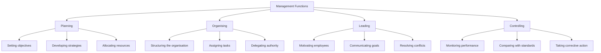

# Basics of Management

> [!abstract] Overview
> This topic covers the four management functions (planning, organising, leading, controlling), key business functions (HR, finance, operations, marketing, information, risk management), and the importance of SMEs and entrepreneurship in Hong Kong.

---

## 1. Management Functions

### The Four Functions

| Function | Description | Key Activities |
|----------|-------------|----------------|
| **Planning** | Setting goals and deciding how to achieve them | Strategic planning, operational planning, forecasting |
| **Organising** | Arranging resources and tasks to achieve objectives | Departmentalisation, delegation, coordination |
| **Leading** | Influencing and motivating employees to work towards goals | Motivation, communication, leadership styles |
| **Controlling** | Monitoring performance and making corrections | Setting standards, measuring performance, corrective action |

### Principles of Effective Management

| Principle | Explanation |
|-----------|-------------|
| **Division of work** | Specialisation increases efficiency and output |
| **Unity of command** | Each employee should receive orders from only one superior |
| **Unity of direction** | One plan of action for a group of activities with the same objective |
| **Balancing authority and responsibility** | Authority should match responsibility |

> [!tip] Exam Tip
> When asked to evaluate a manager's effectiveness, systematically assess all four functions. DSE markers reward structured, multi-functional analysis.

---

## 2. Key Business Functions

| Function | Role | Importance |
|----------|------|------------|
| **Human Resources Management** | Recruitment, training, appraisal, reward management | Ensures the right people with the right skills |
| **Financial Management** | Budgeting, financial analysis, investment decisions | Ensures adequate funds and financial health |
| **Operations Management** | Production, quality control, supply chain | Delivers products/services efficiently |
| **Marketing Management** | Market research, product development, promotion | Identifies and satisfies customer needs |
| **Information Management** | Data collection, processing, reporting | Supports decision-making across all functions |
| **Risk Management** | Risk identification, assessment, mitigation | Protects the business from uncertainties |

> [!important] Integration
> These functions are **interrelated and integrated**. A decision in one function affects others. For example, expanding production (operations) requires hiring more staff (HR) and raising capital (finance).

---

## 3. Small and Medium Enterprises (SMEs)

### Characteristics of SMEs

| Criteria (HK Definition) | Manufacturing | Non-Manufacturing |
|--------------------------|---------------|-------------------|
| Number of employees | < 100 | < 50 |

### Importance to Hong Kong Economy

- Account for **98%+ of all business establishments**
- Employ about **45% of private sector workforce**
- Contribute significantly to GDP
- Serve as a breeding ground for **entrepreneurship and innovation**
- Provide diverse goods and services to the community

### Importance of Entrepreneurship

> [!note] Definition
> An **entrepreneur** is someone who takes on financial risks to start and run a business, combining innovation, organisation, and management skills.

Key entrepreneurial qualities:
- **Risk-taking** — willingness to invest capital and face uncertainty
- **Innovation** — creating new products, services, or processes
- **Decision-making** — making timely and informed business decisions
- **Resilience** — persisting through challenges and setbacks

> [!example] HK Context
> Hong Kong's entrepreneurial spirit is evident in its dynamic SME sector. From local cha chaan tengs (茶餐廳) to tech startups, SMEs drive economic diversity and create employment opportunities.

---

## Related

- [[Business Environment]] — The external environment in which management operates
- [[Financial Reporting by Business Ownership]] — Accounting for different business forms
- [[Incomplete Records]] — SMEs often have incomplete records
- [[BAFS Index]]
