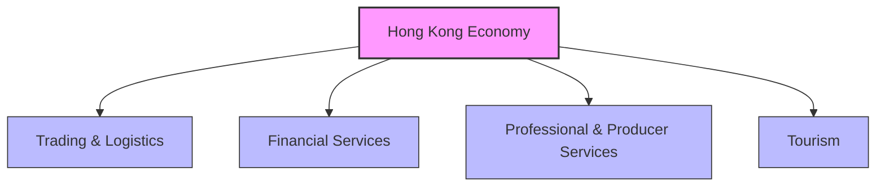
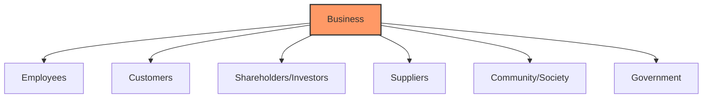

# Business Environment

> [!abstract] Overview
> This topic covers the role of business in the Hong Kong economy, the major forms of business ownership (sole proprietorship, partnership, limited company), and the importance of business ethics and social responsibility. It forms the foundation for understanding how businesses operate within a dynamic environment.

---

## 1. Hong Kong Business Environment

### Role and Importance of Business

Hong Kong is a service-oriented, knowledge-driven economy built on **four pillar industries**:

> [!important] Key Point
> Business transforms ideas into **high value-added services**, driving Hong Kong's economic growth and competitiveness.

### PESTLE Factors Affecting Business Decisions

| Factor | Examples in HK |
|--------|----------------|
| **Political** | One Country Two Systems, Mainland policies, trade agreements |
| **Economic** | GDP growth, interest rates, inflation, exchange rates |
| **Social** | ageing population, income inequality, consumer trends |
| **Technological** | FinTech, e-commerce, AI adoption |
| **Legal** | Employment ordinance, Companies Ordinance, competition law |
| **Environmental** | Carbon neutrality targets, waste reduction regulations |

> [!tip] Exam Tip
> When analysing business environment questions, always consider **multiple PESTLE factors** and link them to specific business decisions. DSE markers reward multi-perspective analysis.

---

## 2. Forms of Business Ownership

### Comparison Table

| Feature | Sole Proprietorship | Partnership | Limited Company |
|---------|-------------------|-------------|-----------------|
| **Owners** | One person | 2–20 partners | Shareholders |
| **Legal status** | Not a separate legal entity | Not a separate legal entity | Separate legal entity |
| **Liability** | Unlimited | Unlimited (jointly & severally) | Limited to shares/debentures |
| **Capital** | Owner's savings | Partners' contributions | Share capital + loan capital |
| **Decision-making** | Owner decides | Partners consult | Board of directors |
| **Continuity** | Dies with owner | Dissolved on death/retirement of partner | Perpetual succession |
| **Regulation** | Minimal | Partnership Act | Companies Ordinance |
| **Confidentiality** | Private | Private | Must file annual returns |

### Advantages and Disadvantages

**Sole Proprietorship**
- ✅ Easy to set up, full control, keeps all profits
- ❌ Unlimited liability, limited capital, burden of work

**Partnership**
- ✅ More capital, shared workload, specialised skills
- ❌ Unlimited liability, potential conflicts, limited life

**Limited Company**
- ✅ Limited liability, separate legal entity, easier to raise capital
- ❌ More regulation, higher costs, less privacy, double taxation

> [!example] HK Context
> Many HK SMEs start as sole proprietorships or partnerships before incorporating as limited companies (有限公司) as they grow. Examples: many local restaurants and trading firms.

### Multinational Corporations (MNCs) in HK

- HK serves as a **regional headquarters** for many MNCs due to:
  - Free port status (no trade barriers)
  - Simple and low tax system
  - Rule of law and efficient legal system
  - Strategic location connecting Mainland China and international markets

---

## 3. Business Ethics and Social Responsibilities

### What is Business Ethics?

> [!note] Definition
> **Business ethics** refers to the moral principles and standards that guide behaviour in the world of business. It distinguishes between right and wrong in business decisions.

### Why Businesses Should Be Ethically Responsible

1. **Stakeholder expectations** — employees, customers, investors, community all expect responsible behaviour
2. **Long-term sustainability** — ethical practices build trust and reputation
3. **Legal compliance** — many ethical issues overlap with legal requirements
4. **Competitive advantage** — ethical brands attract customers and talent

### Key Stakeholders

### Examples of Ethical Issues

| Issue | Ethical Dilemma |
|-------|----------------|
| Environmental pollution | Profit vs. environmental protection |
| Worker exploitation | Cost reduction vs. fair wages |
| False advertising | Short-term sales vs. customer trust |
| Product safety | Cost cutting vs. consumer safety |
| Corruption/bribery | Business gain vs. legal/moral standards |

> [!warning] DSE Common Question
> "Discuss whether the prime objective of running a business is to maximise profit." — Use both **for** (economic role, shareholder wealth) and **against** (stakeholder theory, CSR) arguments.

### Corporate Social Responsibility (CSR)

Businesses can demonstrate social responsibility through:
- Environmental protection initiatives
- Fair trade practices
- Community investment and charity
- Ethical labour practices
- Transparent reporting

---

## Related

- [[Basics of Management]] — How management functions apply within the business environment
- [[Personal Financial Management]] — How individuals interact with businesses as consumers and investors
- [[Purposes and Role of Accounting]] — Accounting provides information for business decisions
- [[BAFS Index]]
