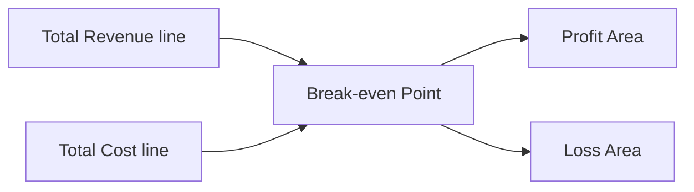

# Cost Accounting for Decision-Making

> [!abstract] Overview
> Cost accounting provides the quantitative information managers need to make business decisions. This topic covers relevant costs, CVP analysis, and common decision scenarios including make-or-buy, special orders, and equipment replacement.

---

## 1. Relevant Costs for Decision-Making

| Cost Type | Relevant? | Reason |
|-----------|-----------|--------|
| Sunk costs | No | Already incurred, cannot be changed |
| Incremental costs | Yes | Future costs that differ between alternatives |
| Opportunity costs | Yes | Benefit foregone by choosing one option |
| Future costs (same across alternatives) | No | No difference between options |

> [!warning] Golden Rule
> Only consider **future costs that differ** between alternatives. Ignore sunk costs and costs that are the same regardless of the decision.

---

## 2. Cost-Volume-Profit (CVP) Analysis

### Key Formulas

$$\text{Contribution per unit} = \text{Selling price per unit} - \text{Variable cost per unit}$$

$$\text{Break-even point (units)} = \frac{\text{Fixed costs}}{\text{Contribution per unit}}$$

$$\text{Break-even point (\$)} = \frac{\text{Fixed costs}}{\text{Contribution/sales ratio}}$$

$$\text{Margin of safety} = \frac{\text{Actual/Budgeted sales} - \text{Break-even sales}}{\text{Actual/Budgeted sales}} \times 100\%$$

$$\text{Target profit units} = \frac{\text{Fixed costs} + \text{Target profit}}{\text{Contribution per unit}}$$

> [!example] Worked Example
> Selling price = \$50, Variable cost = \$30, Fixed costs = \$40,000
>
> Contribution per unit = \$50 − \$30 = **\$20**
>
> Break-even point = \$40,000 ÷ \$20 = **2,000 units**
>
> At 2,500 units: Margin of safety = (2,500 − 2,000) / 2,500 = **20%**

### CVP Graph

---

## 3. Decision Scenarios

### Make or Buy Decision

| Consideration | Make | Buy |
|---------------|------|-----|
| Variable costs | Include | Exclude |
| Avoidable fixed costs | Include | Exclude |
| Opportunity cost of capacity | Include | Exclude |
| Unavoidable fixed costs | Exclude | Exclude |

> [!tip] Key Question
> "Should we make this component ourselves or buy it from an outside supplier?"
> Only include **avoidable costs** in the make option. Compare with the purchase price.

### Accept or Reject Special Order

| Consideration | Treatment |
|---------------|-----------|
| Incremental revenue from order | Compare with |
| Incremental costs (variable + any specific fixed costs) | Determine profitability |
| Existing capacity | Can we fulfil the order without affecting regular sales? |
| Opportunity cost | Lost contribution from regular sales if capacity is constrained |

### Retain or Replace Equipment

| Consideration | Treatment |
|---------------|-----------|
| Book value of old equipment | Sunk cost — ignore |
| Disposal value of old equipment | Relevant (cash inflow) |
| Cost of new equipment | Relevant (cash outflow) |
| Operating cost savings | Relevant (incremental benefit) |

### Sell or Process Further

> [!note] Decision Rule
> Process further only if **incremental revenue > incremental processing cost**.

### Eliminate or Retain Unprofitable Segment

| Consideration | Treatment |
|---------------|-----------|
| Revenue lost | Deduct |
| Variable costs saved | Add back |
| Avoidable fixed costs | Add back |
| Unavoidable fixed costs | Ignore (continue regardless) |

---

## 4. Multi-Product CVP Analysis

When a business sells multiple products:

$$\text{Weighted average contribution} = \frac{\text{Total contribution}}{\text{Total units sold}}$$

Or use sales mix ratio:

$$\text{WACM} = \sum (\text{Contribution per unit} \times \text{Sales mix proportion})$$

---

## Related

- [[Cost Classification and Terminology]] — Understanding cost types for decision-making
- [[Marginal and Absorption Costing]] — The costing methods that support CVP analysis
- [[BAFS Index]]
