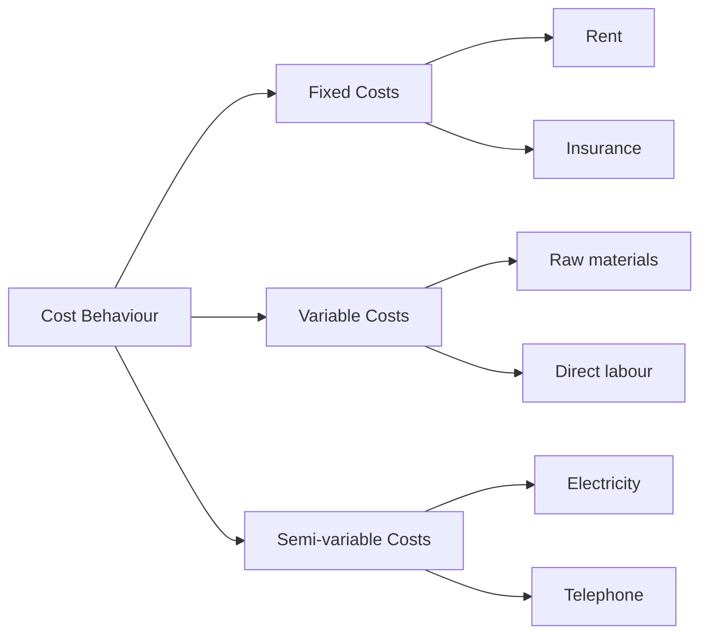

# Cost Classification and Terminology

> [!abstract] Overview
> Cost accounting provides information for internal decision-making. This topic covers how costs are classified by nature, behaviour, function, and relevance to decision-making.

---

## 1. Why Cost Accounting Matters

> [!note] Definition
> **Cost accounting** is the process of collecting, analysing, and reporting cost information for internal management use. It helps managers:
> - Set selling prices
> - Control costs
> - Make product mix decisions
> - Evaluate profitability of products/services

---

## 2. Cost Classifications

### By Behaviour

| Cost Type | Definition | Example |
|-----------|------------|---------|
| **Fixed costs** | Remain constant regardless of output level | Rent, insurance, salaries |
| **Variable costs** | Change in total in proportion to output | Raw materials, direct labour |
| **Semi-variable (mixed) costs** | Have both fixed and variable components | Electricity (standing charge + usage) |

### By Traceability

| Cost Type | Definition | Example |
|-----------|------------|---------|
| **Direct costs** | Can be directly attributed to a specific cost unit/product | Direct materials, direct labour |
| **Indirect costs (overheads)** | Cannot be directly attributed to a single cost unit | Factory rent, supervisor salary |

### By Function

| Cost Type | Definition |
|-----------|------------|
| **Production/manufacturing costs** | Costs of making the product (materials, labour, factory overheads) |
| **Administrative costs** | General management and office costs |
| **Selling and distribution costs** | Costs of marketing, delivering, and selling products |

### By Relevance to Decision-Making

| Cost Type | Definition | Example |
|-----------|------------|---------|
| **Sunk costs** | Costs already incurred, cannot be changed | Original purchase price of equipment |
| **Incremental (marginal) costs** | Additional cost of producing one more unit | Extra materials for one more product |
| **Opportunity costs** | Benefit foregone by choosing one alternative over another | Interest lost by investing in equipment instead of bank |
| **Relevant costs** | Future costs that differ between alternatives | Used in make-or-buy decisions |

> [!warning] Key Point
> **Sunk costs are NEVER relevant** to decision-making. They have already been incurred and cannot be recovered regardless of the decision made.

---

## 3. Factory vs Administrative Overheads

| Factory Overheads | Administrative Overheads |
|-------------------|--------------------------|
| Factory rent | Office rent |
| Factory power | Office salaries |
| Depreciation of machinery | Depreciation of office equipment |
| Factory supervisor salary | Accountant salary |

> [!tip] Exam Tip
> When preparing income statements, distinguish between production costs (used in cost of goods sold) and non-production costs (shown as operating expenses). This distinction is crucial for marginal vs absorption costing.

---

## Related

- [[Marginal and Absorption Costing]] — Applying cost classifications to income statements
- [[Cost Accounting for Decision-Making]] — Using cost information for business decisions
- [[BAFS Index]]
