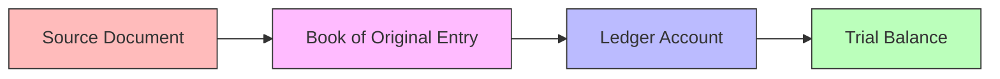

# Books of Original Entry and Ledgers

> [!abstract] Overview
> Transactions are first recorded in **books of original entry** (journals) and then posted to **ledger accounts**. This topic covers the functions of each book, the major types of ledgers, and the posting process.

---

## 1. Books of Original Entry (Journals)

> [!note] Definition
> Books of original entry are where transactions are **first recorded** in chronological order, before being posted to ledger accounts.

### Types of Books of Original Entry

| Book | Records | Entries |
|------|---------|---------|
| **Sales journal** | Credit sales of goods | Dr Trade receivables, Cr Sales |
| **Purchases journal** | Credit purchases of goods | Dr Purchases, Cr Trade payables |
| **Sales returns journal** | Returns inward (goods returned by customers) | Dr Sales returns, Cr Trade receivables |
| **Purchases returns journal** | Returns outward (goods returned to suppliers) | Dr Trade payables, Cr Purchases returns |
| **Cash book** | All cash and bank transactions | Dr/Cr Cash and Bank |
| **General journal** | Non-routine transactions (adjustments, corrections) | Various |

### Cash Book (Three-Column)

| Date | Particulars | Fol | Receipts (Dr) | Date | Particulars | Fol | Payments (Cr) |
|------|-------------|-----|---------------|------|-------------|-----|---------------|
| | | | Discount Allowed | | | | Discount Received |
| | | | Cash | | | | Cash |
| | | | Bank | | | | Bank |

> [!tip] Exam Tip
> The cash book serves as both a book of original entry AND a ledger account for cash/bank. When balancing, remember to account for discounts, outstanding items, and bank overdrafts.

---

## 2. Types of Ledgers

| Ledger | Purpose | Contains |
|--------|---------|----------|
| **General Ledger** | Main ledger with all non-subsidiary accounts | Assets, liabilities, equity, expenses, revenue |
| **Sales Ledger (Receivables)** | Individual accounts for credit customers | Trade receivables |
| **Purchases Ledger (Payables)** | Individual accounts for credit suppliers | Trade payables |

### Ledger Account Format

```
         Account Name
    ┌──────────┬──────────┐
    │  Debit   │  Credit  │
    │   (Dr)   │   (Cr)   │
    ├──────────┼──────────┤
    │ Date  Bal b/d │ Date  Bal b/d │
    │ ...          │ ...          │
    ├──────────┼──────────┤
    │ Total    │ Total    │
    └──────────┴──────────┘
```

---

## 3. Posting Process



> [!example] Worked Example
> **Transaction:** Sold goods to ABC Ltd for \$3,000 on credit.
>
> **Step 1 — Sales Journal:**
> | Date | Customer | Fol | Amount |
> |------|----------|-----|--------|
> | Jun 1 | ABC Ltd | SL1 | \$3,000 |
>
> **Step 2 — Sales Ledger (ABC Ltd account):**
> | Date | Particulars | Fol | Dr | Cr | Balance |
> |------|-------------|-----|----|----|---------|
> | Jun 1 | Sales | SJ | 3,000 | | 3,000 (Dr) |

---

## 4. Contra Entries

When the same entity appears in both the sales and purchases ledger, the balances can be **contra'd off** against each other in the general ledger, reducing the total of receivables and payables.

---

## Related

- [[Double Entry System]] — The rules governing debit and credit
- [[Trial Balance]] — The output of balancing all ledger accounts
- [[Control System]] — Bank reconciliation and error correction
- [[BAFS Index]]
