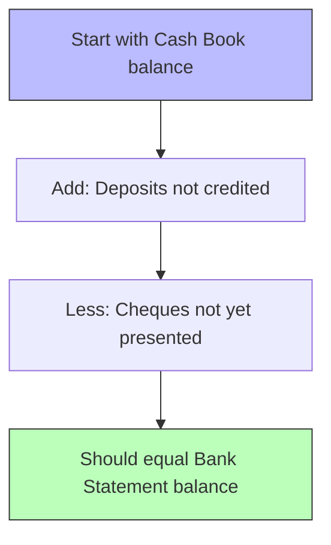

# Control System

> [!abstract] Overview
> Control systems ensure the accuracy and reliability of accounting records. This topic covers bank reconciliation statements and the correction of accounting errors using suspense accounts.

---

## 1. Bank Reconciliation Statement

> [!note] Definition
> A **bank reconciliation statement** explains the difference between the cash book (bank column) balance and the bank statement balance at a particular date.

### Why Differences Arise

| Cash Book Shows | Bank Statement Shows | Effect |
|-----------------|---------------------|--------|
| Unpresented cheques (issued but not yet cashed) | Not yet recorded | Cash book > Bank statement |
| Outstanding deposits (deposited but not yet credited) | Not yet recorded | Bank statement > Cash book |
| Bank charges/interest | Not yet recorded in cash book | Bank statement > Cash book |
| Direct debits/standing orders | Not yet recorded in cash book | Bank statement > Cash book |
| Dishonoured cheques | Not yet recorded in cash book | Bank statement > Cash book |

### Preparation Process

### Format

| | \$ | \$ |
|---|---|---|
| Balance as per cash book (adjusted) | | X |
| Less: Unpresented cheques | | |
| Cheque No. 123 | X | |
| Cheque No. 456 | X | (X) |
| Add: Outstanding deposits | | |
| Deposit of 15 June | X | X |
| **Balance as per bank statement** | | **X** |

> [!tip] Exam Tip
> Always start from the **cash book** balance and adjust it to reach the bank statement balance (or vice versa). The question will specify which direction. Remember to update the cash book FIRST for items the bank has recorded but you haven't.

---

## 2. Correction of Errors

### Types of Errors

| Error Type | Description | Detected by TB? |
|------------|-------------|-----------------|
| **Error of omission** | Transaction completely left out | No |
| **Error of commission** | Posted to wrong account of same type | No |
| **Error of principle** | Posted to wrong class of account | No |
| **Error of original entry** | Wrong amount in both Dr and Cr | No |
| **Compensating error** | Two errors offset each other | No |
| **Error of reversal** | Dr and Cr swapped | No |
| **Suspense account errors** | TB不平衡, placed in suspense | Yes (不平衡) |

### Correcting Entries

> [!example] Worked Example 1 — Error of Commission
> Purchase of furniture \$5,000 was debited to purchases account instead of furniture account.
>
> **Correcting entry:**
> | Account | Dr | Cr |
> |---------|----|----|
> | Furniture (Asset ↑) | 5,000 | |
> | Purchases (Expense ↓) | | 5,000 |

> [!example] Worked Example 2 — Error of Principle
> Wages \$2,000 was debited to motor vehicle account.
>
> **Correcting entry:**
> | Account | Dr | Cr |
> |---------|----|----|
> | Wages (Expense ↑) | 2,000 | |
> | Motor vehicles (Asset ↓) | | 2,000 |

### Suspense Account Process

1. Trial balance doesn't balance → difference goes to suspense account
2. Identify and correct each error (some affect suspense, some don't)
3. Once all errors found, suspense account balance = zero

> [!warning] Important
> Errors that affect **only one side** (omission, commission, principle, original entry, reversal) will involve the suspense account when corrected. Errors that affect **both sides equally** (compensating) do not involve the suspense account.

---

## Related

- [[Trial Balance]] — The starting point for bank reconciliation and error detection
- [[Books of Original Entry and Ledgers]] — Where errors may originate
- [[BAFS Index]]
