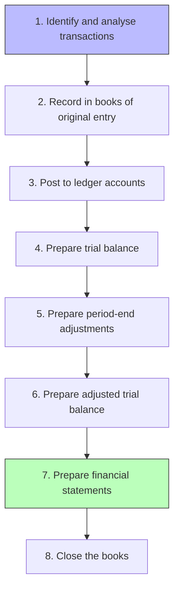

# Purposes and Role of Accounting

> [!abstract] Overview
> Accounting is often called the **"language of business"**. This topic explains why accounting matters, its key functions, and the flow of the accounting cycle from transaction to financial statements.

---

## 1. Importance of Accounting

> [!note] Definition
> **Accounting** is the process of identifying, measuring, recording, and communicating financial information to enable users to make informed decisions.

### Who Uses Accounting Information?

| Internal Users | External Users |
|----------------|----------------|
| Management (decision-making) | Investors (investment decisions) |
| Employees (job security, wages) | Creditors (lending decisions) |
| Board of directors (governance) | Government (taxation, regulation) |
| | Customers (supplier stability) |
| | Public (transparency) |

> [!important] Key Point
> Accounting serves both **internal** (management accounting) and **external** (financial accounting) users. The focus of this module is primarily on **financial accounting** — preparing financial statements for external users.

---

## 2. Functions of Accounting

1. **Recording** — Systematically recording all business transactions
2. **Classifying** — Grouping transactions into categories (assets, liabilities, etc.)
3. **Summarising** — Preparing financial statements from classified data
4. **Analysing** — Interpreting financial information through ratio analysis
5. **Communicating** — Reporting financial information to relevant stakeholders

---

## 3. The Accounting Cycle

> [!tip] Exam Tip
> The accounting cycle is the backbone of financial accounting. Every topic in the elective part connects to one or more steps in this cycle. Understand each step thoroughly before moving on.

### Detailed Steps

| Step | Action | Output |
|------|--------|--------|
| 1 | Identify source documents (invoices, receipts) | Source documents |
| 2 | Record transactions in journals | Books of original entry |
| 3 | Transfer (post) to ledger accounts | Ledger accounts |
| 4 | Check arithmetic accuracy | Trial balance |
| 5 | Make accruals, depreciation, provisions | Adjusting entries |
| 6 | Verify adjusted balances | Adjusted trial balance |
| 7 | Prepare income statement & SFP | Financial statements |
| 8 | Transfer nominal accounts to P&L | Closed books |

---

## Related

- [[Double Entry System]] — The recording mechanism used in Step 2
- [[Books of Original Entry and Ledgers]] — Detailed look at Steps 2–3
- [[Trial Balance]] — Step 4 in detail
- [[Period-End Adjustments]] — Step 5 in detail
- [[BAFS Index]]
