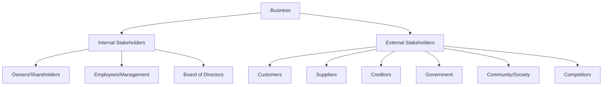
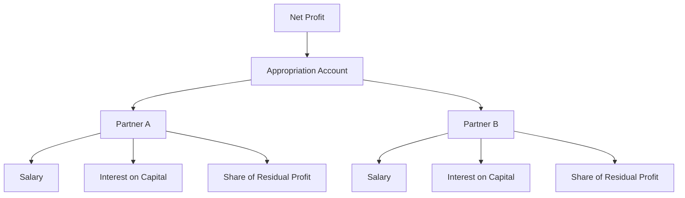

# Exam Scope Study Notes

> [!info] Exam Scope Summary
> Based on the provided exam scope, this note consolidates all examinable content for focused revision.

---

## Compulsory Part: Ch3 - Stakeholders (MC & SQ)

> [!exam] Only 'stakeholders' is examable from Ch3

### Key Stakeholders of a Business

### Stakeholder Groups and Their Interests

| Stakeholder | Primary Interest | Conflict Example |
|-------------|------------------|------------------|
| **Owners/Shareholders** | Profit maximisation, ROI | May conflict with employee welfare |
| **Employees** | Job security, fair wages, good conditions | May conflict with cost reduction |
| **Customers** | Quality products, fair prices | May conflict with profit margins |
| **Suppliers** | Prompt payment, regular orders | May conflict with buyer's cost cutting |
| **Creditors** | Timely repayment | May conflict with business expansion |
| **Government** | Tax revenue, legal compliance | May conflict with profit minimisation |
| **Community** | Employment, environmental protection | May conflict with industrial expansion |

### Stakeholder Conflict Analysis

> [!exam] Common Exam Question
> "Discuss whether the prime objective of running a business is to maximise profit."

**Arguments FOR profit maximisation:**
- Economic role of business: generate wealth for owners
- Shareholder wealth maximisation is primary fiduciary duty
- Profits enable reinvestment, growth, and survival
- Creates employment and economic value

**Arguments AGAINST (stakeholder theory):**
- Businesses have responsibilities to ALL stakeholders
- Ethical considerations: fair wages, environmental protection
- Long-term sustainability vs short-term profit
- CSR builds trust, reputation, and competitive advantage
- Legal compliance and social licence to operate

### Balancing Stakeholder Interests

| Strategy | Description |
|----------|-------------|
| **Corporate Governance** | Board accountability, transparency, independent directors |
| **CSR Reporting** | Environmental, social, governance (ESG) disclosures |
| **Employee Share Schemes** | Align employee and shareholder interests |
| **Ethical Codes of Conduct** | Guide decision-making across stakeholder groups |

---

## Elective Part: Ch13-15 Partnership (Question)

> [!exam] Partnership accounts - question format

### Partnership Account Structure

### Appropriation Account Format

| | $ | $ |
|---|---|---|
| **Net profit for the year** | | X |
| Less: Partner salaries | | (X) |
| Less: Interest on capital | | (X) |
| **Residual profit** | | X |
| Share of profit: | | |
| Partner A (ratio) | X | |
| Partner B (ratio) | X | (X) |
| **Total distributed** | | X |

### Current Account Format

| Partner A | Dr | Cr |
|-----------|----|----|
| Drawings | X | |
| Share of profit | | X |
| Salary | | X |
| Interest on capital | | X |
| Balance c/d | | X |

### Changes in Partnership

> [!exam] Key Scenarios

| Event | Treatment |
|-------|-----------|
| **Change in profit-sharing ratio** | Revalue assets, adjust capital accounts |
| **Admission of new partner** | Revalue assets, calculate goodwill, adjust capital |
| **Retirement of partner** | Revalue assets, calculate goodwill, adjust capital |

### Goodwill

> [!note] Definition
> **Goodwill** is the value of a business's reputation, customer base, and other intangible factors that enable it to earn higher profits than a new business in the same industry.

**Factors affecting goodwill:**
- Quality of management
- Brand reputation
- Customer loyalty
- Location
- Profit track record

### Worked Example

> [!example] Partnership Question
> Partners A and B share profits 3:2. C is admitted for 1/4 share.
> Revaluation shows equipment has increased by $10,000.
>
> Dr Equipment: $10,000
> Cr Revaluation account: $10,000
>
> Revaluation profit shared: A = $6,000, B = $4,000

---

## Elective Part: Ch23 Accounting Concepts (Question)

> [!exam] Accounting principles and conventions - question format

### Key Accounting Principles

| Principle | Core Idea | Exam Application |
|-----------|-----------|------------------|
| **Business Entity** | Business ≠ owner | Explain why drawings are not expenses |
| **Going Concern** | Business will continue | Justifies cost-based valuation |
| **Historical Cost** | Record at original cost | Provides verifiable values |
| **Consistency** | Same methods each period | Enables comparison across periods |
| **Accrual** | Record when earned/incurred | More accurate profit measurement |
| **Matching** | Match expenses to revenues | Proper profit determination |
| **Realisation** | Record revenue when earned | Prevents premature revenue recognition |
| **Prudence** | Don't overstate assets/income | Protects users from misleading info |
| **Materiality** | Focus on significant items | Avoids unnecessary complexity |
| **Money Measurement** | Only record monetary items | Defines the scope of accounting |

### Exam Application Questions

> [!exam] Common Question Types

**Q: "Explain which accounting principle is being applied when inventory is valued at the lower of cost and NRV."**
- Answer: **Prudence** - ensures inventory is not overstated

**Q: "Why are personal transactions of the owner not included in the business's financial statements?"**
- Answer: **Business Entity** principle - the business is treated as a separate entity from its owner(s)

**Q: "Explain why depreciation is charged on assets even if their market value has increased."**
- Answer: **Historical Cost** principle - assets are recorded at their original cost, not current market value

**Q: "Why must accounting policies be applied consistently from one period to the next?"**
- Answer: **Consistency** principle - enables comparison across periods

**Q: "Why are accrued expenses recorded in the period they are incurred, not when cash is paid?"**
- Answer: **Accrual** principle - revenue and expenses are recorded when earned or incurred

### Shortcomings of Accounting Principles

| Principle | Limitation |
|-----------|------------|
| Historical cost | Does not reflect current value (inflation) |
| Prudence | May understate assets/income |
| Consistency | May prevent adoption of better methods |
| Money measurement | Ignores non-financial factors |
| Going concern | May not be valid if business is failing |

---

## Elective Part: Ch24-27 Cost Accounting (MC & Question)

> [!exam] Cost accounting - multiple choice AND question format

### Cost Classifications

| Cost Type | Definition | Example |
|-----------|------------|---------|
| **Fixed costs** | Remain constant regardless of output level | Rent, insurance, salaries |
| **Variable costs** | Change in total in proportion to output | Raw materials, direct labour |
| **Semi-variable costs** | Have both fixed and variable components | Electricity (standing charge + usage) |
| **Direct costs** | Can be directly attributed to a specific cost unit | Direct materials, direct labour |
| **Indirect costs (overheads)** | Cannot be directly attributed to a single cost unit | Factory rent, supervisor salary |
| **Sunk costs** | Costs already incurred, cannot be changed | Original purchase price of equipment |
| **Incremental costs** | Additional cost of producing one more unit | Extra materials for one more product |
| **Opportunity costs** | Benefit foregone by choosing one alternative | Interest lost by investing in equipment |

> [!warning] Golden Rule
> **Sunk costs are NEVER relevant** to decision-making. They have already been incurred and cannot be recovered regardless of the decision made.

### Marginal vs Absorption Costing

| Feature | Marginal Costing | Absorption Costing |
|---------|-----------------|-------------------|
| **Fixed production costs** | Treated as period costs | Treated as product costs |
| **Inventory valuation** | Variable production costs only | Variable + fixed production costs |
| **Contribution shown?** | Yes | No |
| **Profit when production > sales** | Lower profit | Higher profit |
| **Profit when production < sales** | Higher profit | Lower profit |

### Income Statement Formats

**Marginal Costing:**
| | $ |
|---|---|
| **Sales** | X |
| Less: Variable costs | |
| Variable cost of goods sold | |
| Opening inventory | X |
| Add: Variable production costs | X |
| Less: Closing inventory | (X) |
| Variable selling & admin costs | (X) |
| **Contribution** | **X** |
| Less: Fixed costs | |
| Fixed production overheads | (X) |
| Fixed selling & admin costs | (X) |
| **Net profit** | **X** |

**Absorption Costing:**
| | $ |
|---|---|
| **Sales** | X |
| Less: Cost of goods sold | |
| Opening inventory | X |
| Add: Production costs (variable + fixed) | X |
| Less: Closing inventory | (X) |
| **Gross profit** | **X** |
| Less: Non-production costs | |
| Selling & admin costs (variable + fixed) | (X) |
| **Net profit** | **X** |

> [!important] Key Formula
> $$\text{Profit difference} = \text{Change in inventory units} \times \text{Fixed production overhead rate per unit}$$
>
> When inventory **increases**: Absorption profit > Marginal profit
> When inventory **decreases**: Marginal profit > Absorption profit

### CVP Analysis Formulas

$$\text{Contribution per unit} = \text{Selling price per unit} - \text{Variable cost per unit}$$

$$\text{Break-even point (units)} = \frac{\text{Fixed costs}}{\text{Contribution per unit}}$$

$$\text{Break-even point (\$)} = \frac{\text{Fixed costs}}{\text{Contribution/sales ratio}}$$

$$\text{Margin of safety} = \frac{\text{Actual/Budgeted sales} - \text{Break-even sales}}{\text{Actual/Budgeted sales}} \times 100\%$$

$$\text{Target profit units} = \frac{\text{Fixed costs} + \text{Target profit}}{\text{Contribution per unit}}$$

### Decision Scenarios

| Scenario | Key Consideration |
|----------|-------------------|
| **Make or Buy** | Only include avoidable costs in make option |
| **Special Order** | Compare incremental revenue with incremental costs |
| **Equipment Replacement** | Book value is sunk cost - ignore it |
| **Sell or Process Further** | Process only if incremental revenue > incremental cost |

---

## Elective Part: Ch11 Depreciation (MC)

> [!exam] Depreciation - multiple choice format

### Methods of Depreciation

| Method | Formula | Best For |
|--------|---------|----------|
| **Straight-line** | $\frac{\text{Cost} - \text{Residual value}}{\text{Useful life}}$ | Assets with uniform usage |
| **Reducing balance** | $\text{NBV at start of year} \times \text{Rate\%}$ | Assets that lose value quickly |
| **Units of production** | $\frac{\text{Cost} - \text{Residual value}}{\text{Total estimated units}} \times \text{Units produced}$ | Assets with variable usage |

### Journal Entry

| Account | Dr | Cr |
|---------|----|----|
| Depreciation expense (Expense ↑) | X | |
| Accumulated depreciation (Contra-asset ↑) | | X |

### Disposal of Asset

When an asset is sold:

1. Update depreciation to date of disposal
2. Remove cost and accumulated depreciation
3. Record sale proceeds
4. Calculate and record **gain or loss on disposal**

| Account | Dr | Cr |
|---------|----|----|
| Cash/Bank (received) | X | |
| Accumulated depreciation | X | |
| Loss on disposal (if any) | X | |
| Non-current asset (cost) | | X |
| Gain on disposal (if any) | | X |

### Capital vs Revenue Expenditure

| Type | Definition | Treatment |
|------|------------|-----------|
| **Capital expenditure** | Buying/improving non-current assets | Capitalise (record as asset, depreciate) |
| **Revenue expenditure** | Day-to-day operating costs | Expense in income statement |

> [!warning] Misclassification
> If capital expenditure is treated as revenue expenditure, profits are **understated** and assets are **understated**. The reverse is also true.

### Inventory Valuation

> [!important] IAS 2 / HKAS 2
> Inventory must be valued at the **lower of cost and NRV**. This ensures inventory is not overstated.

- **Cost** = purchase price + import duties + transport + other directly attributable costs
- **NRV** = estimated selling price − estimated costs to complete − estimated costs to sell

### Weighted Average Cost

$$\text{Weighted average cost per unit} = \frac{\text{Total cost of goods available for sale}}{\text{Total units available for sale}}$$

---

## Quick Reference Formulas

| Formula | Equation |
|---------|----------|
| **Break-even (units)** | Fixed costs ÷ Contribution per unit |
| **Break-even ($)** | Fixed costs ÷ Contribution/Sales ratio |
| **Margin of safety** | (Actual sales − Break-even sales) ÷ Actual sales |
| **Straight-line depreciation** | (Cost − Residual value) ÷ Useful life |
| **Reducing balance depreciation** | NBV at start of year × Rate% |
| **Weighted average cost** | Total cost of goods available ÷ Total units available |

---

## Related

- [[Exam Format and Tips]]
- [[Key Formulas Reference]]
- [[BAFS Index]]
