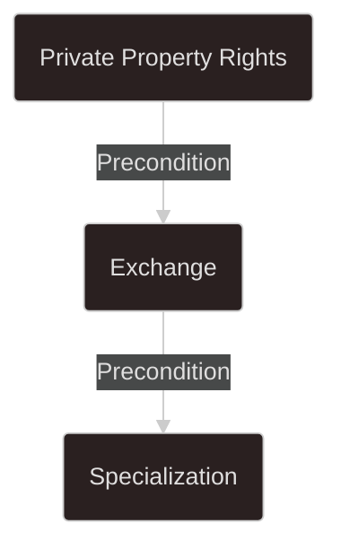
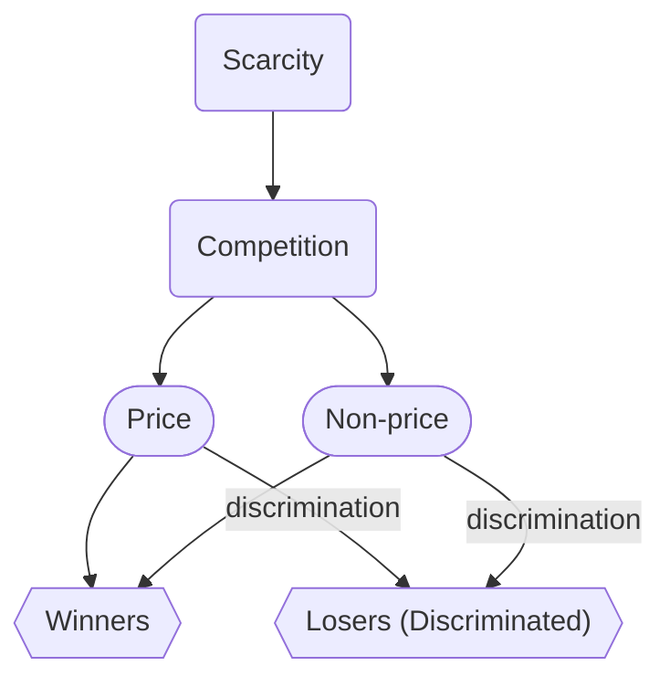
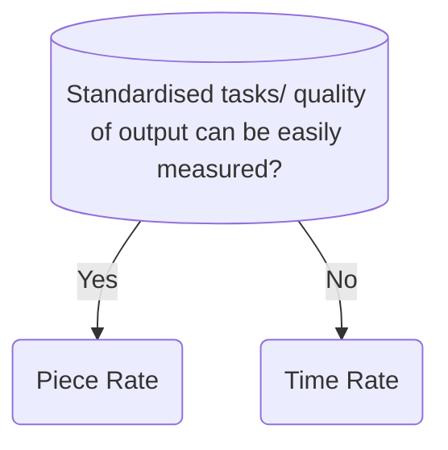

# Chapter 1: Basic Economic Concepts

## Economics as a Social Science

> [!note] Definition
> Economics is a ==social science== that studies how humans use ==limited resources== to satisfy ==unlimited wants==.

### Two Branches of Economics

1. **Microeconomics**: studies the choices of individual decision makers
2. **Macroeconomics**: studies the performance of the whole economy

## Scarcity

> [!warning] Key Concept
> When resources are insufficient to satisfy all our wants, **scarcity** arises.

- In the real world, scarcity always exists because we have unlimited wants but limited resources.
- Because of scarcity, choices have to be made to decide what wants to satisfy and what wants to forgo.

## Opportunity Cost (OC)

> [!important] Definition
> The ==highest value option forgone== is the **opportunity cost**.

Opportunity cost changes when:

1. The value of the highest valued option forgone changes
2. The value of another option forgone increases to a point higher than the value of the original highest value option forgone to become the new highest valued option forgone.

## Full Cost

$$
\text{Full Cost} = \text{Money Cost} + \text{Non-money Cost}
$$

- **Money cost** is the highest valued alternative use of the money spent
- **Non-money cost** is the highest valued alternative use of the non-money resources spent, usually ==time==.

## Goods and Bads

### Goods

- Can satisfy human wants
- We prefer some to none

### Bads

- Not wanted
- We prefer less to more

> [!tip] Classification
> Goods are classified into ==economic goods== or ==free goods==.

| **Economic Goods**                                                  | **Free Goods**                                                    |
| ------------------------------------------------------------------- | ----------------------------------------------------------------- |
| Quantity available is insufficient to satisfy all human wants of it | Quantity available is sufficient to satisfy all human wants of it |
| At zero price, $Qd<Qs$                                              | At zero price, $Qs<Qd$                                            |
| More of it is preferred to less                                     | More of it is **not** preferred to less                           |
| People compete to obtain more economic goods                        | People **do not** compete to obtain more free goods               |
| People are willing to pay a cost to obtain it                       | People **are not** willing to pay a cost to obtain it             |
| Provision of it incurs production cost                              | Provision of it **does not** incur production cost                |

## Positive vs Normative Statements

| Criterion | Positive Statements | Normative Statements |
|-----------|--------------------|---------------------|
| Value judgement? | No | Yes |
| Refutable by facts? | Yes | No |

---

# Chapter 2: Economic Problems and Economic Activities

## Three Basic Economic Problems

### What to Produce

> [!note] Definition
> To decide the types and quantities of goods to be produced.

### How to Produce

> [!note] Definition
> To decide the way of production.

### For Whom to Produce

> [!note] Definition
> To decide the distribution of goods produced = to decide the distribution criteria.

## Different Methods of Solving the Three Economic Problems

### Customs and Traditions

### Government Command

### Market Mechanism

> [!info] Market Mechanism
> The market mechanism uses ==market prices== as signals to guide resource allocation and distribution of goods. Consumption or production decisions are made according to market prices.

## Specialization, Exchange and Private Property Rights

### Specialization

> [!note] Definition
> To specialise in producing a particular good or a particular stage of production of a good.

### Exchange

> [!important] Key Point
> A **precondition** for specialization.

### Private Property Rights

> [!important] Key Point
> A **precondition** for exchange to take place.

#### Exclusive Right to Use

- The owner has the right to exclude others from using their property.
- The owner has the right to use the property in any way they wish as long as it is lawful.

#### Exclusive Right to Receive Income

The owner has the exclusive right to receive income generated from their property.

#### Right to Transfer

The owner has the right to transfer their property to other people.

### Relationship Between Specialization, Exchange and Private Property Rights

## Scarcity, Competition and Discrimination

### Price Competition

- Those who are willing and able to pay the market price can get the resources or goods.

### Non-price Competition

- Those who meet the specific criteria (that is not price) can get the resources or goods.

---

# Chapter 3: Basic Concepts of Production

> [!note] Definition
> **Production** is the act of turning input into output. It creates value.

## Consumer Goods vs Producer Goods

- **Producer goods** / ==capital goods== are used to produce other goods and services
- **Consumer goods** are used to satisfy wants directly

## Private Goods vs Public Goods

- **Private goods** are ==rival== and ==excludable== in consumption
- **Public goods** are ==non-rival== and ==non-excludable== in consumption

### Rival in Consumption

- One's consumption of the good will reduce the amount available for others
- The good cannot be consumed by different people concurrently

### Excludable in Consumption

- It is easy for the owner to exclude non-payers from consuming the good.

## Types of Production

| Type | Description |
|------|-------------|
| **Primary** | The extraction of natural resources |
| **Secondary** | Turning raw materials into semi-finished goods or finished goods |
| **Tertiary** | Provision of services |

## Factors of Production

### Land

> [!note] Definition
> Natural resources used in production.

### Capital

> [!note] Definition
> Man-made resources used in production.

### Labour

> [!note] Definition
> Physical or mental effort a person provides in production.

### Entrepreneurship

> [!note] Definition
> Bearing risk and making production decisions.

---

# Chapter 4: Division of Labour

## Measures of Labour

### Labour Supply

$$
\text{Labour Supply} = \text{Number of workers} \times \text{Average working hours}
$$

**Unit:** man-hours

**Factors:**

- Population
- Government:
	- Minimum working age
	- Retirement age
	- Subsidy for further education
	- Importation of workers
	- Unemployment benefits
	- Maximum working hours
	- Number of public holidays

### Labour Productivity

$$
\text{Labour Productivity} = \frac{\text{Total Output}}{\text{Total Working Hours}}
$$

**Units:** units of output per man-hour

**Factors:**

- Working conditions
- Capital
- Education and training
- Management
- Technology
- Working incentives

## Mobility of Labour

### Geographical Mobility

> [!note] Definition
> Willingness and ability to move from one location to another.

**Factors:**

- Difference in wages or job opportunities
- Political and social factors
- Transportation
- Immigration and emigration policies

### Occupational Mobility

> [!note] Definition
> Willingness and ability of a worker to move from one occupation to another.

**Factors:**

- **Personal level:**
	- Wage difference
	- Whether skills are transferrable or specialised
- **Non-personal level:**
	- Entrance requirements
	- Retraining programmes

## Wage Payment Methods

### Piece Rate and Time Rate

> [!question] When to Use Which Method?

#### To Employers

**Advantages of piece rate:**

- Lower monitoring cost as workers have a higher working incentive
- Spread the risk between employers and employees

**Advantages of time rate:**

- Lower cost of monitoring as they get the same amount of wage regardless of how much output they produce, so no need to hurry
- Lower cost of calculating wage, because there is no need to calculate the amount of worker's contribution
- More stable team of workers because workers' income is more stable

#### To Employees

- They can earn more by working faster with piece rate
- They earn more stable income with time rate

### Profit Sharing, Commissions and Tips

> [!tip] Note
> Similar to Piece rate.

## Division of Labour

### Benefit of Division of Labour: Increased Productivity

- Practice makes perfect
- Save time in training
- Save time in changing tasks
- Ensure the right person for each job
- Facilitate mechanisation

### Other Advantages

- Save the cost of equipments / raise capital productivity
- Raise living standards

### Disadvantages

- Lowered job satisfaction
- Higher risk of unemployment without transferrable skills
- Over-interdependent production stages
- Excessive standardisation of products

---

# Chapter 5: Production and Costs

## Classification of Factors of Production and Production Runs

### Variable Factors and Fixed Factors

> [!note] Key Concept
> When output changes, not every input changes.

- **Variable Factors**' quantities vary when output changes.
- **Fixed factors**' quantities do not vary when output changes.

### Short-run and Long-run Production

| Period | Characteristics |
|--------|-----------------|
| **Short-run** | Has fixed factors and variable factors |
| **Long-run** | No fixed factors, only variable factors |

## Short-run Production

### Measures of Output

| Measure | Definition |
|---------|------------|
| **Total Product (TP)** | The total output from production |
| **Average Product (AP)** | Average output per unit of a factor |
| **Marginal Product (MP)** | Change in total product from one unit change of a factor |

### Law of Diminishing Marginal Returns

> [!warning] Important Law
> The law states that when more units of a variable factor keep being added to a given quantity of fixed factors, the marginal product of the variable factor will finally decrease, holding technology constant.
>
> *(Only applies to short-run production)*

## Long-run Production

> [!note] Optimal Scale
> The production scale where the average product is the lowest = **Optimal Scale**

### Internal Economies of Scale

- Able to borrow from banks at a lower interest rate due to higher goodwill and more assets
- Enjoy greater discounts in bulk purchase of goods
- Practise a larger scope of division of labour to raise labour productivity and lower average production cost
- Spread the cost of equipment over a larger output
- Spread the advertising cost over a larger output
- Spread the research & development (R&D) cost over a larger output

### Internal Diseconomies of Scale

- May become too large in scale, lowering the management efficiency
- The market may be saturated, leading to rise in marketing cost
- The firm may have large outstanding loans so the cost of further borrowing increases.

### External Economies of Scale

- Concentration of similar firms in a place creates marketing effect, lowering marketing cost.
- Lower delivery cost from suppliers (i.e. Carriage Inwards in BAFS) because suppliers can deliver goods in bulk to individual firms at once
- Lower cost of recruiting workers because workers can be attracted to the same place
- More supporting businesses available
- Transport network and other infrastructure would develop more quickly

### External Diseconomies of Scale

- Demand for related input will increase, resulting in an increase in price for such input
- The market may be saturated, leading to rise in marketing cost

---

# Chapter 6: Ownership, Expansion and Integration of Firms

> [!note] Definition
> A **firm** is a production unit that makes decisions regarding the employment of factors of production and the production of goods and services.

## Public Enterprises (Owned by the Government)

### Government Departments

- Directly managed and operated by **the government**
- Not for profit
- Mainly financed by government fund

### Public Corporation

- Managed and operated by a board of directors, which is separate from the government.
- May run on commercial principles
- Financially independent of the government

### Comparison of Government Departments and Public Corporations

#### Advantages of Public Enterprises

- They can provide services with lower price, which reduces the burden of users
- They have more information from the government, which helps for the development of the enterprises
- Easier to get loan with the backup from government

#### Disadvantage of Public Enterprises

- Lower efficiency, as they are not profit-maximising and have lower incentive to provide better goods and services.

## Private Enterprises (Owned by Private Individuals)

### Sole Proprietorship & Partnership

- Not a legal entity, meaning owners have to bear ==unlimited liability==

> [!info] Limited Liability
> The liability of an owner is limited to the amount of his investment in the firm.

#### Points of Comparison between Sole Proprietorship and Partnership

- Decision-making
- Source of capital
- Division of labour among owners
- Sharing of risk and profit

### Limited Companies

- Legal entities
- Shareholders bear limited liabilities
- Separation of ownership and management

#### Public LC vs Private LC

| Aspect | Private LC | Public LC |
|--------|------------|-----------|
| Number of owners | 1-50 | 2 or more |
| Can issue shares/bonds to public | No | Yes |
| Transfer of shares | Requires consent of board of directors | Freely transferable |
| Disclosure of financial information | Not required | Required |

#### Advantages of Private LCs

- Disclosure of financial information to the public is not necessary
- Lower risk of being taken over

#### Advantages of Public LCs

- Shares and Bonds can be issued to the public
- Shares can be freely transferred

#### Listed Companies

- Transfer shares even more freely
- Stricter regulations in order to protect the rights of shareholders

### Points of Comparison Between Non-Separate Legal Entities and Separate Legal Entities

- Limited liabilities
- Business continuity
- Profit tax rate
- Procedures for starting such a business type
- Source of capital
- Disclosure of financial information to the public

## Shares and Bonds

> [!note] Key Concept
> Issuing shares and bonds are ways for companies to raise capital.

### Differences Between Shares and Bonds

| Aspect | Shares | Bonds |
|--------|--------|-------|
| Status | Shareholders are **owners** of the company | Bondholders are **creditors** of the company |
| Voting rights | Yes | No |
| Return (dividend/interest) | Floating based on performance | Fixed |
| Capital gain | Possible when share price rises | Possible when bond price rises |
| Liquidation priority | Last | Before shareholders |
| Redemption obligation | No obligation to pay shareholders | Must redeem bonds |

### Pros and Cons of Issuing Shares

#### For Companies

**Pros:**

- There's no interest burden, meaning they do not necessarily need to distribute dividends to shareholders.
- Companies do not need to redeem the shares.

**Cons:**

- There's a higher risk of being taken over
- Existing shareholders' control over the company is diluted.

#### For Investors

**Pros:**

- Investors may receive higher dividends when a company's performance is good and enjoy capital gains when a share price rises.
- Investors can also vote at a general meeting.

**Cons:**

- Shareholders may not receive any dividend when the company's performance is unsatisfactory.
- In case of liquidation, shareholders are the last one to get back their capital invested.

### Pros and Cons of Issuing Bonds

#### For Companies

**Pros:**

- Companies can prevent a takeover.
- Existing shareholders' control over the company is not diluted.

**Cons:**

- Companies need to bear interest burden.
- Companies need to redeem the bonds.

#### For Investors

**Pros:**

- Investors can get interest return, even if the company does not make any profit that year.
- When companies liquidate, bondholders get paid before shareholders.

**Cons:**

- Investors cannot receive high return, even if the company's performance is good.
- Bondholders have no voting rights at general meetings.

## Expansion of Firms

> [!note] Definition
> A firm can expand its scale by **internal expansion** and **external expansion**, also known as **integration**.
> - **Internal expansion**: A firm enlarging its scale by opening new branches.
> - **External expansion**: A firm enlarging its scale through taking over or merging with another firm.

### Types of Expansion

#### Horizontal Expansion

> [!note] Definition
> **Horizontal expansion** refers to the firm expanding its business in the same production stage of the same product.

For example, a mobile phone manufacturer opens an extra factory or takes over another mobile phone factory.

#### Vertical Expansion

> [!note] Definition
> **Vertical expansion** refers to the firm expanding its business into a different stage of production in the same industry.

- **Vertical forward expansion**: The firm expanding its business into a ==later stage== of production in the same industry.
- **Vertical backward expansion**: The firm expanding its business into an ==earlier stage== of production in the same industry.

#### Lateral Expansion

> [!note] Definition
> **Lateral expansion** refers to the firm expanding into a business of related but not directly competing products.

- **Related products**: Products that require similar resources to produce.
- **Not directly competing products**: Products that satisfy different needs of customers.

#### Conglomerate Expansion

> [!note] Definition
> **Conglomerate expansion** refers to the firm expanding into a business of unrelated products.

For example, conglomerate expansion occurs when a mobile phone manufacturer opens a hotel.

### Motives for Expansion

#### General Motives

> [!info] General Motives
> These apply to any type of expansion:

1. **Economies of scale**: By enlarging the scale of production, a firm can enjoy various economies of scale to lower its average cost.

2. **Better utilization of resources**: By enlarging the scale of production, a firm can reorganise its structure to better utilize resources and save costs. For example, after integrating with another firm, the firm can close down some overlapping departments or plants to lower costs.

3. **Acquisition of brands, technology, and other assets**: This only applies to external expansion.

#### Specific Motives

> [!info] Specific Motives
> These are advantages enjoyed by specific types of expansion:

**Motives for horizontal expansion:**

- Increasing its market share
- Reducing competitors

**Motives for vertical forward expansion:**

- Secure market outlet of its output
- Gain more first-hand information on its market

**Motives for vertical backward expansion:**

- Securing the supply of raw materials

**Motives for lateral and conglomerate expansion:**

- Risk diversification
- Making use of its brand name to sell other products

---

# Chapter 7: Competition and Market Structure

> [!note] Overview
> There are four types of market structures: ==perfect competition==, ==monopolistic competition==, ==oligopoly==, and ==monopoly==.

## Comparison of Market Structures

| Feature | Perfect Competition | Monopolistic Competition | Oligopoly | Monopoly |
|---------|--------------------|-------------------------|-----------|----------|
| Number of sellers | Many small sellers | Many small sellers | Few dominating sellers | Only one seller |
| Market entry | Free (no barriers) | Free (no barriers) | Entry barriers exist | Extremely strict barriers |
| Product type | Homogeneous goods | Heterogeneous goods | Homogeneous or heterogeneous | No close substitutes |
| Market information | Perfect | Imperfect | Imperfect | Imperfect |
| Price control | Price takers | Price searchers | Price searchers | Price searchers |
| Competition type | Price competition only | Price & non-price competition | Price & non-price competition | Price & non-price competition |

### Perfect Competition

> [!note] Features
> - There are many ==small sellers==
> - Entry into the market is ==free==, meaning there are no entry barriers
> - Sellers provide ==homogeneous goods==
> - Market information is ==perfect==

**Other features:**

- Sellers are ==price takers==
- There's only ==price competition==

### Monopolistic Competition

> [!note] Features
> - There are many ==small sellers==
> - Market entry is ==free==
> - Sellers sell ==heterogeneous goods==
> - Market information is ==imperfect==

**Other features:**

- Sellers are ==price searchers==
- They engage in both ==price competition== and ==non-price competition==

### Oligopoly

> [!note] Features
> - There are a ==few dominating sellers==
> - There are ==entry barriers==
> - Sellers sell ==homogeneous or heterogeneous goods== (not a distinguishing feature)
> - Market information is ==imperfect==

**Other features:**

- Sellers are ==price searchers==
- Sellers engage in both ==price competition== and ==non-price competition==
- ==Interdependent pricing== and marketing strategies among sellers
- ==Price rigidity==

### Monopoly

> [!note] Features
> - Only ==one seller==
> - ==Extremely strict entry barriers==, making it impossible for newcomers to enter the market
> - There are ==no close substitutes==
> - Market information is ==imperfect==

**Other features:**

- Sellers are ==price searchers==
- There are both ==price== and ==non-price competitions==

---

# Chapter 14: Efficiency, Equity and the Role of Government

## Market Failure from Externalities

### What are Externalities?

> [!note] Definition
> **Externalities** occur when the production or consumption of a good affects third parties who are not directly involved in the transaction.

#### Negative Externalities

> [!warning] Negative Externalities
> When your action incurs a ==cost on others== without compensating them, your action creates an ==external cost==.

$$
\text{Social Cost} = \text{Private Cost} + \text{External Cost}
$$

- When there's an external cost, there will be a ==divergence between private and social costs==
- Leads to ==overproduction== from society's perspective

#### Positive Externalities

> [!tip] Positive Externalities
> When your action ==benefits others== without being compensated, your action creates an ==external benefit==.

$$
\text{Social Benefit} = \text{Private Benefit} + \text{External Benefit}
$$

- When there's an external benefit, there will be a ==divergence between private and social benefits==
- Leads to ==underproduction== from society's perspective

### Government Solutions

#### Solutions to Overproduction from Negative Externality

> [!info] Objective
> To reduce the problem of ==overproduction==, the government can adopt the following measures:

| Measure | Description |
|---------|-------------|
| **Taxes and Fees** | Impose a tax to increase private cost to align with social cost. This reduces quantity towards its efficient level. |
| **Quantity Control (Quota)** | Limit the quantity of production/consumption to the efficient level. |
| **Zoning** | Restrict certain activities to specific areas to minimize external costs on others. |

#### Solutions to Underproduction from Positive Externality

> [!info] Objective
> To reduce the problem of ==underproduction==, the government can adopt the following measures:

| Measure | Description |
|---------|-------------|
| **Subsidy** | Subsidize people to increase their private benefit to align with social benefit. This increases quantity towards its efficient level. |

### The Market Solution (Coase Theorem)

> [!important] Key Principle
> When ==private property rights are well defined== and ==transaction costs are zero==, the inefficiency from externalities will be solved by the market mechanism.

### Which Solution to Adopt?

> [!note] Decision Framework
> The under-/over-production problem of externalities reflects either:
> 1. The ==absence of clear definition of private property rights==, or
> 2. The ==presence of high transaction costs==

**Decision criteria:**

| Situation | Solution |
|-----------|----------|
| Transaction costs low | Define private property rights and let market solve it |
| Transaction costs high | Government intervention (taxes/subsidies) |
| Both costs high | Do nothing (cost of correction > benefit) |

> [!tip] General Rule
> Take the ==least costly measure==.

---

## Income Inequality

### Measurements of Income Inequality

> [!note] Gini Coefficient
> The ==Gini coefficient== measures income inequality. The ==higher== the value, the ==greater== the income gap.

### Limitations of Income Inequality Measurements

The limitations include, but are not limited to:

- Measure income equality among ==households==, rather than among ==individuals==
- Measure income at a ==specific point in time==, instead of ==lifetime income==
- If the ==income redistributive measures== of the government are ignored, income inequality may be overstated

### Sources of Income Inequality

| Source | Explanation |
|--------|-------------|
| **Difference in human capital** | People with more training, education, and experience tend to earn higher income |
| **Discrimination** | People of certain gender or race may earn lower income due to discrimination |
| **Unequal ownership of capital** | Those with more capital and financial assets (through savings, investments, or inheritance) have additional income sources |

---

## Equity

> [!note] Definition
> In economics, ==equity== concerns the ==fair distribution of income==. Equity is a broad concept - how it's defined and achieved depends on one's ethical principles.

### Equalising Income

> [!note] Focus
> Equalising income focuses on the ==result== of the distribution. The more equalised the outcomes, the fairer the income distribution.

#### Taxes

Taxes can be separated into:

| Type | Description |
|------|-------------|
| **Sales Tax** | Imposed on luxury items |
| **Income Tax** | Imposed on various sources of income (salaries, profits, rental income, etc.) |

> [!tip] Post-tax Income
> Post-tax income is also called ==disposable income==.

**Progressive Tax System:**

- Under a ==progressive tax system==, the disposable income of the rich decreases by a larger percentage than the poor
- Therefore, the post-tax income gap is reduced
- ==Tax allowance== excludes lowest income earners from the tax net

#### Transfers

> [!note] Definition
> The government can use taxes collected from the rich to finance benefits provided mainly to the poor, thus reducing income inequality.

| Type | Description |
|------|-------------|
| **Transfer Payment** | Cash transfers |
| **Transfer in Kind** | Goods and services |

#### Price Controls

Examples:

- Price ceilings on necessities
- Minimum wage laws

### Equalizing Opportunities

> [!note] Focus
> Equalizing opportunities focuses on the ==rules== of the distribution. Income distribution is fair when the rules give everyone an ==equal opportunity== to increase their income.

#### Education Policies

> [!example] Example
> The government can give low-income groups more resources to increase their income-earning abilities, so their future income will not be affected by their background.

**Hong Kong Example:**

- The Hong Kong government provides ==means-tested grants== and/or ==loans== for post-secondary students
- This ensures the poor are not deprived of tertiary education because of their background

#### Reducing Discrimination

> [!example] Example
> The Hong Kong government has enacted laws against ==gender==, ==race==, and ==disability discrimination==.

- Established the ==Equal Opportunities Commission== to implement these laws
- People's income will not be affected by factors irrelevant to their contribution

---

## Trade-off Between Equity and Efficiency

### Disincentive Effects on Work

> [!warning] Trade-off
> Income taxes and transfers, which aim at equalizing income, ==discourage work incentive==, causing:
> - Loss in total output
> - Decreases in efficiency

### Administrative Cost

Government intervention involves administrative costs to implement and enforce policies.

### Distortion of Resource Allocation

> [!warning] Deadweight Loss
> Government intervention can ==distort resource allocation in the market==, resulting in ==deadweight loss==.
