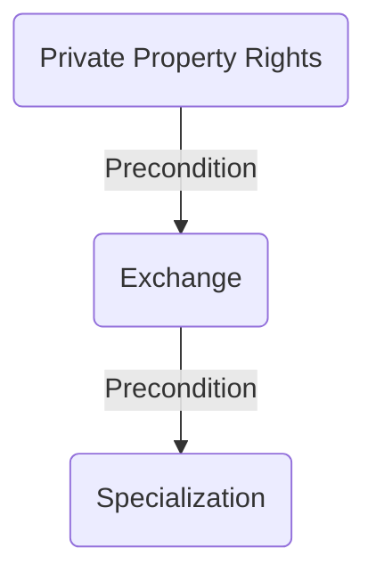
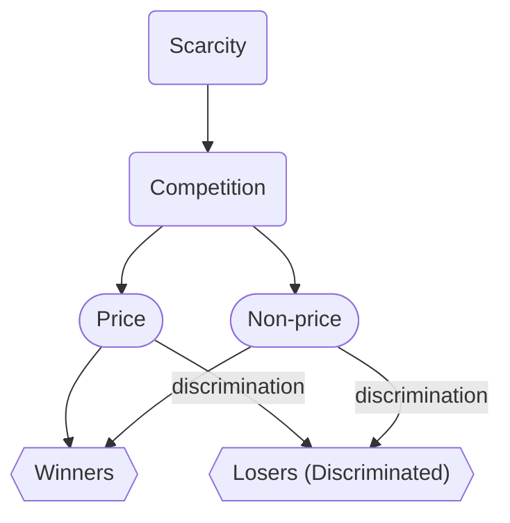
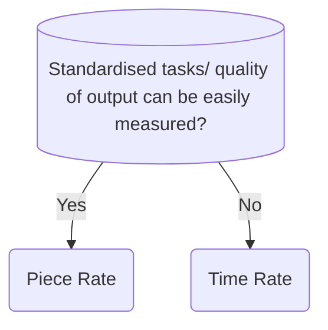

# Chapter 1: Basic Economic Concepts
## Economics as a social science
Economics is a social science that studies how humans use limited resources to satisfy unlimited wants.
### Two Branches of Economics
1. **Microeconomics**: studies the choices of individual decision makers
2. **Macroeconomics**: studies the performance of the whole economy
## Scarcity
- When resources are insufficient to satisfy all our wants, scarcity arises.
- In the real world, scarcity always exists because we have unlimited wants but limited resources.
- Because of scarcity, choices have to be made to decide what wants to satisfy and what wants to forgo
## Opportunity Cost (OC)
- The highest value option forgone is the opportunity cost
- Opportunity cost changes when
	1. The value of the highest valued option forgone changes
	2. The value of another option forgone increases to a point higher than the value of the original highest value option forgone to become the new highest valued option forgone.
## Full cost
$$
\text{Full Cost} = \text{Money Cost} + \text{Non-money Cost}
$$
- **Money cost** is the highest valued alternative use of the money spent
- **Non-money cost** is the highest valued alternative use of the non-money resources spent, usually time.
## Goods and Bads
### Goods
- Can satisfy human wants
- we prefer some to none
### Bads
- Not wanted
- We prefer less to more
Goods are classified into economic goods or free goods
- Table: Economic Goods vs Free goods

| **Economic Goods**                                                  | **Free Goods**                                                    |
| ------------------------------------------------------------------- | ----------------------------------------------------------------- |
| Quantity available is insufficient to satisfy all human wants of it | Quantity available is sufficient to satisfy all human wants of it |
| At zero price, $Qd<Qs$                                              | At zero price, $Qs<Qd$                                            |
| More of it is preferred to less                                     | More of it is **not** preferred to less                           |
| People compete to obtain more economic goods                        | People **do not** compete to obtain more free goods               |
| People are willing to pay a cost to obtain it                       | People **are not** willing to pay a cost to obtain it             |
| Provision of it incurs production cost                              | Provision of it **does not** incur production cost                |
## Positive statements vs Normative Statements
Value judgement?
Refutable by facts?

# Chapter 2: Economic Problems and Economic Activities
## Three basic economic problems
### What to produce
- to decide the types and quantities of goods to be produced.
### How to produce
- to decide the way of production
### For whom to produce
- to decide the distribution of good produced
  = to decide the distribution criteria
## Different methods of solving the three economic problems
### Customs and traditions
### Government command
### Market Mechanism
The market mechanism uses market prices as signals to guide resource allocation and distribution of goods. Consumptions or product decisions are made according to market prices.
## Specialization, Exchange and Private Property Rights
### Specialization
- to specialise in producing a particular good or a particular stage of production of a good
### Exchange
A precondition for specialization
### Private Property Rights
A precondition for exchange to take place
#### Exclusive right to use
- The owner has the right to exclude others from using their property.
- The owner has the right to use the property in any way they wish as long as it is lawful
#### Exclusive right to receive income from
The owner has the exclusive right to receive income generated from their property
#### Right to transfer
The owner has the right to transfer their property to other people.
### Relationship between Specialization, Exchange and Private Property Rights

## Scarcity, Competition and Discrimation

### Price Competition
- Those who are willing and able to get pay the market price can get the resources or goods
### Non-price Competition
- Those who meet the specific criteria (that is not price) can get the resources or goods.
# Chapter 3: Basic Concepts of Production
Production is the act of turning input into output. It creates value.
## Consumer Goods vs Producer Goods
- Producer goods/capital goods are used to produce other goods and services
- Consumer goods are used to satisfy wants directly
## Private Goods vs Public Goods
- Private goods are rival and excludable in consumption
- Public goods are **non-rival** and **non-excludable** in consumption
### Rival in consumption
- one's consumption of the good will reduce the amount available for others
- the good cannot be consumed by different people concurrently
### Excludable in consumption
- It is easy for the owner to exclude non-payers from consuming the good.
## Types of production
Primary: the extraction of natural resources
Secondary: turning raw materials into semi-finished goods or finished goods.
Tertiary: Provision of services
## Factors of production
### Land
Natural resources used in production
### Capital 
Man-made resources used in production
### Labour
Physical or mental effort a person provides in production
### Entrepreneurship
Bearing risk and making production decision
# Chapter 4: Division of Labour
## Measures of Labour
### Labour Supply
$$\text{Labour Supply} = \text{Number of workers} * \text{Average working hours}$$
Unit: man-hours
Factors:
- Population
- Government:
	- minimum working age
	- retirement age
- subsidy for further education
- importation of workers
- unemployment benefits
- maximum working hour
- number of public holidays
### Labour productivity
$$
\text{Labour Productivity} = \frac{\text{Total Output}}{\text{Total Working Hours}}
$$
Units: units of output per man-hour
Factors:
- Working conditions
- Capital
- Education and training
- Management
- Technology
- Working incentives
## Mobility of Labour
### Geographical mobility
Willingness and ability to move from one location to another
Factors:
- Difference in wages or job opportunities
- Political and social factors
- Transportation
- Immigration and emigration policies
### Occupational mobility
Willingness and ability of a worker to move from one occupation to another
Factors include:
- Personal level
	- Wage difference
	- Whether skills are transferrable or specialised
- Non-personal level
	- Entrance Requirements
	- Retraining Programmes
## Wage Payment Methods
### Piece Rate and Time Rate
When to use a wage payment method?

To employers
Advantages of piece rate:
- lower monitoring cost as workers have a higher working incentive
- Spread the risk between employers and employees
Advantages of time rate:
- lower cost of monitoring as they get the same amount of wage regardless of how much output they produce, so no need to hurry
- lower cost of calculating wage, because there is no need to calculate the amount of worker's contribution
- more stable team of workers because workers' income is more stable
To employees:
- they can earn more by working faster with piece rate
- they earn more stable income with time rate
### Profit sharing, commissions and tips
Similar to Piece rate
## Division of Labour
### Benefit of division of labour: Increased productivity
- Practice makes perfect
- save time in training
- save time in changing tasks
- ensure the right person for each job
- facilitate mechanisation
### Other advantages
- Save the cost of equipments/raise capital productivity 
- Raise living standards
### Disadvantages
- lowered job satisfaction
- higher risk of unemployment without transferrable skills
- over-interdependent production stages
- excessive standardisation of products
# Chapter 5: Production and Costs
## Classification of Factors of production and production runs
### Variable Factors and Fixed Factors
When output changes, not every input changes.
**Variable Factors**' quantities vary when output changes.
**Fixed factors**' quantities does not vary when output changes.
### Short-run and Long-run Production
Short-run: has fixed factors and variable factors.
Long-run: no fixed factors, only variable factors.
## Short-run production
### Measures of output
Total product(TP): the total output from production
Average product (AP): average output per unit of a factor
Marginal product (MP): change in total product from one unit change of a factor
### Law of diminishing marginal returns
The law states that when more units of a variable factor keep being added to a given quantity of fixed factors, the marginal product of the variable factor will finally decrease, holding technology constant.
(only applies to short-run production)
## Long-run production
The production scale where the average product is the lowest = Optimal Scale
### Internal Economies of scale
- able to borrow from banks at a lower interest rate due to higher goodwill and more assets
- enjoy greater discounts in bulk purchase of goods
- practise a larger scope of division of labour to raise labour productivity and lower average production cost
- spread the cost of equipment over a larger output
- spread the advertising cost over a larger output
- spread the research & development (R&D) cost over a larger output
### Internal Diseconomies of scale
- may become too large in scale, lowering the management efficiency
- the market may be saturated, leading to rise in marketing cost
- the firm may have large outstanding loans so the cost of further borrowing increases.
### External economies of scale
- concentration of similar firms in a place creates marketing effect, lowering marketing cost.
- lower deliver cost from suppliers (i.e. Carriage Inwards in BAFS) because suppliers can deliver goods in bulk to individual firms at once
- lower cost of recruiting workers because workers can be attracted to the same place
- more supporting businesses available
- Transport network and other infrastructure would develop more quickly
### External diseconomies of scale
- Demand for related input will increase, resulting in an increase in price for such input
- the market may be saturated, leading to rise in marketing cost

# Chapter 6: ownership, expansion and integration of firms.
A firm is a production unit that makes decisions regarding the employment of factors of production and the production of goods and services.
## Public Enterprises (Owned by the government)
### Government departments
- directly managed and operated by **the government**
- not for profit
- mainly financed by government fund
### Public corporation
- managed and operated by a board of directors, which is separate from the government.
- may run on commercial principles
- financially independent of the government
### Comparison of Government Departments and Public Corporations
#### Advantages of public enterprises
- They can provide services with lower price, which reduces the burden of users
- They have more information from the government, which help for the development of the enterprises
- Easier to get loan with the backup from government
#### Disadvantage of public enterprises
Lower efficiency, as they are not profit-maximising and have lower incentive to provide better goods and services.
## Private enterprises (owned by private individuals)
### Sole proprietorship & Partnership
- not a legal entity, meaning owners have to bear unlimited liability
> [!info] Limited Liability
> The liability of an owner is limited to the amount of his investment in the firm.
#### Points of Comparison between Sole Proprietorship and Partnership
- decision-making
- source of capital
- division of labour among owners
- sharing of risk and profit
### Limited Companies
- legal entities
- shareholders bear limited liabilities
- separation of ownership and management
#### Public LC vs Private LC
- private LCs have 1 -50 owners, while public LCs have 2 or more
- Public LCs can issue shares or bonds to the public
- transfer of shares in Private LC requires the consent of the board of directors
- disclosure of financial information to the public is needed for public LCs
#### Advantages of Private LCs
- disclosure of financial information to the public is not necessary
- lower risk of being taken over
#### Advantages of Public LCs
- Shares and Bonds can be issued to the public
- Shares can be freely transferred
#### Listed Companies
- transfer shares even more freely 
- stricter regulations in order to protect the rights of shareholders
### Points of Comparison between non-separate legal entities and separate legal entities
- Limited liabilities
- Business Continuity
- Profit Tax Rate
- procedures for starting such a business type
- source of capital
- disclosure of financial information to the public
## Shares and Bonds
- shareholders are owners, while bondholders are creditors
	- this means that shareholders have voting rights in the company while bondholders do not
	- bondholders get their money back before shareholders in case of liquidation 

shut up i need to rush this before i sleep