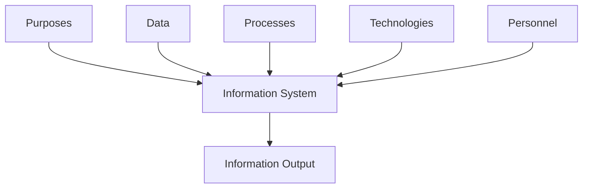
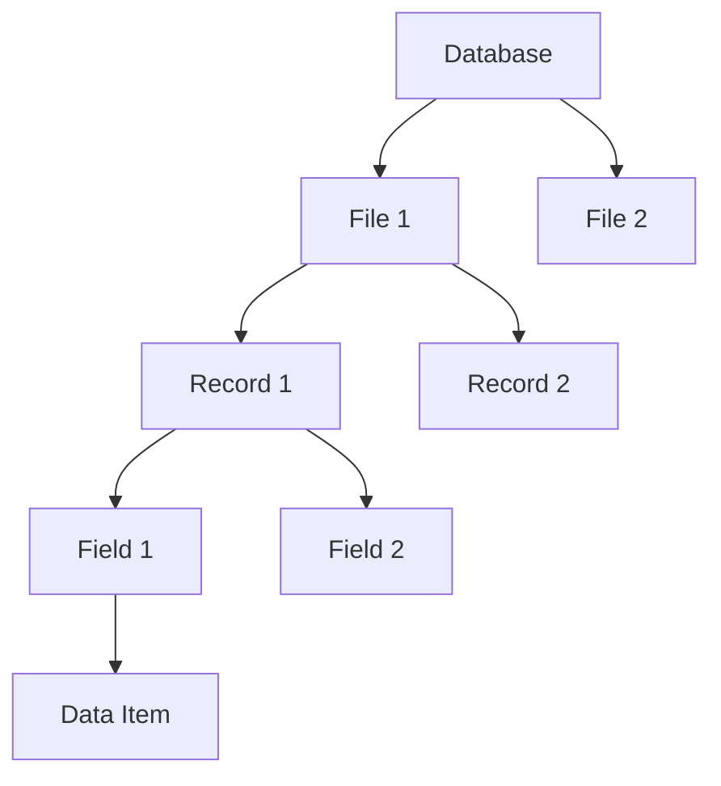
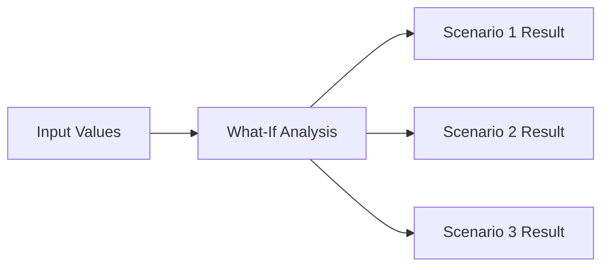

---
tags:
  - ict
  - compulsory
  - information-processing
aliases:
  - Compulsory A
  - Information Processing
  - Information Systems
---

# Information Processing

> [!info] HKDSE ICT Compulsory Module A: Information Processing
> **Duration:** 37 hours | **Sections:** [[#Information Systems]], [[#Data Organisation]], [[#Data Representation]], [[#Data Manipulation and Analysis]]

---

# Information Systems

## Components of an Information System

An ==information system== is a collection of components that work together to collect, process, store and present data to support decision-making.

| Component | Purpose | Example |
|:---|:---|:---|
| **Purposes** | Defines what the system aims to achieve | Track student grades |
| **Data** | Raw facts collected by the system | Student names, marks |
| **Processes** | Actions that convert data into information | Calculate averages |
| **Technologies** | Hardware and software used | Computers, databases |
| **Personnel** | People who operate or use the system | Teachers, IT staff |



## Information Processes

The seven key information processes are:

1. ==Data collection== — gathering raw facts from sources
2. ==Data organisation== — structuring data in a meaningful way
3. ==Data analysis== — examining data to find patterns
4. ==Data storage== — saving data for future use
5. ==Data processing== — transforming raw data into useful information
6. ==Data transmission== — sending data between locations
7. ==Data presentation== — displaying information to users

> [!tip] Exam Tip
> Exam questions often ask you to identify which information process is being described. Pay attention to keywords: "collecting" = collection, "structuring" = organisation, "finding patterns" = analysis, etc.

## Data vs Information

- ==Data==: Raw, unprocessed facts (e.g. `85`, `"John"`, `true`)
- ==Information==: Processed, meaningful data (e.g. *"John scored 85, which is above average"*)

> [!warning] Common Exam Mistake
> Students often confuse data and information. Remember: data is the **raw input**; information is the **useful output** after processing.

## Types of Data

| Type | Description | Example |
|:---|:---|:---|
| ==Text== | Alphabetic characters and symbols | `"Hello World"` |
| ==Number== | Numeric values used in calculations | `42`, `3.14` |
| ==Image== | Graphics, photos, diagrams | `.jpg`, `.png` |
| ==Audio== | Sound recordings, speech | `.mp3`, `.wav` |
| ==Video== | Moving images with or without sound | `.mp4`, `.avi` |

## The Information Age and Information Literacy

The ==Information Age== (also called the Digital Age) is the period from the late 20th century onwards, characterised by the rapid shift from traditional industry to an economy based on ==information technology==.

==Information literacy== is the ability to:

- Recognise when information is needed
- Locate, evaluate and use information effectively
- Understand ethical and legal issues around information use

> [!info] Knowledge-Based Society
> In a knowledge-based society, information is a key resource. Being information literate means being able to critically assess the reliability and relevance of information from various sources.

---

# Data Organisation

## Hierarchy of Data



| Level | Description | Example |
|:---|:---|:---|
| ==Database== | A collection of related files | School management system |
| ==File== | A collection of related records | Student Records |
| ==Record== | A collection of related fields | One student's entry |
| ==Field== | A single category of data | Student Name |
| ==Data Item== | A single piece of data | `"Chan Tai Man"` |

> [!tip] Exam Tip
> You may be asked to identify the hierarchy level from a given example. Remember: **Database > File > Record > Field > Data Item**

## File Access Methods

### Sequential Access

Records are accessed ==one after another== in a fixed order (e.g. first record, second record, etc.).

- **Advantages:** Simple to implement; efficient for batch processing
- **Disadvantages:** Slow for finding specific records; must pass through all preceding records

**Applications:** Tape backups, printing mailing lists, batch processing

### Direct Access (Random Access)

Records can be accessed ==directly== by their address or key without reading through other records.

- **Advantages:** Fast retrieval of specific records; efficient for online processing
- **Disadvantages:** More complex to implement; requires more storage overhead

**Applications:** Online databases, ATM systems, real-time booking systems

> [!tip] Exam Tip
> Sequential access is like reading a book page by page. Direct access is like using the index to jump to a specific page. Exams love comparing these two — know the trade-offs.

## Data Control

Data control ensures data remains ==accurate, consistent and secure== throughout its lifecycle. Key concerns:

| Concern | Description |
|:---|:---|
| ==Data integrity== | Data remains accurate and consistent |
| ==Data security== | Data is protected from unauthorised access |
| ==Data redundancy== | Unnecessary duplication of data is avoided |
| ==Data backup== | Copies are made to prevent data loss |

## Validation and Verification

> [!warning] Don't Confuse Validation with Verification
> **Validation** checks if data is ==acceptable== (valid input). **Verification** checks if data has been ==transferred correctly== (no transcription errors).

### Validation Techniques

| Technique | Description | Example |
|:---|:---|:---|
| ==Presence check== | Ensures a field is not empty | Name field cannot be blank |
| ==Range check== | Checks data falls within a range | Age must be 0–150 |
| ==Type check== | Ensures data matches expected type | Marks must be numeric |
| ==Length check== | Ensures data has correct length | Phone number must be 8 digits |
| ==Format check== | Checks data matches a pattern | Email must contain `@` |
| ==Look-up check== | Validates against a reference list | Postcode must exist in database |

### Verification Techniques

- ==Double entry== — User enters data twice; system compares both entries
- ==Visual check== — Operator visually compares data with source document
- ==Check digit== — A calculated digit appended to a number to detect transcription errors

### Parity Checking

==Parity checking== is used in data transmission to detect errors:

- **Even parity**: Total number of 1s (including parity bit) must be even
- **Odd parity**: Total number of 1s (including parity bit) must be odd

```
Data: 1011001 (four 1s)
Even parity bit: 0  → 10110010 (total 1s = 4, even) ✓
Odd parity bit: 1   → 10110011 (total 1s = 5, odd)  ✓
```

> [!example] Parity Check Example
> | Data | Parity Type | Parity Bit | Transmitted | Detected? |
> |:---|:---|:---|:---|:---|
> | `1011001` | Even | `0` | `10110010` | Valid |
> | `1011001` (error: `1001001`) | Even | `0` | `10010010` | Error! (only 3 ones) |
>
> Parity checking can detect ==single-bit errors== but ==cannot correct== them.

---

# Data Representation

## Analog vs Digital Data

| Feature | Analog | Digital |
|:---|:---|:---|
| Signal type | ==Continuous== wave | ==Discrete== steps |
| Examples | Vinyl records, mercury thermometers | CDs, digital thermometers |
| Precision | Limited by measurement | Limited by number of bits |
| Storage | Deteriorates over time | Can be copied perfectly |

> [!info] Why IT Uses Digital Data
> Digital data can be ==precisely reproduced==, ==easily processed== by computers, and ==transmitted with error correction==. Digital signals are also less susceptible to noise and degradation.

### Conversion Between Analog and Digital

- ==Analog → Digital==: Sampling and quantisation (e.g. microphone recording)
- ==Digital → Analog==: Reconstruction (e.g. speaker output)

## Number Systems

### Denary (Base 10)

Uses digits 0–9. Each position represents a power of 10:

$$4273 = 4 \times 10^3 + 2 \times 10^2 + 7 \times 10^1 + 3 \times 10^0$$

### Binary (Base 2)

Uses digits 0 and 1. Each position represents a power of 2:

| Position | $2^7$ | $2^6$ | $2^5$ | $2^4$ | $2^3$ | $2^2$ | $2^1$ | $2^0$ |
|:---|:---:|:---:|:---:|:---:|:---:|:---:|:---:|:---:|
| Value | 128 | 64 | 32 | 16 | 8 | 4 | 2 | 1 |

> [!tip] Binary to Denary
> Multiply each bit by its position value and sum the results.
>
> `10110011` = 128 + 32 + 16 + 2 + 1 = **179**

> [!tip] Denary to Binary
> Repeatedly divide by 2 and record remainders (read bottom to top).
>
> ```
> 179 ÷ 2 = 89 R 1
>  89 ÷ 2 = 44 R 1
>  44 ÷ 2 = 22 R 0
>  22 ÷ 2 = 11 R 0
>  11 ÷ 2 = 5  R 1
>   5 ÷ 2 = 2  R 1
>   2 ÷ 2 = 1  R 0
>   1 ÷ 2 = 0  R 1
> ```
> Result: `10110011`

### Hexadecimal (Base 16)

Uses digits 0–9 and letters A–F (where A=10, B=11, ..., F=15):

| Hex | 0 | 1 | 2 | 3 | 4 | 5 | 6 | 7 | 8 | 9 | A | B | C | D | E | F |
|:---|:---:|:---:|:---:|:---:|:---:|:---:|:---:|:---:|:---:|:---:|:---:|:---:|:---:|:---:|:---:|:---:|
| Denary | 0 | 1 | 2 | 3 | 4 | 5 | 6 | 7 | 8 | 9 | 10 | 11 | 12 | 13 | 14 | 15 |

> [!tip] Hex ↔ Binary Conversion
> Each hex digit = ==4 binary digits== (nibbles):
>
> `B3₁₆` → `1011 0011₂` → 179₁₀
>
> This makes hex a ==shorthand for binary==.

### Why Use Hexadecimal?

- ==More compact== than binary for humans to read
- ==Easy conversion== to/from binary (1 hex digit = 4 bits)
- Commonly used for ==memory addresses==, ==colours (RGB)==, ==MAC addresses==

## Binary Arithmetic

### Binary Addition

```
  Carry:  1 1 0 1 1
          1 0 1 1 0
        + 0 1 1 0 1
        -----------
          1 0 0 0 1 1
```

Rules:
| A | B | Sum | Carry |
|:---:|:---:|:---:|:---:|
| 0 | 0 | 0 | 0 |
| 0 | 1 | 1 | 0 |
| 1 | 0 | 1 | 0 |
| 1 | 1 | 0 | 1 |

### Binary Subtraction

```
          1 0 1 1 0
        - 0 1 1 0 1
        -----------
          0 1 0 0 1
```

### Overflow Errors

> [!warning] Overflow Error
> An ==overflow error== occurs when the result of a calculation exceeds the number of bits allocated for storage.
>
> Example with 8-bit storage: `10000001₂ + 10000010₂ = 100000011₂` — the 9th bit is lost!
>
> Always check: does the answer fit in the given number of bits?

> [!tip] Exam Tip
> Exam questions often ask you to identify when overflow occurs. Count the bits carefully and show your working for binary addition/subtraction.

## Character Encoding

### ASCII (American Standard Code for Information Interchange)

- Uses ==7 bits== (128 characters) or ==8 bits== (256 characters, extended ASCII)
- Includes English letters, digits, punctuation and control characters
- ==Not sufficient== for Chinese characters

```
Character 'A' = ASCII code 65 = 01000001₂ = 41₁₆
Character 'a' = ASCII code 97 = 01100001₂ = 61₁₆
```

### Big-5 Code

- A ==Chinese character encoding== standard
- Uses ==2 bytes== (16 bits) per character
- Primarily used in ==Taiwan and Hong Kong==
- Limited to ==traditional Chinese characters==

### GB Code (GB2312)

- A Chinese character encoding standard for ==simplified Chinese==
- Uses ==2 bytes== per character
- Primarily used in ==mainland China==
- GBK is an extended version with more characters

### Unicode

- An ==international standard== that aims to encode ==all characters from all writing systems==
- Common encodings: **UTF-8** (variable: 1–4 bytes), **UTF-16** (2 or 4 bytes)
- ==Backward compatible== with ASCII (UTF-8 first 128 characters match ASCII)
- The standard used by modern systems

> [!warning] Big-5 vs GB Code vs Unicode
> | Feature | Big-5 | GB Code | Unicode |
> |:---|:---|:---|:---|
> | Script | Traditional Chinese | Simplified Chinese | All scripts |
> | Bytes per char | 2 | 2 | 1–4 (UTF-8) |
> | Region | HK, Taiwan | Mainland China | Global |
> | Compatibility | Limited | Limited | Universal |

## Multimedia Digitisation

### Image Digitisation

- Images are represented as a ==grid of pixels==
- Each pixel is assigned a ==colour value== (e.g. RGB)
- Factors affecting quality: ==resolution== (pixels), ==colour depth== (bits per pixel)

### Audio Digitisation

- Sound waves are ==sampled== at regular intervals (==sampling rate==, e.g. 44,100 Hz for CD)
- Each sample is assigned a ==bit depth== (e.g. 16-bit for CD)
- Higher sampling rate and bit depth = better quality but larger file size

### Video Digitisation

- A sequence of ==frames== (images) displayed rapidly (e.g. 24 fps)
- Each frame is digitised as an image
- Includes ==audio track== synchronised with frames

### Common File Formats and Comparison

| Format | Type | Features |
|:---|:---|:---|
| `.bmp` | Image | Uncompressed, large file, high quality |
| `.jpg` | Image | Lossy compression, small file, good for photos |
| `.png` | Image | Lossless compression, supports transparency |
| `.gif` | Image | 256 colours, supports animation, small |
| `.mp3` | Audio | Lossy compression, small file, widely supported |
| `.wav` | Audio | Uncompressed, large file, high quality |
| `.mp4` | Video | Compressed, widely supported, good quality |
| `.avi` | Video | Less compressed, larger files |

> [!tip] Exam Tip
> You may be asked to compare file formats or explain why one format is preferred over another. Consider: ==file size==, ==quality==, ==compression type== (lossy vs lossless), and ==compatibility==.

---

# Data Manipulation and Analysis

## Spreadsheets

Spreadsheets are used for ==data organisation, calculation and analysis==.

### Basic Features

#### Cell References

| Reference Type | Description | Example |
|:---|:---|:---|
| ==Relative== | Changes when copied to another cell | `A1` |
| ==Absolute== | Fixed, does not change when copied | `$A$1` |
| ==Mixed== | Partially fixed | `$A1` or `A$1` |

#### Formulas

All formulas begin with `=`:

```excel
=A1+B1          // Simple addition
=A1*0.9         // Apply 10% discount
=SUM(A1:A10)    // Sum of range
=AVERAGE(B1:B5) // Average of range
=COUNT(C1:C10)  // Count of numeric entries
=MAX(D1:D20)    // Maximum value
=MIN(D1:D20)    // Minimum value
```

#### Operators

| Category | Operators | Example |
|:---|:---|:---|
| ==Mathematical== | `+`, `-`, `*`, `/`, `^` | `=A1+B1*2` |
| ==Relational== | `=`, `<>`, `<`, `>`, `<=`, `>=` | `=A1>50` |
| ==Logical== | `AND`, `OR`, `NOT` | `=AND(A1>50,B1>50)` |

> [!warning] Order of Operations
> Spreadsheets follow the ==BODMAS/PEMDAS== rule. Multiplication and division are performed before addition and subtraction. Use brackets to override:
>
> `=A1+B1*C1` ≠ `=(A1+B1)*C1`

### Data Manipulation Techniques

| Technique | Description |
|:---|:---|
| ==Filtering== | Display only rows matching certain criteria |
| ==Searching== | Find specific data within a range |
| ==Sorting== | Arrange data in ascending/descending order |
| ==Multiple worksheets== | Organise related data across different sheets |

### Data Analysis Tools

#### Pivot Tables

A ==pivot table== summarises large datasets by grouping and aggregating data (e.g. counting, summing, averaging).

#### Pivot Charts

A ==pivot chart== is a graphical representation of pivot table data that provides a ==visual summary== of the underlying information. It dynamically links to a pivot table — when the pivot table is updated, the chart updates automatically.

> [!tip] Relationship
> A pivot chart is the ==visual counterpart== of a pivot table. The table provides the raw summary; the chart makes patterns, trends and comparisons easier to see at a glance.

| Chart Type | Best For |
|:---|:---|
| ==Column/Bar chart== | Comparing categories (e.g. sales by product) |
| ==Line chart== | Showing trends over time (e.g. monthly revenue) |
| ==Pie chart== | Displaying proportions of a whole (e.g. market share) |
| ==Stacked chart== | Comparing parts within and across categories |

> [!example] Use Case
> A school has a spreadsheet of student marks across subjects. A **pivot table** can calculate average marks per class. A **pivot chart** then visualises this as a bar chart, making it easy to see which class performs best at a glance.

#### What-If Scenarios

==What-if analysis== explores how changing input values affects outcomes:

- **Goal Seek**: Finds the input needed for a desired result
- **Data Tables**: Shows results for multiple input combinations
- **Scenario Manager**: Compares different sets of input values



> [!tip] Exam Tip
> In exam questions, you may be given a spreadsheet scenario and asked to write formulas, identify the result of a pivot table, or predict outcomes of what-if analysis. Practice writing formulas by hand.

## Database Management Systems (DBMS)

A ==DBMS== is software used to create, manage and manipulate databases (e.g. Microsoft Access, MySQL).

### Creating a Database

Key steps:

1. ==Design the structure== — identify tables, fields and data types
2. ==Define primary keys== — unique identifier for each record
3. ==Create relationships== — link tables using foreign keys
4. ==Normalise data== — reduce data redundancy

### Tables and Fields

| Concept | Description | Example |
|:---|:---|:---|
| ==Table== | A collection of related records | Students |
| ==Field== | A column in a table | StudentName |
| ==Record== | A row in a table | One student's data |
| ==Primary key== | Unique identifier for each record | StudentID |
| ==Foreign key== | Field linking to another table's primary key | ClassID in Students |

### Forms for Data Entry

Forms provide a ==user-friendly interface== for entering data into tables. Benefits:

- Reduces data entry errors
- Can include ==validation rules==
- Can display related data from multiple tables

### Querying a Database

#### Selection and Filtering

- ==Selection==: Choosing specific ==columns/fields== from a table
- ==Filtering==: Choosing specific ==rows/records== that meet criteria

#### Sorting

Records can be sorted in ==ascending== or ==descending== order by one or more fields.

### SQL Basics

==SQL (Structured Query Language)== is used to query and manage databases.

#### SELECT Statement

```sql
-- Select all columns
SELECT * FROM Students;

-- Select specific columns
SELECT StudentName, Marks FROM Students;

-- Filter with WHERE
SELECT * FROM Students WHERE Marks >= 50;

-- Sort with ORDER BY
SELECT * FROM Students ORDER BY Marks DESC;

-- Limit results
SELECT * FROM Students LIMIT 10;
```

#### Aggregate Functions

```sql
-- Count records
SELECT COUNT(*) FROM Students;

-- Calculate average
SELECT AVG(Marks) FROM Students;

-- Find maximum and minimum
SELECT MAX(Marks), MIN(Marks) FROM Students;

-- Sum
SELECT SUM(Marks) FROM Students;
```

#### GROUP BY

```sql
-- Count students in each class
SELECT Class, COUNT(*) AS StudentCount
FROM Students
GROUP BY Class;

-- Average marks by class
SELECT Class, AVG(Marks) AS AverageMarks
FROM Students
GROUP BY Class
HAVING AVG(Marks) >= 60;
```

> [!example] SQL Example
> Given a `Sales` table with fields: `SaleID`, `Product`, `Quantity`, `Price`, `Date`
>
> **Q: Find all sales where quantity > 10, sorted by date descending:**
>
> ```sql
> SELECT * FROM Sales
> WHERE Quantity > 10
> ORDER BY Date DESC;
> ```

### Reports

Reports present data in a ==formatted, printable layout==. They can include:

- Grouped and sorted data
- Calculated fields (totals, averages)
- Headers and footers
- Charts and graphs

> [!tip] Exam Tip
> SQL questions are common in the DSE. Practice writing SELECT statements with WHERE, ORDER BY, GROUP BY and aggregate functions. Pay attention to ==correct syntax== — keywords must be in uppercase in some marking schemes.

---

## Cross-References

- [[Compulsory/B]] — Multimedia and Web Publishing (extends data representation to web)
- [[Compulsory/C]] — Networking and Data Transmission
- [[Compulsory/C]] — Internet and Its Applications
- [[Compulsory/D]] — Problem Formulation and Analysis (algorithm design for data manipulation)
- [[Compulsory/E]] — Impact of ICT on Society (social implications of information processing)
- [[Elective/A]] — Databases (advanced database design, normalisation, relational model)
- [[ICT Index]] — Subject overview
