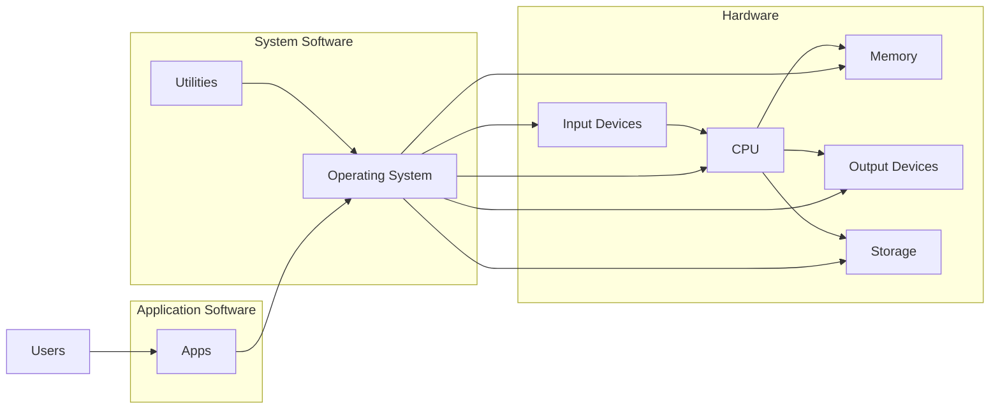
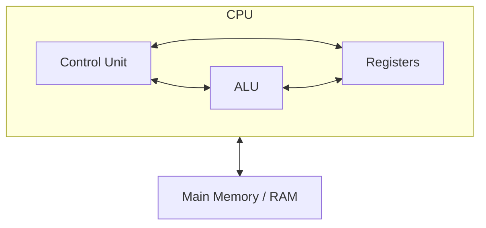
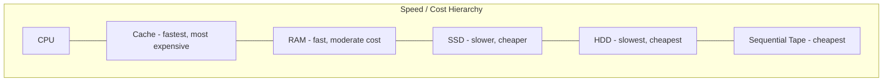
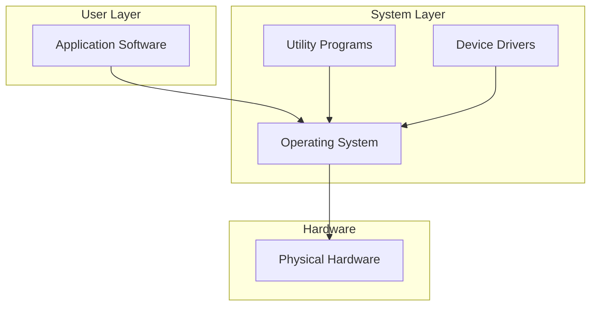

---
tags:
  - ict
  - compulsory
  - computer-systems
aliases:
  - Computer System Fundamentals
  - Compulsory B
  - Module B
---

# Computer System Fundamentals

> [!abstract] Module Overview
> HKDSE ICT Compulsory Module B (20 hours): How computers work at the hardware and system software level.

---

# 1 Computer Hardware

A computer system consists of ==hardware== (physical components) and ==software== (programs). System software bridges hardware and application software for the user.

## 1.1 Input Devices

| Device | Purpose | Advantages | Disadvantages |
| :--- | :--- | :--- | :--- |
| Keyboard | Text input | Fast typing, well-known | Unfamiliar layouts slow users |
| Mouse | Pointing/clicking | Intuitive, precise | Not suitable for some disabilities |
| Scanner | Digitises documents/images | Quick capture, preserves hard copies | Expensive, quality varies |
| Microphone | Audio input | Records natural speech | Background noise issues |
| Touchscreen | Direct manipulation | Intuitive, no extra device | Finger smudges, less precise |

## 1.2 Output Devices

| Device | Purpose | Advantages | Disadvantages |
| :--- | :--- | :--- | :--- |
| Monitor | Visual display | High resolution, adjustable | Consumes power, eye strain |
| Printer | Hard copy output | Physical records, various formats | Ongoing cost (ink/toner) |
| Speaker | Audio output | Multimedia, accessibility | Privacy concerns in public |

## 1.3 Processing Units

- ==CPU (Central Processing Unit)==: The "brain" that executes instructions and performs calculations. [[#2 The CPU|See detailed CPU section]]
- ==GPU (Graphics Processing Unit)==: Specialised processor for rendering images, video, and parallel computations. Can handle thousands of simultaneous operations.

> [!tip] CPU vs GPU
> The CPU handles general-purpose tasks sequentially; the GPU handles massively parallel tasks (e.g. rendering graphics, AI training).

## 1.4 Bus System

A ==bus== is a communication pathway that transfers data between components.

| Bus Type | Function |
| :--- | :--- |
| ==Data Bus== | Carries actual data between components |
| ==Address Bus== | Carries memory addresses for read/write operations |
| ==Control Bus== | Carries control signals (read/write, interrupts) |

The ==width== of a bus determines how much data can be transferred at once (e.g. 32-bit vs 64-bit).

## 1.5 Storage Devices

| Type | Example | Access Method | Volatility | Use Case |
| :--- | :--- | :--- | :--- | :--- |
| Hard Disk Drive (HDD) | Desktop PCs | Random (mechanical) | Non-volatile | Bulk storage |
| Solid State Drive (SSD) | Laptops | Random (electronic) | Non-volatile | Fast boot/app loading |
| USB Flash Drive | Portable transfer | Random | Non-volatile | Portable storage |
| Optical Disc (CD/DVD) | Archive/distribution | Sequential/random | Non-volatile | Media distribution |
| Magnetic Tape | Data centres | Sequential only | Non-volatile | Backup, archival |

> [!info] Access Methods
> - ==Random access==: Any location can be accessed directly in equal time (e.g. RAM, SSD)
> - ==Sequential access==: Data must be read in order from the start (e.g. magnetic tape)

---

# 2 The CPU

## 2.1 Structure and Components

| Component | Function |
| :--- | :--- |
| ==Control Unit (CU)== | Directs the flow of data, decodes instructions, generates control signals |
| ==Arithmetic Logic Unit (ALU)== | Performs arithmetic operations (`+`, `-`, `*`, `/`) and logical operations (`AND`, `OR`, `NOT`, comparisons) |
| ==Registers== | Small, extremely fast storage within the CPU for temporary data and addresses |
| ==Cache== | High-speed memory between CPU and RAM for frequently used data |
| ==Clock== | Sends timing signals to synchronise all operations |

### Registers

| Register | Role |
| :--- | :--- |
| ==Program Counter (PC)== | Holds the address of the ==next== instruction to fetch |
| ==Memory Address Register (MAR)== | Holds the address of the current memory location being accessed |
| ==Memory Data Register (MDR)== | Holds data being transferred to/from memory |
| ==Current Instruction Register (CIR)== | Holds the instruction currently being decoded/executed |
| ==Accumulator== | Holds intermediate results of ALU operations |

### Clock Speed

Clock speed is measured in ==Hz== (cycles per second). Modern CPUs operate in ==GHz== (billions of cycles per second).

| Unit | Duration |
| :--- | :--- |
| 1 millisecond (ms) | $10^{-3}$ seconds |
| 1 microsecond (μs) | $10^{-6}$ seconds |
| 1 nanosecond (ns) | $10^{-9}$ seconds |
| 1 picosecond (ps) | $10^{-12}$ seconds |

> [!tip] Faster is better
> A higher clock speed means more instructions can be executed per second. However, the number of cores and architecture also affect overall performance.

## 2.2 The Fetch-Decode-Execute Cycle

### Detailed Steps

| Step | What Happens | Registers Involved |
| :--- | :--- | :--- |
| **Fetch** | Instruction at address in PC is loaded from RAM into MDR, then into CIR. PC is incremented. | PC → MAR → MDR → CIR; PC + 1 |
| **Decode** | CU interprets the instruction held in the CIR to determine what action is needed. | CIR, CU |
| **Execute** | ALU performs the operation (arithmetic/logic), or data is moved. Results stored in accumulator or written back to RAM. | ALU, Accumulator, MDR |
| **Store** | Results are written back to the specified memory address or output device. | MAR, MDR, Accumulator |

> [!warning] Exam Pitfall
> The PC holds the address of the ==next== instruction, not the current one. Students often confuse the CIR (current) with the PC (next).

> [!example] Example: `ADD R1, R2`
> 1. **Fetch**: PC holds address `0x100`. The instruction at `0x100` is copied to MDR → CIR. PC becomes `0x101`.
> 2. **Decode**: CU recognises this is an ADD operation on two registers.
> 3. **Execute**: ALU adds the values in R1 and R2, stores result in the accumulator.
> 4. **Store**: Result is written back to the destination register or memory.

---

# 3 Memory

## 3.1 RAM (Random Access Memory)

- ==Volatile==: Data is lost when power is turned off.
- Used to store data and instructions ==currently in use==.
- Much faster than secondary storage.

> [!info] SRAM vs DRAM
> - ==SRAM (Static RAM)==: Faster, more expensive, used for cache.
> - ==DRAM (Dynamic RAM)==: Slower, cheaper, used for main memory. Requires periodic refresh.

## 3.2 ROM (Read-Only Memory)

- ==Non-volatile==: Data is retained without power.
- Stores firmware and BIOS/boot instructions.
- Cannot be easily modified during normal operation.

| ROM Type | Description |
| :--- | :--- |
| ==PROM== | Programmable ROM — written once after manufacturing |
| ==EPROM== | Erasable PROM — erased with UV light, reprogrammed |
| ==EEPROM== | Electrically Erasable PROM — erased electrically, no UV needed |

## 3.3 Cache Memory

- Located ==between CPU and RAM==.
- Stores copies of frequently accessed data/instructions.
- Faster than RAM but much more expensive per byte.

## 3.4 Memory Hierarchy

| Level | Type | Speed | Cost | Volatility |
| :--- | :--- | :--- | :--- | :--- |
| Registers | CPU internal | Fastest | Highest | Volatile |
| Cache (L1/L2/L3) | SRAM | Very fast | High | Volatile |
| Main memory | DRAM (RAM) | Fast | Moderate | Volatile |
| Solid state | Flash | Moderate | Low | Non-volatile |
| Magnetic | HDD | Slow | Lower | Non-volatile |
| Optical/Tape | Disc/tape | Slowest | Lowest | Non-volatile |

## 3.5 Memory Units

> [!warning] Binary vs Decimal
> In computing, ==1 KB = 1024 Bytes== (2¹⁰), NOT 1000 Bytes. This is a common exam mistake.

| Unit | Value |
| :--- | :--- |
| 1 Byte | 8 bits |
| 1 Kilobyte (KB) | 1024 Bytes |
| 1 Megabyte (MB) | 1024 KB |
| 1 Gigabyte (GB) | 1024 MB |
| 1 Terabyte (TB) | 1024 GB |

### Memory Address and Word Length

- Each byte in memory has a unique ==memory address==.
- ==Word length== is the number of bits a CPU can process in one operation (e.g. 32-bit or 64-bit).
- A larger word length means the CPU can handle larger data values and access more memory in one cycle.

> [!example] Example Calculation
> If a computer has a ==32-bit== word length and ==4 GB== of RAM:
> - Maximum addressable memory = $2^{32}$ bytes = 4,294,967,296 bytes = 4 GB ✓
> - If word length were only 16-bit, max addressable memory = $2^{16}$ = 65,536 bytes = 64 KB

---

# 4 Storage Devices (Expanded)

## 4.1 Magnetic Storage

- **HDD**: Uses spinning magnetic platters and read/write heads.
- Data stored as magnetic polarities on circular tracks.
- ==Pros==: High capacity, low cost per GB.
- ==Cons==: Mechanical parts (fragile, slower, noisy).

## 4.2 Optical Storage

- **CD/DVD/Blu-ray**: Uses laser light to read pits and lands on the disc surface.
- ==Pros==: Cheap to produce, long shelf life.
- ==Cons==: Slow access, lower capacity than HDD/SSD.

| Disc Type | Capacity | Notes |
| :--- | :--- | :--- |
| CD | ~700 MB | Single layer |
| DVD | ~4.7 GB | Single layer |
| Blu-ray | ~25 GB | Single layer |

## 4.3 Flash Storage

- **SSD / USB drives**: Uses flash memory (floating-gate transistors).
- ==Pros==: No moving parts (durable), fast access, silent.
- ==Cons==: More expensive per GB, limited write cycles.

## 4.4 Comparison

| Feature | HDD | SSD | Optical | Flash (USB) |
| :--- | :--- | :--- | :--- | :--- |
| Access method | Random (mechanical) | Random (electronic) | Sequential/random | Random |
| Volatility | Non-volatile | Non-volatile | Non-volatile | Non-volatile |
| Data transfer rate | ~100–200 MB/s | ~500–7000 MB/s | ~10–25 MB/s | ~100–300 MB/s |
| Capacity | High (up to 20 TB) | Medium (up to 8 TB) | Low–Medium | Low (up to 2 TB) |
| Durability | Lower (moving parts) | Higher | Scratches possible | High |

> [!tip] Exam Tip
> When asked to compare storage devices, always address: ==access method==, ==volatility==, ==data transfer rate==, and ==storage capacity==.

## 4.5 Latest Developments in Hardware

Emerging technologies are reshaping what computers can do and how data is stored.

| Technology | Overview | Potential Impact |
| :--- | :--- | :--- |
| ==Quantum Computing== | Uses ==qubits== which exploit quantum superposition and entanglement to represent 0, 1, or both simultaneously. Unlike classical bits, qubits enable massive parallelism in certain computations. | Could break current encryption, accelerate drug discovery, and solve optimisation problems far faster than classical computers. Still largely experimental (IBM, Google, IonQ). |
| ==Neuromorphic Chips== | Chips designed to ==mimic the structure of the human brain==, with artificial neurons and synapses on a single processor. They process information in a highly parallel, event-driven manner. | Extremely energy-efficient for AI/ML tasks such as pattern recognition and sensory processing. Intel's Loihi and IBM's TrueNorth are notable examples. |
| ==DNA Storage== | Encodes digital data into ==synthetic DNA strands== (A, T, C, G nucleotides). A single gram of DNA can theoretically store ~215 PB of data. Data is read via sequencing. | Offers extraordinary density and longevity (thousands of years), but read/write speeds are currently very slow and costs are high. Suitable for cold/archival storage. |
| ==Processor Trends== | Multi-core CPUs, system-on-chip (SoC) designs, and specialised accelerators (TPUs, NPUs) are the dominant trend. Moore's Law (doubling transistors every ~2 years) is slowing but architectural innovations (chiplets, 3D stacking) continue to push performance. | Mobile and edge devices increasingly integrate AI accelerators directly on-chip, enabling on-device machine learning without cloud dependency. |

> [!note] Curriculum Relevance
> While most of these technologies are beyond the scope of the exam, understanding them provides context for how ==storage== and ==processing== capabilities may evolve. Quantum computing and DNA storage represent fundamentally different approaches to information representation.

---

# 5 System Software

## 5.1 Software Layers

## 5.2 Operating System (OS)

The ==operating system== manages hardware resources and provides a user interface.

| OS Function | Description |
| :--- | :--- |
| ==Memory management== | Allocates and deallocates RAM; handles virtual memory |
| ==Process management== | Schedules tasks, multitasking, handles interrupts |
| ==File management== | Organises files in directories, manages access permissions |
| ==Device management== | Communicates with peripherals via drivers |
| ==User interface== | GUI or CLI for user interaction |
| ==Security== | User authentication, file permissions, firewall |

### Common OS Types

| OS | Type | Examples |
| :--- | :--- | :--- |
| Desktop/Laptop | General-purpose | Windows, macOS, Linux (Ubuntu, Fedora) |
| Mobile | Touch-optimised | Android, iOS |
| Server | Multi-user, networking | Windows Server, Linux (CentOS, Debian) |
| Embedded | Resource-constrained | FreeRTOS, embedded Linux (routers, IoT) |

## 5.3 Utility Programs

| Utility | Function |
| :--- | :--- |
| ==Data compressor== | Reduces file size for storage/transfer (ZIP, RAR) |
| ==Virus checker== | Detects and removes malware |
| ==File manager== | Organises, copies, moves, deletes files |
| ==Defragmentation tool== | Rearranges fragmented data on HDD for faster access |
| ==System monitor== | Displays CPU usage, memory usage, running processes |
| ==Disk cleanup== | Removes temporary and unnecessary files |

> [!info] Defragmentation
> Over time, files on an HDD become ==fragmented== (scattered across non-contiguous sectors). Defragmentation reassembles them to improve read speed. This is ==not needed== for SSDs.

## 5.4 Device Drivers

- ==Device driver==: A program that allows the OS to communicate with a specific hardware device.
- Each device (printer, GPU, network card) requires its own driver.
- Manufacturers often provide updated drivers for bug fixes and performance improvements.

## 5.5 Modes of Operation

| Mode | Description | Example |
| :--- | :--- | :--- |
| ==Batch processing== | Data collected over time, processed all at once | Payroll, bank statements |
| ==Real-time processing== | Data processed immediately as received; response within strict time limit | Air traffic control, ATM |
| ==Parallel processing== | Multiple processors work on different parts of the same task simultaneously | Weather forecasting, scientific simulations |
| ==Distributed processing== | Multiple computers connected via network process different tasks together | Internet search engines, blockchain |
| ==Virtualisation== | A single physical machine hosts multiple virtual machines, each running its own OS | Cloud computing (AWS, Azure), testing environments |

> [!tip] Exam Tip
> The key distinction between ==real-time== and ==batch== processing: real-time must respond within a strict deadline (missed deadline = system failure). Batch processing has no such constraint.

> [!warning] Parallel vs Distributed
> - ==Parallel processing==: Multiple processors in the ==same== computer.
> - ==Distributed processing==: Multiple ==separate== computers connected via a network.

> [!example] Real-time Processing Example
> An ATM must respond within seconds. If the system takes 30 seconds to verify a PIN, it is effectively useless. This is a strict real-time requirement.

---

## Related

- [[ICT Index]] - Subject overview
- [[Compulsory/A]] - Information Processing (data handling, validation)
- [[Compulsory/C]] - Internet and its Applications (networking hardware, communication protocols)
- [[Compulsory/D]] - Problem Formulation and Programming
- [[Compulsory/E]] - Impact of ICT on Society (hardware's societal implications)
