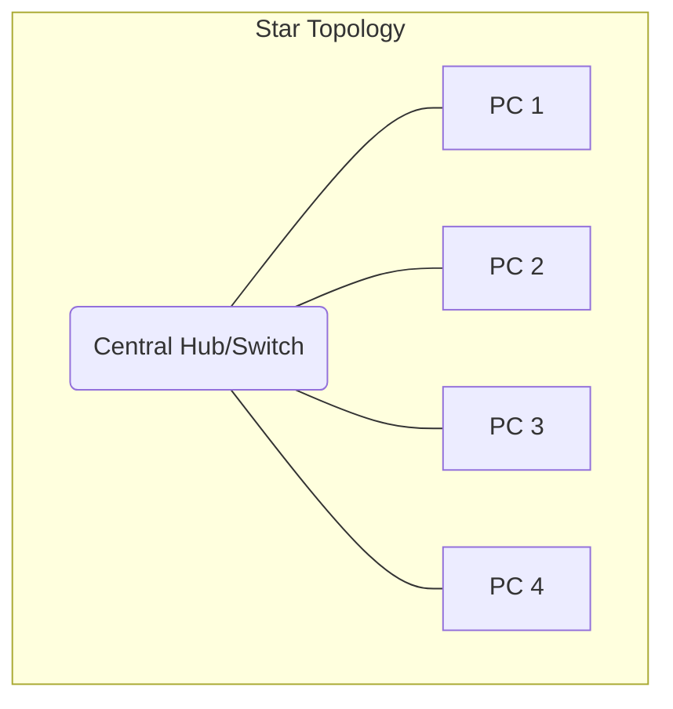
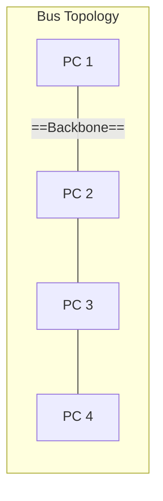
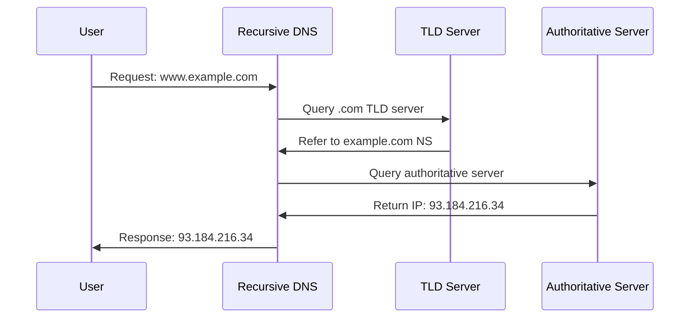

---
tags:
  - ict
  - compulsory
  - internet
  - networking
aliases:
  - Compulsory C
  - Internet and its Applications
  - Module C
---

# Internet and its Applications

> [!info] Module Overview
> **Compulsory Module C** — 31 hours total
> - Topic a: Networking and Internet Basics (9 hours)
> - Topic b: Internet Services and Applications (5 hours)
> - Topic c: Elementary Web Authoring (3 hours)
> - Topic d: Threats and Security on the Internet (14 hours)

---

# Networking Fundamentals

## LAN vs WAN

| Feature | LAN (Local Area Network) | WAN (Wide Area Network) |
| :--- | :--- | :--- |
| **Coverage** | Small area (building, campus) | Large area (city, country, global) |
| **Speed** | High (100 Mbps – 10 Gbps) | Lower (varies by provider) |
| **Cost** | Lower setup & maintenance | Higher (leased lines, ISPs) |
| **Ownership** | Private organisation | Often leased from telecoms |
| **Example** | School network, office intranet | The Internet, corporate WAN |

> [!tip] Exam Tip
> When comparing LAN and WAN, always mention ==speed==, ==cost==, ==coverage==, and ==ownership==.

## Network Topologies





| Topology | Advantages | Disadvantages |
| :--- | :--- | :--- |
| **Star** | Easy to install; failure of one node doesn't affect others | Central hub failure brings down entire network |
| **Bus** | Simple, cheap to install | Hard to troubleshoot; backbone failure affects all |
| **Ring** | Equal access for all nodes | Single break disrupts entire network |

## Network Hardware

| Hardware | Function |
| :--- | :--- |
| **Network Interface Card (NIC)** | Connects a device to the network; has unique MAC address |
| **Modem** | Modulates/demodulates digital ↔ analogue signals for transmission over phone lines |
| **Switch** | Connects devices within a LAN; forwards data based on MAC addresses |
| **Router** | Connects different networks; forwards data based on IP addresses |
| **Hub** | Broadcasts data to all connected devices (less efficient than switch) |

### Communication Links

| Medium | Characteristics |
| :--- | :--- |
| **Fibre Optics** | Very high speed, long distance, immune to EMI, expensive |
| **UTP Cable** | Cheap, easy to install, susceptible to interference, short range |
| **Microwave** | Wireless, line-of-sight required, affected by weather |
| **Satellite** | Global coverage, high latency, expensive |

---

# Internet Architecture

## TCP/IP Model

The ==TCP/IP== (Transmission Control Protocol/Internet Protocol) model has 4 layers:

| Layer | Protocol Examples | Function |
| :--- | :--- | :--- |
| **Application** | HTTP, FTP, SMTP, DNS | User-facing services |
| **Transport** | TCP, UDP | Reliable (TCP) or fast (UDP) data delivery |
| **Internet** | IP, ICMP | Addressing and routing packets |
| **Network Access** | Ethernet, Wi-Fi | Physical transmission of data |

### TCP vs UDP

| Feature | TCP | UDP |
| :--- | :--- | :--- |
| **Connection** | Connection-oriented | Connectionless |
| **Reliability** | Guaranteed delivery | No guarantee |
| **Speed** | Slower (acknowledgements) | Faster (no overhead) |
| **Use cases** | Email, web browsing, file transfer | Streaming, VoIP, online gaming |

## IP Addressing

### IPv4

- ==32-bit== address, written as 4 decimal octets (e.g., `192.168.1.1`)
- Provides approximately **4.3 billion** addresses
- Divided into **network** and **host** portions via subnet mask

```
IPv4 Address:   192 . 168 . 1 . 1
Subnet Mask:    255 . 255 . 255 . 0
                 ─────────  ───────
                 Network    Host
```

### IPv6

- ==128-bit== address, written in hexadecimal (e.g., `2001:0db8:85a3::8a2e:0370:7334`)
- Provides **3.4 × 10³⁸** addresses — solves IPv4 exhaustion
- Simplified header for more efficient routing

> [!warning] IPv4 vs IPv6
> IPv6 is NOT backward-compatible with IPv4. Both coexist during the transition period using **dual-stack** and **tunneling** techniques.

## DNS (Domain Name System)

DNS translates ==domain names== to ==IP addresses== — like a phonebook for the Internet.



> [!tip] DNS Lookup Steps
> 1. Browser cache → 2. OS cache → 3. Recursive resolver → 4. Root server → 5. TLD server → 6. Authoritative server

## URLs and HTTP/S

A ==URL== (Uniform Resource Locator) specifies the address of a resource:

```
https://www.example.com:443/path/page.html?query=value#section
│       │                │    │              │            │
Scheme  Hostname         Port Path           Query        Fragment
```

### HTTP vs HTTPS

| Feature | HTTP | HTTPS |
| :--- | :--- | :--- |
| **Port** | 80 | 443 |
| **Security** | Unencrypted | Encrypted (SSL/TLS) |
| **Use** | Non-sensitive data | Banking, login, personal data |
| **URL starts with** | `http://` | `https://` |

---

# Internet Services

## Search Engines

> [!tip] Effective Search Strategies
> - Use ==specific keywords== rather than full sentences
> - Use **Boolean operators**: `AND`, `OR`, `NOT`
> - Use **quotation marks** for exact phrases: `"machine learning"`
> - Use **site:** to search within a domain: `site:gov climate change`
> - Use **filetype:** to find specific file types: `filetype:pdf research`

### Evaluating Sources (CRAAP Test)

| Criterion | Question to Ask |
| :--- | :--- |
| **C**urrency | When was the information published or updated? |
| **R**elevance | Does it relate to your topic? |
| **A**uthority | Who is the author/publisher? What are their credentials? |
| **A**ccuracy | Is it supported by evidence? Can it be verified? |
| **P**urpose | Why does the information exist? Is there bias? |

## File Formats

| Type | Common Formats |
| :--- | :--- |
| **Graphics** | JPEG, PNG, GIF, SVG, BMP, TIFF |
| **Audio** | MP3, WAV, AAC, FLAC, OGG |
| **Video** | MP4, AVI, MOV, MKV, WebM |

## Communication Services

| Service | Description |
| :--- | :--- |
| **Email** | Store-and-forward messaging using SMTP (send), POP3/IMAP (receive) |
| **File Transfer** | FTP for uploading/downloading files between client and server |
| **Remote Logon** | Telnet/SSH for accessing a remote computer |
| **Online Chat** | Instant messaging (IRC, modern platforms) |
| **Discussion Forum** | Asynchronous group discussion (Usenet, web forums) |

### Email Protocols

| Protocol | Port | Direction | Description |
| :--- | :--- | :--- | :--- |
| **SMTP** | 25 / 587 | Outbound | Sends email from client to server |
| **POP3** | 110 | Inbound | Downloads email to client (deletes from server) |
| **IMAP** | 143 | Inbound | Syncs email across devices (keeps on server) |

## Streaming Technology

==Streaming== delivers media in a continuous flow without downloading the entire file first.

- **Buffering**: Data is preloaded into a buffer to prevent playback interruptions
- **Voicemail**: Audio messages stored and retrieved via the Internet
- **Videoconferencing**: Real-time video/audio communication (Zoom, Teams)
- **Webcasting**: Broadcasting live events over the Internet

> [!info] Smart City & IoT
> The Internet enables ==smart city== initiatives: traffic management, energy monitoring, waste management, and public safety through ==IoT== (Internet of Things) devices. See also [[Compulsory/E]] for ethical implications.

---

# Web Authoring

## HTML Basics

HTML (HyperText Markup Language) uses ==tags== to structure web content.

```html
<!DOCTYPE html>
<html>
<head>
    <title>My First Web Page</title>
</head>
<body>
    <h1>Welcome to ICT</h1>
    <p>This is a <strong>paragraph</strong>.</p>
    
    <a href="https://www.hkeaa.edu.hk">HKEAA Link</a>
</body>
</html>
```

### Common HTML Tags

| Tag | Purpose |
| :--- | :--- |
| `<h1>` – `<h6>` | Headings (largest to smallest) |
| `<p>` | Paragraph |
| `<a href="...">` | Hyperlink |
| `` | Image |
| `<table>`, `<tr>`, `<td>` | Table structure |
| `<ul>`, `<ol>`, `<li>` | Lists |
| `<frameset>`, `<frame>` | Frames (deprecated but tested) |
| `<br>` | Line break |
| `<b>`, `<i>`, `<u>` | Bold, italic, underline |

> [!warning] Cross-Platform Compatibility
> HTML is platform-independent — it renders on any device with a web browser. However, browser-specific tags may not work across all browsers.

## Page Design Considerations

- **Navigation**: Clear menus, consistent layout, sitemap
- **Links**: Internal (within site) and external (to other sites)
- **Tables**: For data presentation and layout
- **Frames**: Divide browser window into sections (deprecated in HTML5)
- **Multimedia**: Embed images, audio, video
- **Colour & Background**: Readable colour contrast, appropriate backgrounds
- **Font**: Web-safe fonts, consistent typography

---

# Network Security

## Threats Overview

> [!danger] Malware Types
> | Type | Description |
> | :--- | :--- |
> | **Virus** | Attaches to files; requires human action to spread |
> | **Worm** | Self-replicating; spreads across networks without human intervention |
> | **Trojan Horse** | Disguised as legitimate software; creates backdoors |
> | **Spyware** | Secretly collects user information |
> | **Ransomware** | Encrypts files; demands payment for decryption key |

### Network Attack Types

| Attack | Description |
| :--- | :--- |
| **Unauthorised Access** | Gaining access without permission |
| **Interception** | Eavesdropping on data in transit |
| **Intrusion** | Breaking into a system to cause damage |
| **DoS (Denial of Service)** | Overwhelming a server to make it unavailable |
| **DDoS** | DoS from multiple sources simultaneously |

## Security Measures

### Authentication Methods

| Method | Description |
| :--- | :--- |
| **Password** | Something you know |
| **Token/Smart Card** | Something you have |
| **Biometric** | Something you are (fingerprint, iris) |
| **Multi-Factor (MFA)** | Combination of two or more methods |

### Firewall

A ==firewall== monitors and filters incoming/outgoing network traffic based on security rules.

- **Software firewall**: Installed on individual devices
- **Hardware firewall**: Dedicated device between network and Internet
- **Rules-based**: Filters by IP address, port, protocol

### Encryption

| Type | How It Works |
| :--- | :--- |
| **Symmetric (Private Key)** | Same key encrypts and decrypts; fast but key distribution is a problem |
| **Asymmetric (Public/Private Key)** | Public key encrypts, private key decrypts; slower but solves key distribution |
| **PKI (Public Key Infrastructure)** | Framework managing digital certificates and key pairs |

> [!tip] Key Size and Security
> Larger key sizes (e.g., 256-bit vs 128-bit) are harder to crack but require more processing power.

### Digital Certificates & SSL/TLS

- A ==digital certificate== is issued by a ==Certificate Authority (CA)== to verify a website's identity
- ==SSL/TLS== encrypts data between browser and server (shown by 🔒 icon and `https://`)
- **Handshake process**: Browser verifies certificate → establishes encrypted connection

### VPN (Virtual Private Network)

A ==VPN== creates an ==encrypted tunnel== over a public network to ensure secure remote access.

## Security in Electronic Transactions

| Measure | Purpose |
| :--- | :--- |
| **SSL/TLS** | Encrypts data in transit |
| **Smart Cards** | Physical token for identity verification |
| **Security Tokens** | Generate one-time passwords |
| **Digital Certificates** | Verify server/client identity |
| **SMS Verification** | Two-factor authentication via mobile |

---

# Privacy and Ethics

## Data Protection

- **Personal data** must be collected, used, and stored responsibly
- **Data Protection Ordinance** (Hong Kong) regulates how organisations handle personal data
- Key principles: ==purpose limitation==, ==accuracy==, ==retention limitation==, ==security safeguards==

## Maintaining Privacy

| Practice | Description |
| :--- | :--- |
| **Anonymity** | Concealing identity online |
| **Strong Passwords** | Complex, unique passwords for different accounts |
| **Privacy Settings** | Controlling who can see your information |
| **Avoiding Public Wi-Fi** | For sensitive transactions |
| **Cookie Management** | Clearing/tracking cookies |

> [!warning] Ethical Considerations
> The Internet raises ethical questions about ==intellectual property==, ==digital divide==, ==cyberbullying==, and ==misinformation==. See [[Compulsory/E]] for broader ethical and legal issues, and [[Elective/A]] for database security considerations.

---

# Related

- [[ICT Index]] — Subject overview
- [[Compulsory/B]] — Fundamentals of Programming (client-server architecture)
- [[Compulsory/E]] — Ethical and legal issues, data protection
- [[Elective/A]] — Database security and access control
- [[Elective/C]] — Data representation and compression
