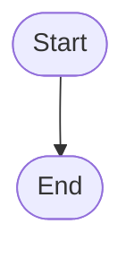

# Problem-Fomulation and Analysis 
## Define a Problem
define a problem and its scope
## Analyse a Problem: IPO cycle
The Input-Process-Output cycle
## Decompose a Problem
Decomposition: Breaking down problems into ==smaller and more manageable== Sub-problems using a ==top-down==/==divide-and-conquer== approach
>[!tip] Stepwise Refinement
>This process involves further breaking down sub-problems into several smaller steps.
>```mermaid
>	flowchart TD
>		a(Problem)
>		b1(Sub-problems)
>		c11(Modules)
>		a -- "Top-down/divide-and-conquer" --> b1
>		b1 -- "Stepwise Refinement" --> c11
>```
## Identify Common Elements Across Similar Problems
==Pattern Recognition== means Identifying similar patterns among different problems and using related solutions to handle the matters.
## Designing User Interface and Components
Use wireframes to draft the user interface of the program and the components to be included.
## Problem solving analysis
There are 5 steps to solving problems.
1. Problem definition
2. Problem analysis
3. Algorithm design
4. Program development
5. Testing and debugging
Throughout these 5 steps, **documentation** is done.
# Algorithm Design
An ==algorithm== is a set of steps for solving a problem in the specified order. 
Buzzword: ==dry run==: deduce the purpose and output of an algorithm or a program.
## Pseudocode and flowcharts
==Pseudocode== uses simple words/==statements== to express an algorithm
==Flowchart== uses specific shapes and links them to express an algorithm.
### Start/end of the algorithm

Such expressions are not necessary in pseudocode.
### Assignment
```
A <- 21
B <- A
B <- B + 1
```
Rectangles are used for assignments in flowcharts.
### Input and Output
```
Input A, B
```
Parallelograms are used for assignments in flowcharts.
### Decisions / Conditions
```
if A = B then
	...
else
	...
```
Rhombuses are used for conditions in flowcharts.
### Module / functions (rarely tested)
```
Call ProcedureABC
```
Rectangles with double side borders are used for calling modules in flowcharts.
## Variables
Variables store data.
### Naming rules
1. A variable name can only start with English letters or an underscore.
2. Only English letters, numbers and underscores can be used in a variable name.
### Data types
Integers store integers
Floats store integers and decimals
Characters/strings store all letters, numbers and some special symbols.
Booleans must be either `True` or `False`.
# Program Testing and Debugging
## Testing Programs
==Test data== can be used to verify the accuracy of the program.
Test data is specifically chosen and usually includes
- ==Normal data values==, which is data within the valid range the program is expected to process.
- ==Erroneous data values==, which are for testing if the program can process invalid inputs.
- ==Boundary data values/boundary cases==, which refer to some extreme data values.
## Program Errors and Debugging
### Three types of program errors
#### Syntax error
This happens when a code breaks the rules of the programming language, such as
- missing colons
- misspelt keywords
- capitalisation errors
- missing indents or brackets
#### Logic error
No error messages are shown and the program still works. but it will function abnormally and/or gives wrong results.
#### Run-time error
The program encounters a problem that leads to an unexpected termination, such as
- dividing a number by zero
- calculating the square root of a negative number
- accessing an item outside the range of array index
