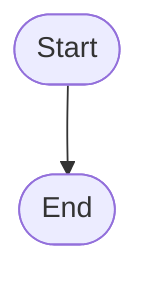

---
tags:
  - ict
  - compulsory
  - programming
  - algorithms
aliases:
  - Problem Formulation
  - Compulsory D
  - Algorithm Design
---

# Problem Formulation and Analysis

## Define a Problem

Define a problem and its scope.

## Analyse a Problem: IPO Cycle

The Input-Process-Output cycle.

## Decompose a Problem

Decomposition: Breaking down problems into ==smaller and more manageable== sub-problems using a ==top-down==/==divide-and-conquer== approach.

> [!tip] Stepwise Refinement
> This process involves further breaking down sub-problems into several smaller steps.
> ```mermaid
> flowchart TD
>     a(Problem)
>     b1(Sub-problems)
>     c11(Modules)
>     a -- "Top-down/divide-and-conquer" --> b1
>     b1 -- "Stepwise Refinement" --> c11
> ```

## Identify Common Elements Across Similar Problems

==Pattern Recognition== means identifying similar patterns among different problems and using related solutions to handle the matters.

## Designing User Interface and Components

Use wireframes to draft the user interface of the program and the components to be included.

## Problem Solving Analysis

There are 5 steps to solving problems:

1. Problem definition
2. Problem analysis
3. Algorithm design
4. Program development
5. Testing and debugging

Throughout these 5 steps, **documentation** is done.

---

# Algorithm Design

An ==algorithm== is a set of steps for solving a problem in the specified order.

> [!note] Buzzword
> ==Dry run==: Deduce the purpose and output of an algorithm or a program.

## Pseudocode and Flowcharts

==Pseudocode== uses simple words/==statements== to express an algorithm.

==Flowchart== uses specific shapes and links them to express an algorithm.

### Start/End of the Algorithm


```mermaid
flowchart TD
    A([Start]) --> B([End])
```

Such expressions are not necessary in pseudocode.

### Assignment

```
A <- 21
B <- A
B <- B + 1
```

Rectangles are used for assignments in flowcharts.

### Input and Output

```
Input A, B
```

Parallelograms are used for input/output in flowcharts.

### Decisions / Conditions

```
if A = B then
    ...
else
    ...
```

Rhombuses are used for conditions in flowcharts.

### Module / Functions (Rarely Tested)

```
Call ProcedureABC
```

Rectangles with double side borders are used for calling modules in flowcharts.

---

# Variables

Variables store data.

## Naming Rules

1. A variable name can only start with English letters or an underscore.
2. Only English letters, numbers and underscores can be used in a variable name.

## Data Types

| Type | Description |
| :--- | :--- |
| Integer | Stores whole numbers |
| Float | Stores integers and decimals |
| Character/String | Stores all letters, numbers and some special symbols |
| Boolean | Must be either `True` or `False` |

---

# Program Testing and Debugging

## Testing Programs

==Test data== can be used to verify the accuracy of the program.

Test data is specifically chosen and usually includes:

- ==Normal data values== - Data within the valid range the program is expected to process.
- ==Erroneous data values== - For testing if the program can process invalid inputs.
- ==Boundary data values/boundary cases== - Extreme data values at the edges of valid ranges.

## Program Errors and Debugging

### Three Types of Program Errors

> [!error] Syntax Error
> This happens when a code breaks the rules of the programming language, such as:
> - Missing colons
> - Misspelt keywords
> - Capitalisation errors
> - Missing indents or brackets

> [!warning] Logic Error
> No error messages are shown and the program still works, but it will function abnormally and/or give wrong results.

> [!danger] Run-time Error
> The program encounters a problem that leads to an unexpected termination, such as:
> - Dividing a number by zero
> - Calculating the square root of a negative number
> - Accessing an item outside the range of array index

---

## Related

- [[ICT Index]] - Subject overview
- [[A2]] - Data validation and control
- [[Compulsory C1]] - Networking (IPO cycle relates to client-server patterns)
