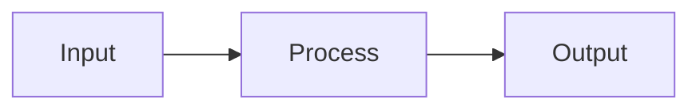
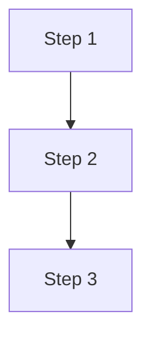
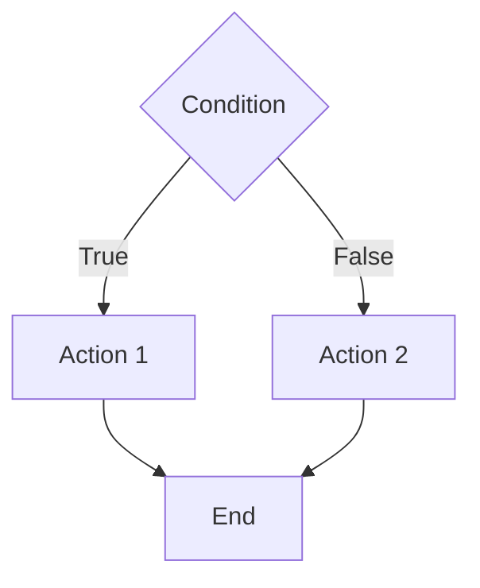
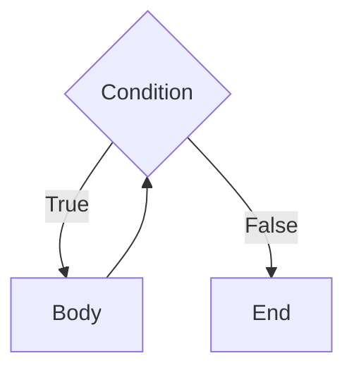

---
tags:
  - ict
  - compulsory
  - programming
  - algorithms
aliases:
  - Compulsory D
  - Problem Formulation
  - Algorithm Design
  - Computational Thinking
---

# Problem Solving

Problem solving is the ==first and most critical== step in programming. It follows the **5-step process**:

1. Problem definition
2. Problem analysis
3. Algorithm design
4. Program development
5. Testing and debugging

==Documentation== is carried out throughout all five steps.

## Define a Problem

Defining a problem means stating:

- What the problem is
- Its ==scope== (what is and is not included)
- The ==constraints== (limitations such as time, memory, or input size)

## Analyse a Problem: IPO Cycle

The ==Input-Process-Output== (IPO) cycle breaks any problem into three components:


```mermaid
flowchart LR
    I[Input] --> P[Process] --> O[Output]
```

| Component    | Description                                    |
|:-------------|:-----------------------------------------------|
| **Input**    | Data required to solve the problem             |
| **Process**  | Steps or calculations applied to the input     |
| **Output**   | The result produced by the program             |

> [!tip] IPO in Client-Server
> The IPO cycle relates to [[Compulsory/C#Networking Fundamentals|client-server]] request-response patterns — a client sends **input**, the server **processes** it, and returns **output**.

## Decompose a Problem

==Decomposition== means breaking down a problem into ==smaller and more manageable== sub-problems using a ==top-down==/==divide-and-conquer== approach.

> [!tip] Stepwise Refinement
> This process involves further breaking down sub-problems into several smaller steps.
>
> ```mermaid
> flowchart TD
>     a(Problem)
>     b1(Sub-problem 1)
>     b2(Sub-problem 2)
>     b3(Sub-problem 3)
>     c11(Module 1)
>     c12(Module 2)
>     a -- "Top-down / divide-and-conquer" --> b1
>     a --> b2
>     a --> b3
>     b1 -- "Stepwise refinement" --> c11
>     b1 --> c12
> ```

> [!example] Example: Calculator Program
> A calculator program can be decomposed into:
> 1. Read two numbers
> 2. Select an operation (+, -, *, /)
> 3. Perform the calculation
> 4. Display the result

## Identify Common Elements Across Similar Problems

==Pattern Recognition== means identifying similar patterns among different problems and using related solutions to handle them.

> [!example] Example
> Finding the maximum value in a list and finding the minimum value share the same structure — both require iterating through a list and comparing values. Recognising this pattern lets you reuse the same algorithm structure.

## Designing User Interface and Components

Use ==wireframes== to draft the user interface of the program and the components to be included. A wireframe sketches:

- Layout of elements (buttons, text boxes, labels)
- Where input is taken from the user
- Where output is displayed

---

# Algorithms

An ==algorithm== is a set of steps for solving a problem in a ==specified order==.

> [!info] Dry Run
> A ==dry run== means deducing the purpose and output of an algorithm or program by tracing through it step-by-step.

## Pseudocode and Flowcharts

==Pseudocode== uses simple words/==statements== to express an algorithm.

==Flowcharts== use specific shapes and links to express an algorithm visually.

### Flowchart Symbols

| Symbol        | Shape            | Purpose                        |
|:--------------|:-----------------|:-------------------------------|
| Start / End   | Rounded rectangle | Indicates start or end of algorithm |
| Input / Output | Parallelogram    | Reading or displaying data     |
| Process       | Rectangle        | Assignment or calculation      |
| Decision      | Rhombus          | Condition (if/else)            |
| Module        | Double-bordered rectangle | Calling a subroutine   |
| Flow line     | Arrow            | Direction of flow              |

### Start/End


```mermaid
flowchart TD
    A([Start]) --> B([End])
```

Such expressions are not necessary in pseudocode.

### Assignment

```
A <- 21
B <- A
B <- B + 1
```

Rectangles are used for assignments in flowcharts.

### Input and Output

```
Input A, B
Print C
```

Parallelograms are used for input/output in flowcharts.

### Decisions / Conditions

```
if A = B then
    ...
else
    ...
```

Rhombuses are used for conditions in flowcharts.

> [!tip] Selection Structures
> Binary selection uses ==if-else==. Multi-way selection uses ==if-else if-else== or ==switch/case==.

### Module / Functions (Rarely Tested)

```
Call ProcedureABC
```

Rectangles with double side borders are used for calling modules in flowcharts.

> [!tip] Modularisation
> Splitting an algorithm into sub-programs (modules/functions) makes code ==easier to understand==, ==facilitates reuse==, and ==enhances development efficiency==. See [[Elective/C#Subprograms|Elective C - Subprograms]] for advanced modularisation.

### Loops (Iteration)

```
while condition do
    ...
endwhile
```

```
for i <- 1 to n
    ...
endfor
```

### Trace Tables

A ==trace table== tracks the value of each variable at every step of an algorithm.

> [!example] Trace Table Example
> ```
> A <- 3
> B <- 5
> C <- A + B
> Print C
> ```
>
> | Step | A | B | C | Output |
> |:----:|:-:|:-:|:-:|:------:|
> | 1    | 3 | - | - | -      |
> | 2    | 3 | 5 | - | -      |
> | 3    | 3 | 5 | 8 | -      |
> | 4    | 3 | 5 | 8 | 8      |

---

# Data Types and Variables

Variables store data that can change during program execution. ==Constants== store data that does not change.

## Naming Rules

1. A variable name can only start with an English letter or an underscore.
2. Only English letters, numbers and underscores can be used in a variable name.
3. Names are ==case-sensitive== (`count` and `Count` are different variables).

> [!warning] Common Mistakes
> - Variable names cannot start with a number: `2count` is invalid
> - No spaces allowed: `item count` is invalid
> - Avoid using reserved keywords: `if`, `while`, `print`

## Data Types

| Type    | Description                                      | Example       |
|:--------|:-------------------------------------------------|:--------------|
| Integer | Whole numbers (positive, negative, or zero)      | `42`, `-7`    |
| Float   | Numbers with decimal points                      | `3.14`, `-0.5`|
| Character/String | Letters, numbers, and special symbols    | `"Hello"`     |
| Boolean | Must be either `True` or `False`                 | `True`        |

> [!tip] Strings vs Characters
> A ==character== is a single symbol (e.g., `'A'`). A ==string== is a sequence of characters (e.g., `"Hello"`). In this syllabus, strings are treated as a data structure rather than a primitive data type.

## Constants

A ==constant== is a named value that cannot be changed after assignment.

```
CONST PI = 3.14159
```

## One-Dimensional Arrays

An ==array== is a ==data structure== that stores ==multiple values of the same type== in a single variable, accessed by ==index==.

```
scores <- [85, 92, 78, 95, 88]
```

| Index | 0  | 1  | 2  | 3  | 4  |
|:-----:|:--:|:--:|:--:|:--:|:--:|
| Value | 85 | 92 | 78 | 95 | 88 |

> [!warning] Array Indexing
> Arrays typically start at index ==0==. Accessing an index outside the valid range causes a ==run-time error==.

### Common Array Operations

| Operation | Description                          |
|:----------|:-------------------------------------|
| Load      | Assign values to array elements      |
| Print     | Display all elements in the array    |
| Add       | Append or insert an element          |
| Delete    | Remove an element from the array     |

```
// Add item at the end
Append item TO scores

// Delete item at index 2
Remove scores[2]
```

---

# Control Structures

Control structures determine the ==flow of execution== in a program. There are three types.

## Sequence

Instructions execute ==one after another== in order.


```mermaid
flowchart TD
    A[Step 1] --> B[Step 2] --> C[Step 3]
```

```
Input name
Print "Hello, " + name
```

## Selection

Selection allows the program to ==make decisions== and choose different paths.

### Binary Selection (if-else)

```
if condition then
    ...
else
    ...
endif
```


```mermaid
flowchart TD
    A{Condition} -->|True| B[Action 1]
    A -->|False| C[Action 2]
    B --> D[End]
    C --> D
```

### Multi-way Selection (if-else if-else)

```
if condition1 then
    ...
else if condition2 then
    ...
else
    ...
endif
```

### Switch/Case

```
switch expression
    case value1:
        ...
    case value2:
        ...
    default:
        ...
endswitch
```

> [!tip] When to Use Switch
> Use `switch/case` when comparing ==one variable against multiple constant values== — it is cleaner than a long `if-else if` chain.

## Iteration

Iteration (==loops==) repeats a block of code while a condition is met.

### While Loop

```
while condition do
    ...
endwhile
```


```mermaid
flowchart TD
    A{Condition} -->|True| B[Body]
    B --> A
    A -->|False| C[End]
```

> [!warning] Infinite Loops
> If the condition never becomes `False`, the loop runs forever. Always ensure the loop variable changes inside the body.

### For Loop

```
for i <- start to end
    ...
endfor
```

### Loop Examples

> [!example] Sum of Numbers 1 to 10
> ```
> sum <- 0
> for i <- 1 to 10
>     sum <- sum + i
> endfor
> Print sum
> ```
>
> | Step | i  | sum |
> |:----:|:--:|:---:|
> | 1    | 1  | 1   |
> | 2    | 2  | 3   |
> | 3    | 3  | 6   |
> | ...  | ...| ... |
> | 10   | 10 | 55  |

> [!warning] Nested Loops
> This syllabus does NOT require ==nested loops==, but you should understand that a loop can be placed inside another loop.

---

# Program Development

## Operators and Expressions

### Arithmetic Operators

| Operator | Meaning       | Example    |
|:--------:|:--------------|:-----------|
| `+`      | Addition      | `5 + 3` → `8` |
| `-`      | Subtraction   | `5 - 3` → `2` |
| `*`      | Multiplication| `5 * 3` → `15`|
| `/`      | Division      | `6 / 3` → `2` |
| `%`      | Modulus (remainder) | `7 % 3` → `1` |

### Comparison Operators

| Operator | Meaning              | Example      |
|:--------:|:---------------------|:-------------|
| `=`      | Equal to             | `5 = 5` → `True` |
| `<>`     | Not equal to         | `5 <> 3` → `True` |
| `>`      | Greater than         | `5 > 3` → `True` |
| `<`      | Less than            | `5 < 3` → `False`|
| `>=`     | Greater than or equal| `5 >= 5` → `True` |
| `<=`     | Less than or equal   | `5 <= 3` → `False`|

### Logical Operators

| Operator | Meaning |
|:--------:|:--------|
| `AND`    | Both conditions must be true |
| `OR`     | At least one condition must be true |
| `NOT`    | Reverses the condition        |

> [!warning] Operator Precedence
> Arithmetic (`*`, `/`) > Comparison (`=`, `>`) > Logical (`AND`, `OR`). Use brackets to clarify.

## Input/Output Statements

```
Input "Enter your name: ", name
Print "Hello, " + name
```

## Assignment Statements

```
total <- price * quantity
count <- count + 1
```

## Common Algorithms

### Find Minimum / Maximum

```
min <- list[0]
for i <- 1 to length(list) - 1
    if list[i] < min then
        min <- list[i]
    endif
endfor
Print min
```

### Calculate Average

```
sum <- 0
for i <- 0 to length(list) - 1
    sum <- sum + list[i]
endfor
average <- sum / length(list)
```

### Linear Search

```
found <- false
for i <- 0 to length(list) - 1
    if list[i] = target then
        found <- true
        position <- i
    endif
endfor
```

### Count Items Meeting Criteria

```
count <- 0
for i <- 0 to length(list) - 1
    if list[i] > threshold then
        count <- count + 1
    endif
endfor
```

### Check if Values are in Order

```
inOrder <- true
for i <- 0 to length(list) - 2
    if list[i] > list[i+1] then
        inOrder <- false
    endif
endfor
```

### Find String Length and Extract Characters

```
length <- 0
for each character in str
    length <- length + 1
endfor

// Extract character at position i
char <- str[i]
```

### Modify an Algorithm for Changes in Task Specification

When a problem specification changes, the existing algorithm must be ==modified== to meet the new requirements. This involves:

- Identifying which parts of the algorithm are affected by the change
- Adjusting input/output, conditions, or calculations as needed
- Verifying that the modified algorithm still works correctly with trace tables or dry runs

> [!example] Example
> An algorithm that finds the maximum value in a list can be modified to find the second maximum. After finding the maximum, a second pass excludes the maximum and repeats the same logic.

> [!tip] Exam Tip
> Always trace through the modified algorithm with test data to confirm correctness. Reusing the original structure reduces errors compared to rewriting from scratch.

> [!tip] Mathematical Formulas
> You may be asked to implement mathematical formulas in pseudocode, such as $n!$, $\sum_{i=1}^{n} i$, or $\sqrt{x}$. These are tested in algorithm design questions — see [[Elective/C#Numerical Errors|Elective C]] for related numerical concepts.

---

# Testing and Debugging

## Types of Test Data

Test data is specifically chosen to verify program accuracy:

| Test Data Type         | Description                                        | Example (age input 0-150) |
|:-----------------------|:---------------------------------------------------|:--------------------------|
| ==Normal data==        | Values within the valid range                      | `75`                      |
| ==Erroneous data==     | Invalid inputs the program should reject           | `-5`, `"abc"`             |
| ==Boundary data==      | Extreme values at the edges of valid ranges        | `0`, `150`                |

> [!example] Test Data Example
> For a program that accepts a student number (1-99):
>
> | Type | Value | Purpose |
> |:-----|:------|:--------|
> | Normal | `45` | Valid student number |
> | Erroneous | `0` | Below minimum |
> | Erroneous | `100` | Above maximum |
> | Erroneous | `-1` | Negative |
> | Boundary | `1` | Minimum valid |
> | Boundary | `99` | Maximum valid |

> [!tip] Exam Tip: Test Data
> When asked to design test data, always include at least one ==boundary case== and one ==erroneous case== alongside normal data. This demonstrates thorough testing.

## Program Errors

### Syntax Error

> [!error] Syntax Error
> This happens when code ==breaks the rules== of the programming language:
> - Missing colons or brackets
> - Misspelt keywords
> - Capitalisation errors
> - Missing indents

The program ==will not run== until syntax errors are fixed.

### Logic Error

> [!warning] Logic Error
> No error messages are shown and the program runs, but it ==gives wrong results==.
>
> Example: Using `>` instead of `>=` when finding the maximum value.

Logic errors are ==hardest to detect== because the program appears to work normally.

### Run-time Error

> [!danger] Run-time Error
> The program encounters a problem that leads to ==unexpected termination==:
> - Dividing a number by zero
> - Calculating the square root of a negative number
> - Accessing an item outside the range of an array index

The program starts but crashes during execution.

### Error Comparison

| Error Type | When Detected | Program Runs? | Error Message? |
|:-----------|:--------------|:-------------:|:--------------:|
| Syntax     | Before running | No            | Yes            |
| Logic      | During testing | Yes           | No             |
| Run-time   | During execution | Crashes     | Sometimes      |

## Debugging Techniques

1. ==Read the error message== carefully — it tells you the line number and type of error
2. ==Use a trace table== to follow variable values step-by-step
3. ==Add print statements== at key points to inspect values
4. ==Test with known inputs== where you can predict the correct output
5. ==Use the debugger== (step-through execution) if available

> [!tip] Comparing Solutions
> When comparing different solutions to the same problem, consider:
> - **Efficiency** — which uses fewer steps or less time
> - **Resource usage** — which uses less memory
> - **Readability** — which is easier to understand and maintain
>
> More efficient solutions may use fewer loops or avoid unnecessary operations.

## Benefits of Modularisation

> [!info] Why Use Modules/Functions?
> 1. ==Easy to understand== — broken into smaller, focused parts
> 2. ==Facilitate reuse== — the same module can be called multiple times
> 3. ==Enhance development efficiency== — multiple people can work on different modules
>
> See [[Elective/C#Subprograms|Elective C - Subprograms]] for advanced module design.

---

## Related

- [[ICT Index]] - Subject overview
- [[Compulsory/A]] - Data validation and control
- [[Compulsory/B]] - Computer system fundamentals (hardware and software layers)
- [[Compulsory/C]] - Networking (IPO cycle relates to client-server patterns)
- [[Elective/C]] - Program errors (overflow, truncation, rounding), subprograms, data structures
