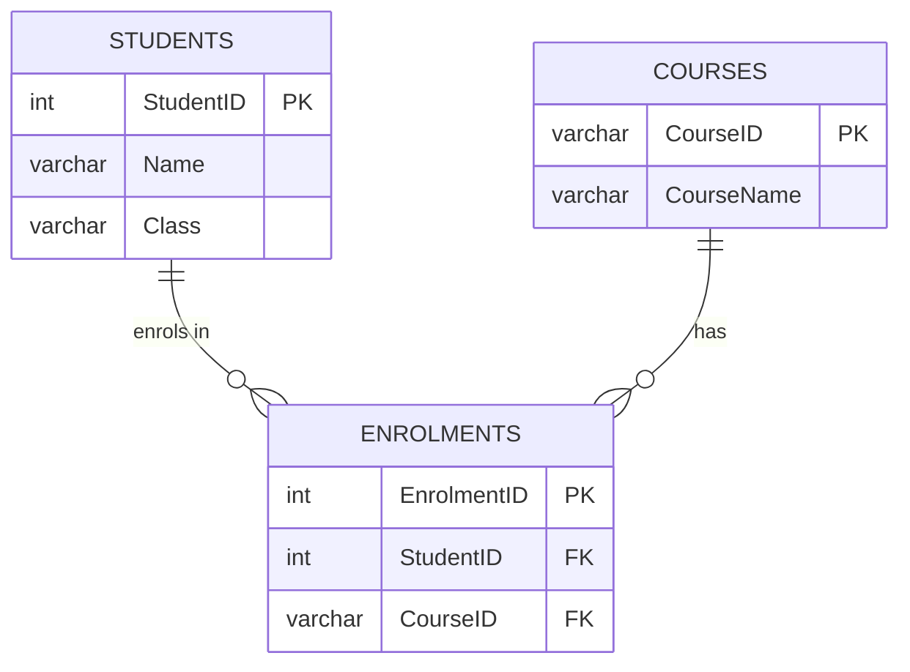
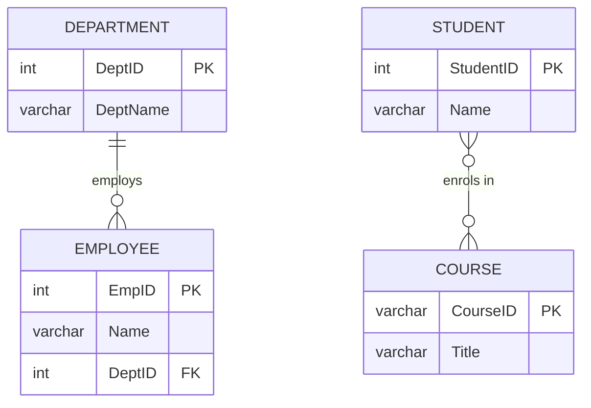

# Elective A: Databases

> [!info] Overview
> **Hours:** 38 | **Weighting:** Significant portion of DSE ICT
> This elective covers relational database concepts, SQL, and database design methodology.
> Cross-references: [[Compulsory/A]] for basic data concepts, [[Database Class Practice]] for exercises.

---

## 1. Relational Database Concepts (6 hours)

> [!tip] Key Concepts
> Understanding these fundamentals is essential for all subsequent topics.

### 1.1 Entity, Attribute, Relationship

| Term | Definition | Example |
|------|------------|---------|
| **Entity** | An object or concept about which data is stored | Student, Course, Order |
| **Attribute** | A property or characteristic of an entity | StudentID, Name, DateOfBirth |
| **Relationship** | An association between two or more entities | Student *enrolls in* Course |
| **Domain** | The set of acceptable values for an attribute | AGE domain: integers 0–150 |

### 1.2 Types of Keys

| Key Type | Description | Example |
|----------|-------------|---------|
| **Primary Key** | Uniquely identifies each record in a table | `StudentID` |
| **Candidate Key** | A minimal set of attributes that can uniquely identify a record | `{StudentID}`, `{Email}` |
| **Foreign Key** | An attribute in one table that references the primary key of another table | `CourseID` in Enrolment table |
| **Composite Key** | A key made up of two or more attributes | `{StudentID, CourseID}` |
| **Surrogate Key** | An artificially generated primary key | Auto-increment `ID` |

### 1.3 Integrity Constraints

```sql
-- Entity Integrity: Primary Key cannot be NULL
CREATE TABLE Students (
    StudentID INT PRIMARY KEY,
    Name VARCHAR(50) NOT NULL,
    Email VARCHAR(100) UNIQUE
);

-- Referential Integrity: Foreign Key must reference valid primary key
CREATE TABLE Enrolments (
    EnrolmentID INT PRIMARY KEY,
    StudentID INT,
    CourseID INT,
    FOREIGN KEY (StudentID) REFERENCES Students(StudentID),
    FOREIGN KEY (CourseID) REFERENCES Courses(CourseID)
);

-- Domain Integrity: CHECK constraint ensures valid values
CREATE TABLE Students (
    StudentID INT PRIMARY KEY,
    Name VARCHAR(50) NOT NULL,
    Age INT CHECK (Age >= 0 AND Age <= 150),
    Gender CHAR(1) CHECK (Gender IN ('M', 'F'))
);
```

### 1.4 Indexes

Indexes improve the speed of data retrieval operations:

```sql
-- Create an index on a single column
CREATE INDEX idx_student_name ON Students(Name);

-- Create a composite index
CREATE INDEX idx_enrolment ON Enrolments(StudentID, CourseID);

-- Unique index (also enforces uniqueness)
CREATE UNIQUE INDEX idx_email ON Students(Email);
```

> [!warning] Index Trade-off
> Indexes speed up **reads** but slow down **writes** (INSERT, UPDATE, DELETE) because the index must also be updated.

### 1.5 Rollback

> [!tip] Purpose of Rollback
> Rollback restores a database to a previous state after an error or failure. It is part of **transaction management** ensuring **ACID** properties (Atomicity, Consistency, Isolation, Durability).

```sql
BEGIN TRANSACTION;

UPDATE Accounts SET Balance = Balance - 1000 WHERE AccountID = 1;
UPDATE Accounts SET Balance = Balance + 1000 WHERE AccountID = 2;

-- If an error occurs:
ROLLBACK;

-- If everything is successful:
COMMIT;
```

---

## 2. SQL Fundamentals (18 hours — Part 1)

> [!info] SQL Categories
> | Category | Purpose | Example Commands |
> |----------|---------|-----------------|
> | **DDL** (Data Definition Language) | Define database structure | `CREATE`, `ALTER`, `DROP` |
> | **DML** (Data Manipulation Language) | Manipulate data | `INSERT`, `UPDATE`, `DELETE` |
> | **DQL** (Data Query Language) | Retrieve data | `SELECT` |
> | **DCL** (Data Control Language) | Control access | `GRANT`, `REVOKE` |

### 2.1 DDL — Modifying Table Structure

```sql
-- Create a table
CREATE TABLE Students (
    StudentID INT PRIMARY KEY,
    Name VARCHAR(50) NOT NULL,
    DateOfBirth DATE,
    Class CHAR(2)
);

-- Add a column
ALTER TABLE Students ADD Email VARCHAR(100);

-- Modify a column
ALTER TABLE Students ALTER COLUMN Name VARCHAR(80);

-- Delete a column
ALTER TABLE Students DROP COLUMN Email;

-- Delete a table
DROP TABLE Students;
```

### 2.2 DML — Adding, Modifying, Deleting Data

```sql
-- Insert data
INSERT INTO Students (StudentID, Name, DateOfBirth, Class)
VALUES (1001, 'Chan Tai Man', '2008-05-15', '4A');

-- Insert multiple rows
INSERT INTO Students (StudentID, Name, DateOfBirth, Class)
VALUES
    (1002, 'Wong Siu Ming', '2008-03-22', '4A'),
    (1003, 'Lee Mei Ling', '2007-11-10', '4B');

-- Update data
UPDATE Students
SET Class = '5A'
WHERE StudentID = 1001;

-- Delete data
DELETE FROM Students
WHERE StudentID = 1003;

-- Delete all data (but keep table structure)
DELETE FROM Students;
-- or
TRUNCATE TABLE Students;
```

### 2.3 DQL — Viewing, Sorting, Selecting, Filtering

```sql
-- Select all columns
SELECT * FROM Students;

-- Select specific columns
SELECT Name, Class FROM Students;

-- Filter with WHERE
SELECT Name, Class
FROM Students
WHERE Class = '4A';

-- Sort results
SELECT Name, DateOfBirth
FROM Students
ORDER BY DateOfBirth ASC;

-- Limit results
SELECT TOP 5 Name FROM Students;
-- or (MySQL/PostgreSQL)
SELECT Name FROM Students LIMIT 5;
```

### 2.4 Operators

#### Arithmetic Operators

```sql
SELECT Name, Score, Score + 10 AS AdjustedScore
FROM Results;
```

#### Comparison Operators

```sql
SELECT Name FROM Students WHERE Age >= 15;
SELECT Name FROM Students WHERE Class <> '4A';
```

#### Logical Operators

```sql
SELECT Name FROM Students
WHERE Class = '4A' AND Age >= 15;

SELECT Name FROM Students
WHERE Class = '4A' OR Class = '4B';

SELECT Name FROM Students
WHERE NOT Class = '4C';
```

#### IN and BETWEEN

```sql
SELECT Name FROM Students
WHERE Class IN ('4A', '4B', '4C');

SELECT Name FROM Students
WHERE Age BETWEEN 14 AND 16;
```

#### LIKE Pattern Matching

```sql
-- Names starting with 'Chan'
SELECT Name FROM Students WHERE Name LIKE 'Chan%';

-- Names with exactly 8 characters
SELECT Name FROM Students WHERE Name LIKE '________';

-- Names containing 'ming'
SELECT Name FROM Students WHERE Name LIKE '%ming%';
```

### 2.5 Built-in Functions

#### Aggregate Functions

```sql
-- Count records
SELECT COUNT(*) AS TotalStudents FROM Students;

-- Sum, Average, Min, Max
SELECT
    SUM(Score) AS TotalScore,
    AVG(Score) AS AvgScore,
    MIN(Score) AS MinScore,
    MAX(Score) AS MaxScore
FROM Results
WHERE CourseID = 'ICT';
```

#### GROUP BY and HAVING

```sql
-- Count students per class
SELECT Class, COUNT(*) AS StudentCount
FROM Students
GROUP BY Class;

-- Classes with more than 20 students
SELECT Class, COUNT(*) AS StudentCount
FROM Students
GROUP BY Class
HAVING COUNT(*) > 20;
```

#### String Functions

```sql
-- Concatenate
SELECT CONCAT(FirstName, ' ', LastName) AS FullName FROM Students;

-- Uppercase / Lowercase
SELECT UPPER(Name), LOWER(Email) FROM Students;

-- Length
SELECT Name, LENGTH(Name) AS NameLength FROM Students;

-- Substring
SELECT SUBSTRING(Email, 1, 3) AS EmailPrefix FROM Students;
```

### 2.6 Creating Views

```sql
-- Create a view
CREATE VIEW vw_4A_Students AS
SELECT StudentID, Name, DateOfBirth
FROM Students
WHERE Class = '4A';

-- Use the view
SELECT * FROM vw_4A_Students;

-- Drop a view
DROP VIEW vw_4A_Students;
```

> [!tip] Views
> Views simplify complex queries and provide a layer of security by restricting which columns/rows users can access.

---

## 3. SQL Advanced (18 hours — Part 2)

### 3.1 Joins — Querying Multiple Tables

> [!warning] Exam Focus
> Joins are frequently tested. Know the difference between each join type.

#### Equi-Join

```sql
-- Combine Students and Enrolments where IDs match
SELECT Students.Name, Enrolments.CourseID
FROM Students, Enrolments
WHERE Students.StudentID = Enrolments.StudentID;
```

#### Natural Join

```sql
-- Automatically joins on columns with the same name
SELECT Name, CourseID
FROM Students
NATURAL JOIN Enrolments;
```

#### INNER JOIN

```sql
SELECT Students.Name, Enrolments.CourseID
FROM Students
INNER JOIN Enrolments ON Students.StudentID = Enrolments.StudentID;
```

#### LEFT / RIGHT / FULL OUTER JOIN

```sql
-- All students, even those not enrolled in any course
SELECT Students.Name, Enrolments.CourseID
FROM Students
LEFT JOIN Enrolments ON Students.StudentID = Enrolments.StudentID;

-- All courses, even those with no students
SELECT Students.Name, Enrolments.CourseID
FROM Students
RIGHT JOIN Enrolments ON Students.StudentID = Enrolments.StudentID;

-- All students and all courses
SELECT Students.Name, Enrolments.CourseID
FROM Students
FULL OUTER JOIN Enrolments ON Students.StudentID = Enrolments.StudentID;
```



### 3.2 Sub-queries

```sql
-- Students enrolled in 'ICT'
SELECT Name
FROM Students
WHERE StudentID IN (
    SELECT StudentID
    FROM Enrolments
    WHERE CourseID = 'ICT'
);

-- Students with above-average score
SELECT Name, Score
FROM Results
WHERE Score > (
    SELECT AVG(Score)
    FROM Results
);
```

> [!info] Sub-query Limit (DSE)
> The HKDSE syllabus requires **one sub-level only** — no nested sub-queries.

### 3.3 Complex Query Examples

```sql
-- Students enrolled in ALL courses they take
SELECT S.Name
FROM Students S
WHERE NOT EXISTS (
    SELECT C.CourseID
    FROM Courses C
    WHERE NOT EXISTS (
        SELECT E.CourseID
        FROM Enrolments E
        WHERE E.StudentID = S.StudentID
        AND E.CourseID = C.CourseID
    )
);

-- Rank students by score
SELECT Name, Score,
    RANK() OVER (ORDER BY Score DESC) AS Rank
FROM Results;
```

---

## 4. Database Design Methodology (14 hours)

### 4.1 Entity-Relationship Diagrams

#### Entity Types

| Symbol | Meaning |
|--------|---------|
| **Rectangle** | Entity |
| **Oval / Ellipse** | Attribute |
| **Diamond** | Relationship |
| **Double rectangle** | Weak entity |
| **Underline** | Primary key attribute |
| **Double oval** | Multi-valued attribute |

### 4.2 Types of Relationships

| Relationship | Description | Example |
|--------------|-------------|---------|
| **1:1** | One-to-One | Person ↔ Identity Card |
| **1:N** | One-to-Many | Department ↔ Employees |
| **M:N** | Many-to-Many | Students ↔ Courses |

### 4.3 Cardinality and Participation



| Notation | Meaning |
|----------|---------|
| `\|\|--o{` | One-to-Many (mandatory on "one" side, optional on "many") |
| `\|\|--\|\|` | One-to-One (mandatory both sides) |
| `}o--o{` | Many-to-Many |

### 4.4 Mapping ER Diagrams to Tables

**Rules:**
1. Each entity becomes a table
2. Each attribute becomes a column
3. The primary key attribute becomes the primary key column
4. **1:N relationships** — add foreign key on the "many" side
5. **M:N relationships** — create a new junction/associative table

```sql
-- 1:N: Department to Employees
CREATE TABLE Employees (
    EmpID INT PRIMARY KEY,
    Name VARCHAR(50),
    DeptID INT,
    FOREIGN KEY (DeptID) REFERENCES Departments(DeptID)
);

-- M:N: Students to Courses (junction table)
CREATE TABLE Enrolments (
    StudentID INT,
    CourseID VARCHAR(10),
    Grade CHAR(2),
    PRIMARY KEY (StudentID, CourseID),
    FOREIGN KEY (StudentID) REFERENCES Students(StudentID),
    FOREIGN KEY (CourseID) REFERENCES Courses(CourseID)
);
```

### 4.5 Weak Entities

A weak entity cannot be uniquely identified by its own attributes alone — it depends on a **strong entity**.

```sql
-- Weak entity: Dependent (depends on Employee)
CREATE TABLE Dependents (
    EmpID INT,
    DepName VARCHAR(50),
    Relationship VARCHAR(20),
    PRIMARY KEY (EmpID, DepName),
    FOREIGN KEY (EmpID) REFERENCES Employees(EmpID)
);
```

---

## 5. Normalisation (14 hours)

### 5.1 Data Redundancy

> [!warning] Problems of Redundancy
> - **Update anomalies**: Changing data in one place but not another
> - **Insertion anomalies**: Cannot insert data without unrelated data
> - **Deletion anomalies**: Deleting data causes loss of unrelated data

### 5.2 Normal Forms

#### First Normal Form (1NF)

> [!tip] 1NF Rules
> - All attributes contain **atomic** (indivisible) values
> - No repeating groups or arrays
> - Each row is unique

**Before 1NF (violation):**
| StudentID | Name | Courses |
|-----------|------|---------|
| 1 | Chan | ICT, MATH |
| 2 | Wong | ICT, ENG |

**After 1NF:**
| StudentID | Name | Course |
|-----------|------|--------|
| 1 | Chan | ICT |
| 1 | Chan | MATH |
| 2 | Wong | ICT |
| 2 | Wong | ENG |

#### Second Normal Form (2NF)

> [!tip] 2NF Rules
> - Already in 1NF
> - All non-key attributes are **fully functionally dependent** on the entire primary key (no partial dependency)

**Violation of 2NF (composite key with partial dependency):**
| StudentID | CourseID | StudentName | CourseName | Grade |
|-----------|----------|-------------|------------|-------|

- `StudentName` depends only on `StudentID` (partial)
- `CourseName` depends only on `CourseID` (partial)

**Solution:** Split into three tables:
- `Students(StudentID, StudentName)`
- `Courses(CourseID, CourseName)`
- `Enrolments(StudentID, CourseID, Grade)`

#### Third Normal Form (3NF)

> [!tip] 3NF Rules
> - Already in 2NF
> - No **transitive dependencies** (non-key attribute does not depend on another non-key attribute)

**Violation of 3NF:**
| StudentID | Name | DeptID | DeptName |
|-----------|------|--------|----------|

- `DeptName` depends on `DeptID`, not directly on `StudentID` (transitive)

**Solution:**
- `Students(StudentID, Name, DeptID)`
- `Departments(DeptID, DeptName)`

### 5.3 Denormalisation

> [!info] Why Denormalise?
> Normalisation reduces redundancy but can require many joins, slowing queries. **Denormalisation** intentionally reintroduces redundancy for:
> - Improved read performance
> - Simpler queries
> - Reporting/analytics workloads

**Procedure:**
1. Identify frequently joined tables
2. Add redundant columns to reduce join operations
3. Ensure application handles data consistency
4. Document all denormalised columns

---

## 6. Database Security

### 6.1 Access Rights

```sql
-- Grant select permission to a user
GRANT SELECT ON Students TO user1;

-- Grant multiple permissions
GRANT SELECT, INSERT, UPDATE ON Students TO user1;

-- Grant with column-level restriction
GRANT SELECT (Name, Class) ON Students TO user2;

-- Revoke permissions
REVOKE INSERT ON Students FROM user1;

-- Grant all permissions
GRANT ALL PRIVILEGES ON Students TO admin;
```

### 6.2 Data Privacy Principles

| Principle | Description |
|-----------|-------------|
| **Least Privilege** | Users get only the minimum access needed |
| **Need-to-Know** | Access sensitive data only when necessary |
| **Separation of Duties** | No single user controls all aspects of a transaction |
| **Audit Trail** | Log all access and changes for accountability |

### 6.3 Integrity via Access Control

```sql
-- Only allow certain users to modify data
GRANT UPDATE (Grade) ON Enrolments TO teacher_role;
REVOKE DELETE ON Enrolments FROM teacher_role;

-- Create a role for read-only access
CREATE ROLE readonly_user;
GRANT SELECT ON ALL TABLES IN SCHEMA public TO readonly_user;
```

> [!tip] Exam Tip
> When asked about data privacy, mention **access rights**, **user roles**, and the principle of **least privilege**.

---

## Exam Tips

> [!tip] High-Yield Topics
> - **SQL queries**: SELECT with WHERE, ORDER BY, GROUP BY, HAVING
> - **Joins**: INNER JOIN, LEFT JOIN, RIGHT JOIN
> - **Normalisation**: Identifying 1NF, 2NF, 3NF violations
> - **ER diagrams**: Drawing and interpreting, mapping to tables

> [!warning] Common Mistakes
> - Forgetting `GROUP BY` when using aggregate functions with other columns
> - Confusing `WHERE` (filters rows) with `HAVING` (filters groups)
> - Not handling NULL values in queries
> - Forgetting foreign key constraints when creating tables

> [!example] Practice Problems
> See [[Database Class Practice]] for hands-on exercises with sample datasets.

---

## Quick Reference

| Task | SQL Syntax |
|------|------------|
| Create table | `CREATE TABLE name (col TYPE constraints);` |
| Add column | `ALTER TABLE name ADD col TYPE;` |
| Insert data | `INSERT INTO name (cols) VALUES (vals);` |
| Update data | `UPDATE name SET col = val WHERE condition;` |
| Delete data | `DELETE FROM name WHERE condition;` |
| Simple query | `SELECT cols FROM name WHERE condition ORDER BY col;` |
| Join | `SELECT ... FROM A INNER JOIN B ON A.id = B.id;` |
| Aggregate | `SELECT col, COUNT(*) FROM name GROUP BY col HAVING condition;` |
| Sub-query | `SELECT ... FROM name WHERE col IN (SELECT ...);` |
| Create view | `CREATE VIEW name AS SELECT ...;` |
| Grant access | `GRANT privileges ON table TO user;` |

---

## Related Notes

- [[Compulsory/A]] — Basic data concepts
- [[Database Class Practice]] — Hands-on SQL exercises
- [[Compulsory/E]] — Social Implications
- [[Compulsory/C]] — Network security

---

> [!quote] HKDSE ICT Syllabus
> "Databases allow data to be organised, stored and retrieved in a structured manner."
