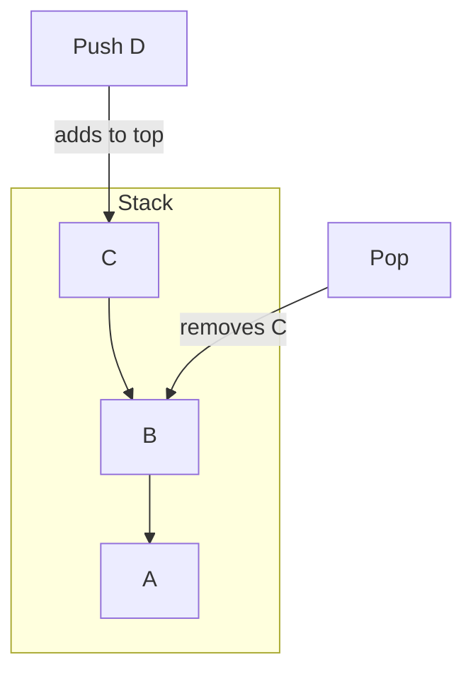
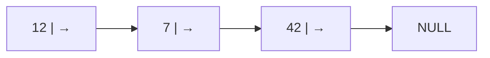
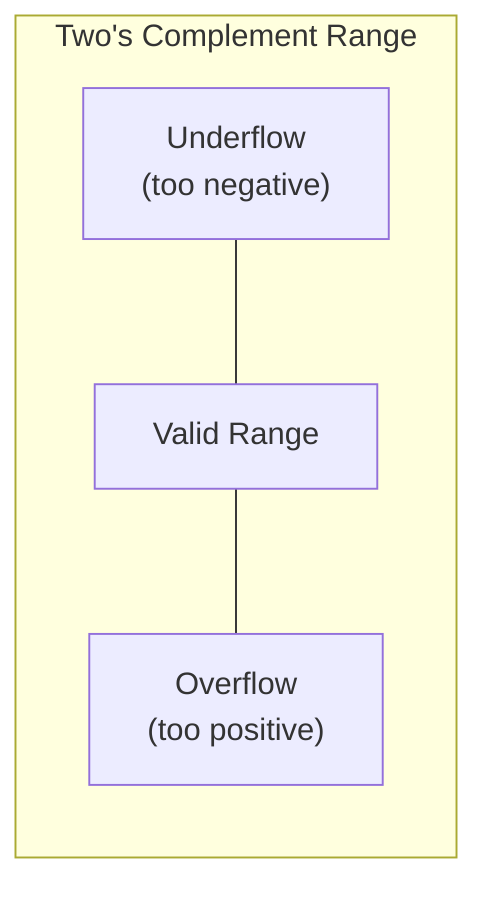

---
tags:
  - ict
  - elective
  - algorithms
  - programming
  - data-structures
aliases:
  - Elective C
  - Algorithm and Programming
  - Programming Elective
---

# Algorithm and Programming

> [!abstract] Overview
> HKDSE ICT Elective C — 42 hours total.
> - **Topic a:** Programming (32 hours) — design, implementation, testing, debugging
> - **Topic b:** Testing and debugging (4 hours) — test strategies, debugging tools
> - **Topic c:** Applications of Programming in Real Life (6 hours) — sensors, physical computing
>
> Cross-references: [[Compulsory/D]] (basic programming), [[Compulsory/A]] (two's complement)

---

## 1. Advanced Data Types

### Simple vs Structured vs User-Defined Types

| Category | Examples | Description |
| :--- | :--- | :--- |
| **Simple** | `int`, `float`, `char`, `bool` | Single atomic value |
| **Structured** | `array`, `record`/`struct` | Composite of multiple values |
| **User-defined** | `class`, `enum`, `type alias` | Programmer-created types |

> [!tip] Exam Tip
> Know the difference between structured types (built-in composites like arrays) and user-defined types (programmer-created like classes). The syllabus requires you to **select** the appropriate type for a given problem.

### Arrays

Arrays store multiple elements of the **same type** under one name, indexed by position.

```python
# 1D Array
scores = [85, 92, 78, 95, 88]

# 2D Array (matrix)
grid = [
    [1, 2, 3],
    [4, 5, 6],
    [7, 8, 9]
]

# Accessing elements
print(scores[0])      # 85 (first element)
print(grid[1][2])     # 6 (row 2, column 3)
```

### Records / Structs

Group **different** data types under one name.

```python
# Using a dictionary as a record
student = {
    "name": "Chan Tai Man",
    "id": "S1234567",
    "class": "5A",
    "gpa": 3.8
}

# Accessing fields
print(student["name"])
```

---

## 2. Algorithm Design

### Searching Algorithms

#### Linear Search

Check each element **sequentially** until found or the list ends.

```python
def linear_search(arr, target):
    for i in range(len(arr)):
        if arr[i] == target:
            return i
    return -1

# Example
data = [42, 17, 93, 8, 56]
print(linear_search(data, 93))  # Output: 2
```

```mermaid
flowchart TD
    A[Start] --> B[Set index i = 0]
    B --> C{i < length of list?}
    C -- No --> D[Return -1: Not found]
    C -- Yes --> E{list[i] == target?}
    E -- Yes --> F[Return i: Found]
    E -- No --> G[i = i + 1]
    G --> C
```

| Metric | Value |
| :--- | :--- |
| Best case | O(1) — first element |
| Worst case | O(n) — last element or absent |
| Average case | O(n) |

#### Binary Search

Search a **sorted** list by repeatedly halving the search interval.

```python
def binary_search(arr, target):
    low, high = 0, len(arr) - 1
    while low <= high:
        mid = (low + high) // 2
        if arr[mid] == target:
            return mid
        elif arr[mid] < target:
            low = mid + 1
        else:
            high = mid - 1
    return -1

# Example (must be sorted)
data = [8, 17, 42, 56, 93]
print(binary_search(data, 56))  # Output: 3
```

```mermaid
flowchart TD
    A[Start] --> B[low = 0, high = n-1]
    B --> C{low <= high?}
    C -- No --> D[Return -1: Not found]
    C -- Yes --> E[mid = low+high / 2]
    E --> F{arr[mid] == target?}
    F -- Yes --> G[Return mid]
    F -- H{arr[mid] < target?}
    H -- Yes --> I[low = mid + 1]
    H -- No --> J[high = mid - 1]
    I --> C
    J --> C
```

> [!warning] Binary Search Requirement
> Binary search **only works on sorted data**. If the list is unsorted, you must either sort it first (O(n log n)) or use linear search (O(n)). On the exam, always check whether data is sorted before choosing an algorithm.

| Metric | Value |
| :--- | :--- |
| Best case | O(1) |
| Worst case | O(log n) |
| Average case | O(log n) |

### Sorting Algorithms

#### Bubble Sort

Repeatedly swap **adjacent** elements if they are in the wrong order.

```python
def bubble_sort(arr):
    n = len(arr)
    for i in range(n - 1):
        swapped = False
        for j in range(n - 1 - i):
            if arr[j] > arr[j + 1]:
                arr[j], arr[j + 1] = arr[j + 1], arr[j]
                swapped = True
        if not swapped:
            break  # Already sorted
    return arr
```

```mermaid
flowchart TD
    A[Start] --> B[i = 0]
    B --> C{i < n-1?}
    C -- No --> Z[Done]
    C -- Yes --> D[j = 0, swapped = false]
    D --> E{j < n-1-i?}
    E -- No --> H{i = i + 1}
    E -- Yes --> F{arr[j] > arr[j+1]?}
    F -- Yes --> G[Swap arr[j] and arr[j+1], swapped = true]
    F -- No --> J[j = j + 1]
    G --> J
    J --> E
    H --> C
```

| Pass | Result |
| :--- | :--- |
| 1 | Largest element "bubbles" to the end |
| 2 | Second largest in position |
| n-1 | List fully sorted |

#### Selection Sort

Find the **minimum** element and swap it to the front, repeat for remaining.

```python
def selection_sort(arr):
    n = len(arr)
    for i in range(n - 1):
        min_idx = i
        for j in range(i + 1, n):
            if arr[j] < arr[min_idx]:
                min_idx = j
        arr[i], arr[min_idx] = arr[min_idx], arr[i]
    return arr
```

#### Insertion Sort

Take each element and **insert** it into its correct position in the sorted portion.

```python
def insertion_sort(arr):
    for i in range(1, len(arr)):
        key = arr[i]
        j = i - 1
        while j >= 0 and arr[j] > key:
            arr[j + 1] = arr[j]
            j -= 1
        arr[j + 1] = key
    return arr
```

> [!info] Sorting Comparison
> | Algorithm | Best | Average | Worst | Stable? |
> | :--- | :--- | :--- | :--- | :--- |
> | Bubble | O(n) | O(n²) | O(n²) | Yes |
> | Selection | O(n²) | O(n²) | O(n²) | No |
> | Insertion | O(n) | O(n²) | O(n²) | Yes |

### Swapping

A fundamental operation used inside sorting algorithms:

```python
# Pythonic swap
a, b = b, a

# Traditional swap (using a temporary variable)
temp = a
a = b
b = temp
```

### Merging

Combine two **sorted** lists into one sorted list.

```python
def merge(left, right):
    result = []
    i = j = 0
    while i < len(left) and j < len(right):
        if left[i] <= right[j]:
            result.append(left[i])
            i += 1
        else:
            result.append(right[j])
            j += 1
    result.extend(left[i:])
    result.extend(right[j:])
    return result
```

> [!tip] Choosing the Right Algorithm
> Consider these factors when selecting an algorithm:
> 1. **Data size** — small n makes O(n²) acceptable; large n needs O(n log n) or better
> 2. **Sorted data** — binary search (O(log n)) beats linear (O(n))
> 3. **Memory** — in-place sorts (bubble, insertion) vs. merge sort (needs extra space)
> 4. **Stability** — do equal elements need to maintain relative order?
> 5. **Existing structure** — nearly sorted data favours insertion sort

---

## 3. Data Structures

### Arrays

Contiguous memory, fixed size, O(1) access by index.

| Operation | Time Complexity |
| :--- | :--- |
| Access by index | O(1) |
| Search (unsorted) | O(n) |
| Search (sorted) | O(log n) |
| Insert (end) | O(1) |
| Insert (middle) | O(n) |
| Delete (middle) | O(n) |

### Stacks

==First In, Last Out (FILO)== — like a stack of plates.

```python
# Stack implementation using a list
stack = []

# Push
stack.append("A")
stack.append("B")
stack.append("C")

# Pop
top = stack.pop()  # Returns "C"
```



| Operation | Description | Time |
| :--- | :--- | :--- |
| `push` | Add to top | O(1) |
| `pop` | Remove from top | O(1) |
| `peek`/`top` | View top without removing | O(1) |
| `isEmpty` | Check if empty | O(1) |

**Applications:** undo/redo, expression evaluation, function call stack, bracket matching

### Queues

==First In, First Out (FIFO)== — like a queue at a shop.

```python
from collections import deque

queue = deque()

# Enqueue
queue.append("P1")
queue.append("P2")
queue.append("P3")

# Dequeue
front = queue.popleft()  # Returns "P1"
```

| Operation | Description | Time |
| :--- | :--- | :--- |
| `enqueue` | Add to rear | O(1) |
| `dequeue` | Remove from front | O(1) |
| `front` | View first element | O(1) |
| `isEmpty` | Check if empty | O(1) |

#### Circular Queue

Reuses empty spaces at the front by wrapping the rear pointer back to the start.

> [!info] Why Circular Queue?
> In a regular queue, once elements are dequeued, that space is wasted. A circular queue wraps around using modulo arithmetic: `rear = (rear + 1) % capacity`. More memory-efficient for fixed-size arrays.

### Linked Lists

A sequence of **nodes**, where each node stores data and a pointer to the next node.



```python
class Node:
    def __init__(self, data):
        self.data = data
        self.next = None

# Build: 12 → 7 → 42
head = Node(12)
head.next = Node(7)
head.next.next = Node(42)
```

| Operation | Linked List | Array |
| :--- | :--- | :--- |
| Access by index | O(n) | O(1) |
| Insert at head | O(1) | O(n) |
| Insert at tail | O(n)* | O(1) |
| Delete | O(n) | O(n) |
| Memory | Non-contiguous, extra pointer overhead | Contiguous, no overhead |

> *O(1) if tail pointer is maintained.

> [!tip] When to Use What?
> - **Array:** random access, known size, cache-friendly
> - **Linked list:** frequent insertions/deletions at arbitrary positions, unknown size
> - **Stack:** LIFO scenarios (undo, recursion, brackets)
> - **Queue:** FIFO scenarios (scheduling, print queue, BFS)

### Constructing Data Structures with Arrays

```python
# Stack using an array
stack_arr = [None] * 100
top = -1

def push(val):
    global top
    top += 1
    stack_arr[top] = val

def pop():
    global top
    val = stack_arr[top]
    top -= 1
    return val

# Queue using an array
queue_arr = [None] * 100
front = 0
rear = -1

def enqueue(val):
    global rear
    rear += 1
    queue_arr[rear] = val

def dequeue():
    global front
    val = queue_arr[front]
    front += 1
    return val
```

---

## 4. File Handling

### Text File Operations

| Operation | Description |
| :--- | :--- |
| **Create** | Open a new file for writing |
| **Read** | Read data from a file |
| **Write** | Write data to a file (overwrites) |
| **Append** | Add data to the end of a file |
| **Insert** | Add data at a specific position |
| **Delete** | Remove a file or delete specific lines |
| **Amend** | Modify existing content in a file |

```python
# Writing (creates or overwrites)
with open("data.txt", "w") as f:
    f.write("Line 1\n")
    f.write("Line 2\n")

# Appending
with open("data.txt", "a") as f:
    f.write("Line 3\n")

# Reading
with open("data.txt", "r") as f:
    content = f.read()
    print(content)

# Reading line by line
with open("data.txt", "r") as f:
    for line in f:
        print(line.strip())
```

> [!warning] File Mode Flags
> | Mode | Description |
> | :--- | :--- |
> | `"r"` | Read only (file must exist) |
> | `"w"` | Write (creates new or **overwrites**) |
> | `"a"` | Append (creates new or adds to end) |
> | `"r+"` | Read and write (file must exist) |
>
> Using `"w"` accidentally will **delete all existing data**.

### Manipulating Text Files

#### Deleting a Line

```python
def delete_line(filename, line_num):
    with open(filename, "r") as f:
        lines = f.readlines()
    with open(filename, "w") as f:
        for i, line in enumerate(lines):
            if i != line_num:
                f.write(line)
```

#### Inserting a Line

```python
def insert_line(filename, line_num, text):
    with open(filename, "r") as f:
        lines = f.readlines()
    lines.insert(line_num, text + "\n")
    with open(filename, "w") as f:
        f.writelines(lines)
```

#### Amending a Line

```python
def amend_line(filename, line_num, new_text):
    with open(filename, "r") as f:
        lines = f.readlines()
    lines[line_num] = new_text + "\n"
    with open(filename, "w") as f:
        f.writelines(lines)
```

---

## 5. Sub-programs

### Functions (Procedures)

```python
# Function with return value
def calculate_area(length, width):
    """Calculate the area of a rectangle."""
    return length * width

# Procedure (no return value)
def greet(name):
    print(f"Hello, {name}!")

# Calling
area = calculate_area(5, 3)
greet("Chan Tai Man")
```

### Parameter Passing

| Method | Description | Example |
| :--- | :--- | :--- |
| **By value** | A copy of the argument is passed | Numbers, strings in Python |
| **By reference** | The original variable is passed | Lists, dictionaries in Python |

```python
# Pass by value — original unchanged
def modify_val(x):
    x = 100

num = 5
modify_val(num)
print(num)  # Still 5

# Pass by reference — original changed
def modify_list(lst):
    lst.append(99)

data = [1, 2, 3]
modify_list(data)
print(data)  # [1, 2, 3, 99]
```

### Local vs Global Scope

```python
counter = 0  # Global variable

def increment():
    global counter   # Declare use of global
    counter += 1

def reset():
    local_counter = 0  # Local variable — not accessible outside
    print(local_counter)

increment()
increment()
print(counter)  # 2
```

> [!warning] Avoid Overusing Global Variables
> Global variables make programs harder to debug and maintain. Prefer passing data through parameters and returning results. Use local variables wherever possible.

### Benefits of Modularisation

1. **Readability** — meaningful function names make code self-documenting
2. **Reusability** — the same function can be called from multiple places
3. **Maintainability** — bugs can be fixed in one place
4. **Testability** — individual functions can be tested independently
5. **Collaboration** — different programmers can work on different modules

> [!tip] Good Programming Styles
> - Use **meaningful names** (`calculate_total`, not `ct`)
> - Add **comments** to explain non-obvious logic
> - Use consistent **indentation** (4 spaces in Python)
> - Keep functions short and focused on one task
> - Follow the **structured programming** paradigm (sequence, selection, iteration)

### Structured Programming

> [!info] Three Basic Constructs
> 1. **Sequence** — statements execute one after another
> 2. **Selection** — `if/elif/else`, `switch/case`
> 3. **Iteration** — `for`, `while` (nested loops required by syllabus)

All algorithms can be expressed using only these three constructs, making programs easier to design, implement, and debug.

---

## 6. Numerical Errors

### Overflow and Underflow

When a number exceeds the **range** of the data type.



- **Overflow:** result is too large positive to store
- **Underflow:** result is too large negative to store

> [!tip] Two's Complement
> Refer to [[Compulsory/A]] for the binary representation of signed integers. For an n-bit signed integer: range is $-2^{n-1}$ to $2^{n-1} - 1$.

### Truncation Error

The difference between the true value and the stored (truncated) value.

$$
\text{Truncation error} = |\text{True value} - \text{Actual value stored}|
$$

> [!example] Example
> $1 \div 3 = 0.333333\ldots$ but stored as $0.3333$ (4 d.p.)
>
> Truncation error = $|0.\overline{3} - 0.3333| = 0.0000\overline{3}$

### Rounding Error

The difference between the true value and the rounded value.

$$
\text{Rounding error} = |\text{True value} - \text{Rounded value}|
$$

> [!example] Example
> $2 \div 3 = 0.666666\ldots$ rounded to 2 d.p. → $0.67$
>
> Rounding error = $|0.\overline{6} - 0.67| = 0.00\overline{3}$

### Other Error Types

> [!info] See [[Compulsory/D]] for:
> - **Syntax errors** — violation of language rules (detected at compile/parse time)
> - **Logical errors** — program runs but produces wrong output
> - **Run-time errors** — occur during execution (e.g., division by zero, out-of-bounds access)

---

## 7. Debugging

### Types of Errors (Summary)

| Error Type | When Detected | Example |
| :--- | :--- | :--- |
| Syntax | Compile/parse time | Missing colon in Python |
| Logical | During testing | Wrong formula, infinite loop |
| Run-time | During execution | Division by zero, file not found |
| Numerical | Results inspection | Rounding, truncation, overflow |

### Manual Debugging Methods

| Method | Description |
| :--- | :--- |
| **Program trace** | Step through code on paper, tracking variable values at each line |
| **Desk checking** | Manually execute the algorithm with sample inputs |
| **Dry run** | Same as desk checking — trace variables in a table |

> [!example] Program Trace Example
> ```
> | Line | a  | b  | temp | Output |
> |------|----|----|------|--------|
> | 1    | 5  | 3  | -    | -      |
> | 2    | 5  | 3  | 5    | -      |
> | 3    | 3  | 3  | 5    | -      |
> | 4    | 3  | 5  | 5    | -      |
> ```

### Software Debugging Tools

| Tool | Description |
| :--- | :--- |
| **Stubs** | Dummy sub-programs that return fixed values to isolate parts of code |
| **Flags** | Boolean variables that trigger `print` statements at key points |
| **Breakpoints** | Pause execution at a specific line to inspect variables |
| **Step-through** | Execute one line at a time in an IDE debugger |

### Test Strategies

| Strategy | Description |
| :--- | :--- |
| **Normal/expected input** | Typical valid data |
| **Boundary/extreme input** | Zero, maximum, minimum values |
| **Erroneous/invalid input** | Wrong type, missing data, out-of-range |

> [!tip] Test Data Selection
> Always test with:
> 1. **Normal** cases (e.g., `age = 16`)
> 2. **Boundary** cases (e.g., `age = 0`, `age = 150`)
> 3. **Erroneous** cases (e.g., `age = -5`, `age = "abc"`)

---

## 8. Real-life Applications

### Interacting with Physical Devices

Extended libraries allow programs to interact with sensors and actuators.

| Sensor / Device | Description | Example Use |
| :--- | :--- | :--- |
| **Light sensor** | Measures ambient light intensity | Automatic street lights |
| **Accelerometer** | Measures acceleration / tilt | Step counting, screen rotation |
| **Temperature sensor** | Measures temperature | Smart thermostat |
| **Motion sensor (PIR)** | Detects movement | Security systems |
| **Servo motor** | Rotates to a specific angle | Robotic arm, RC car steering |

### Programming to Solve Real-life Problems

> [!example] Examples
> - **Smart home:** Read temperature sensor → adjust air conditioning
> - **Healthcare:** Accelerometer data → detect falls in elderly care
> - **Agriculture:** Light/moisture sensors → automated irrigation
> - **Transportation:** GPS + accelerometer → route tracking and fuel monitoring

```python
# Pseudocode: Automatic light control
IF light_level < THRESHOLD THEN
    turn_on(LED_PIN)
ELSE
    turn_off(LED_PIN)
END IF
```

> [!info] IoT Connection
> Real-life programming often involves the **Internet of Things (IoT)** — connecting sensors to the internet for remote monitoring and control. This links to [[Compulsory/D]] (algorithm design) and networking concepts.

---

## Related

- [[ICT Index]] — Subject overview
- [[Compulsory/A]] — Data validation, two's complement representation
- [[Compulsory/B]] — Data types and structures, file handling
- [[Compulsory/D]] — Problem formulation, basic algorithms, pseudocode
- [[Elective/A]] — Database functions (for data processing applications)
