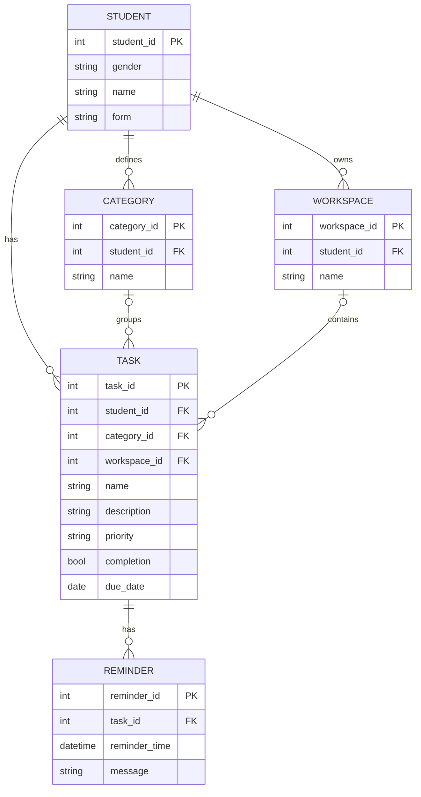

```mermaid
erDiagram
    STUDENT ||--o{ CATEGORY : defines
    STUDENT ||--o{ WORKSPACE : owns
    STUDENT ||--o{ TASK : has
    CATEGORY |o--o{ TASK : groups
    WORKSPACE |o--o{ TASK : contains
    TASK ||--o{ REMINDER : has

    STUDENT {
        int student_id PK
        string gender
        string name
        string form
    }

    CATEGORY {
        int category_id PK
        int student_id FK
        string name
    }

    WORKSPACE {
        int workspace_id PK
        int student_id FK
        string name
    }

    TASK {
        int task_id PK
        int student_id FK
        int category_id FK
        int workspace_id FK
        string name
        string description
        string priority
        bool completion
        date due_date
    }

    REMINDER {
        int reminder_id PK
        int task_id FK
        datetime reminder_time
        string message
    }

    %% Priority should be Low, Medium, or High
```

